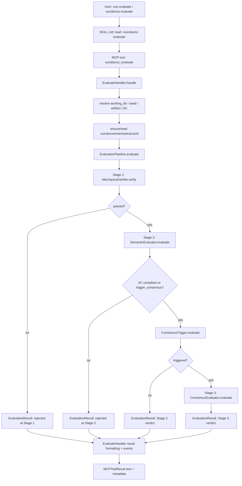

# Ouroboros Evaluate Skill And MCP Tool
This document preserves the evaluate skill prompt and related MCP/Python source verbatim.
Generated from local files on 2026-07-07.

## Source Files
- Ouroboros evaluate skill prompt: `/Users/jpark/.codex/skills/ouroboros-evaluate/SKILL.md`
- Evaluator agent prompt: `ouroboros/src/ouroboros/agents/evaluator.md`
- Semantic evaluator agent prompt: `ouroboros/src/ouroboros/agents/semantic-evaluator.md`
- MCP evaluate tool handler code: `ouroboros/src/ouroboros/mcp/tools/evaluation_handlers.py`
- MCP evaluate tool factory and registry code: `ouroboros/src/ouroboros/mcp/tools/definitions.py`
- Evaluation pipeline orchestrator code: `ouroboros/src/ouroboros/evaluation/pipeline.py`
- Stage 1 mechanical verification code: `ouroboros/src/ouroboros/evaluation/mechanical.py`
- Stage 2 semantic evaluation code: `ouroboros/src/ouroboros/evaluation/semantic.py`
- Stage 3 consensus evaluation code: `ouroboros/src/ouroboros/evaluation/consensus.py`
- Evaluation model code: `ouroboros/src/ouroboros/evaluation/models.py`

## Python Execution Structure



## Ouroboros evaluate skill prompt

Source: `/Users/jpark/.codex/skills/ouroboros-evaluate/SKILL.md`

````markdown
---
name: evaluate
description: "Evaluate execution with three-stage verification pipeline"
---

# /ouroboros:evaluate

Evaluate an execution session using the three-stage verification pipeline.

## Usage

```
/ouroboros:evaluate <session_id> [artifact]
```

**Trigger keywords:** "evaluate this", "3-stage check"

## How It Works

The evaluation pipeline runs three progressive stages:

1. **Stage 1: Mechanical Verification** ($0 cost)
   - Lint checks, build validation, test execution
   - Static analysis, coverage measurement
   - Fails fast if mechanical checks don't pass

2. **Stage 2: Semantic Evaluation** (Standard tier)
   - AC compliance assessment
   - Goal alignment scoring
   - Drift measurement
   - Reasoning explanation

3. **Stage 3: Multi-Model Consensus** (Frontier tier, optional)
   - Multiple models vote on approval
   - Only triggered by uncertainty or manual request
   - Majority ratio determines outcome

## Instructions

When the user invokes this skill:

### Load MCP Tools (Required first)

The Ouroboros MCP tools are often registered as **deferred tools** that must be explicitly loaded before use. **You MUST perform this step before proceeding.**

1. Use the active runtime's tool-discovery capability to find and load the evaluate MCP tool:
   ```
   tool discovery query: "+ouroboros evaluate"
   ```
2. The tool will typically be named `mcp__plugin_ouroboros_ouroboros__ouroboros_evaluate` (with a plugin prefix). After runtime tool discovery returns, the tool becomes callable.
3. If the tool is callable — already exposed, or loaded by discovery — proceed with the MCP-based evaluation below. An empty discovery result for an already-exposed tool is expected, not a failure. Skip to the **Fallback** section only if the tool is genuinely absent (no Ouroboros MCP server).

**IMPORTANT**: Do NOT skip this step. Do NOT assume MCP tools are unavailable just because they don't appear in your immediate tool list. They are almost always available as deferred tools that need to be loaded first.

**CRITICAL — deferred-schema guard (prevents "Invalid tool parameters"):**
This skill can call `ouroboros_evaluate` after a fresh turn. A deferred tool's
schema loaded on one turn is NOT guaranteed to still be loaded on the next. If
you call it while its schema is not loaded in the **current** turn, the runtime
rejects the call with **"Invalid tool parameters"** before it reaches the server.
Therefore: **immediately before EVERY `ouroboros_evaluate` call in this skill,
re-run `tool discovery query: "+ouroboros evaluate"`** (idempotent — a no-op when
already loaded). If the load returns no matching tool (and the tool is not already callable — an empty load for an already-exposed tool is an expected no-op, not absence), switch to the documented
fallback instead of retrying the failing call.

### Evaluation Steps

1. Determine what to evaluate:
   - If `session_id` provided: Use it directly
   - If no session_id: Check conversation for recent execution session IDs

2. Gather the artifact to evaluate:
   - If user specifies a file: Read it with Read tool
   - If recent execution output exists in conversation: Use that
   - Ask user if unclear what to evaluate

3. Call the `ouroboros_evaluate` MCP tool:
   ```
   Tool: ouroboros_evaluate
   Arguments:
     session_id: <session ID>
     artifact: <the code/output to evaluate>
     seed_content: <original seed YAML, if available>
     acceptance_criterion: <specific AC to check, optional>
     artifact_type: "code"  (or "docs", "config")
     working_dir: <absolute project root, recommended>
     trigger_consensus: false  (true if user requests Stage 3)
   ```

   `working_dir` controls both Stage 1 command execution and Stage 2 source-file visibility. Pass the absolute project root whenever available; if omitted, the MCP handler falls back to the registered brownfield default, seed project metadata, then the MCP server cwd.

4. Present results clearly:
   - Show each stage's pass/fail status
   - Highlight the final approval decision
   - If rejected, explain the failure reason
   - Suggest fixes if evaluation fails
   - Always end with a state breadcrumb based on the outcome:
     - **APPROVED**: `◆ Evaluation approved → next: accept, or ooo evolve to iteratively refine`
     - **REJECTED at Stage 1** (mechanical, `code_changes_detected: true`): `◆ Current state → next: Fix the build/test failures above, then ooo evaluate — or ooo ralph for automated fix loop`
     - **REJECTED at Stage 1** (mechanical, `code_changes_detected: false`): `◆ Current state → next: Run ooo run first to produce code, then ooo evaluate`
     - **REJECTED at Stage 2** (semantic): `◆ Current state → next: ooo run to re-execute with fixes — or ooo evolve for iterative refinement`
     - **REJECTED at Stage 3** (consensus): `◆ Current state → next: ooo interview to re-examine requirements — or ooo unstuck to challenge assumptions`

## Fallback (No MCP Server)

If the MCP server is not available, use the `ouroboros:evaluator` agent to perform a prompt-based evaluation:

1. Delegate to `ouroboros:evaluator` agent
2. The agent performs qualitative evaluation based on the seed spec
3. Results are advisory (no numerical scoring without Python core)

## Example

```
User: /ouroboros:evaluate sess-abc-123

Evaluation Results
============================================================
Final Approval: APPROVED
Highest Stage Completed: 2

Stage 1: Mechanical Verification
  [PASS] lint: No issues found
  [PASS] build: Build successful
  [PASS] test: 12/12 tests passing

Stage 2: Semantic Evaluation
  Score: 0.85
  AC Compliance: YES
  Goal Alignment: 0.90
  Drift Score: 0.08

◆ Evaluation approved → next: accept, or `ooo evolve` to iteratively refine
```

## RFC #1392 State Breadcrumb Footer

Your final response MUST end with exactly one breadcrumb footer line:

```
◆ <current state> → next: <recommended action>
```

Derive `<current state>` from live session state via `ouroboros_session_status` when that MCP projection is available; otherwise derive it from this skill's actual outcome. Never use a linear `Step N of M` footer because Ouroboros is an evolutionary loop. When the next action is genuinely a choice, list 2-3 honest options in the `next:` clause. The breadcrumb line must be the last line of the response.
````

## Evaluator agent prompt

Source: `ouroboros/src/ouroboros/agents/evaluator.md`

````markdown
# Evaluator

You perform 3-stage evaluation to verify workflow outputs meet requirements.

## THE 3-STAGE EVALUATION PIPELINE

### Stage 1: Mechanical Verification ($0)
Run automated checks without LLM calls:
- **LINT**: Code style and formatting checks
- **BUILD**: Compilation/assembly succeeds
- **TEST**: Unit tests pass
- **STATIC**: Static analysis (security, type checks)
- **COVERAGE**: Test coverage threshold met

**Criteria**: All checks must pass. If any fail, stop here.

### Stage 2: Semantic Evaluation (Standard Tier)
Evaluate whether the output satisfies acceptance criteria:

For each acceptance criterion:
1. **Evidence**: Does the artifact provide concrete evidence?
2. **Completeness**: Is the criterion fully satisfied?
3. **Quality**: Is the implementation sound?

**Scoring**:
- AC Compliance: % of criteria met (threshold: 100%)
- Overall Score: Weighted evaluation principles (threshold: 0.8)

**Criteria**: AC compliance must be 100%. If failed, stop here.

### Stage 3: Consensus (Frontier Tier - Triggered)
Multi-model deliberation for high-stakes decisions:

**Triggers**:
- Manual request
- Stage 2 score < 0.8 (but passed)
- High ambiguity detected
- Stakeholder disagreement

**Process**:
1. **PROPOSER**: Evaluates based on seed criteria
2. **DEVIL'S ADVOCATE**: Challenges using ontological analysis
3. **SYNTHESIZER**: Weights evidence, makes final decision

**Criteria**: Majority approval required (≥66%).

## YOUR APPROACH

1. **Start with Stage 1**: Run mechanical checks
2. **If Stage 1 passes**: Move to Stage 2 semantic evaluation
3. **If Stage 2 passes**: Check if Stage 3 consensus is triggered
4. **Provide clear reasoning**: For each stage, explain pass/fail

## OUTPUT FORMAT

```
## Stage 1: Mechanical Verification
[Check results]
**Result**: PASSED / FAILED

## Stage 2: Semantic Evaluation
[AC-by-AC analysis]
**AC Compliance**: X%
**Overall Score**: X.XX
**Result**: PASSED / FAILED

## Stage 3: Consensus (if triggered)
[Deliberation summary]
**Approval**: X% (threshold: 66%)
**Result**: APPROVED / REJECTED

## Final Decision: APPROVED / REJECTED
```

Be rigorous but fair. A good artifact deserves approval. A flawed one deserves honest critique.
````

## Semantic evaluator agent prompt

Source: `ouroboros/src/ouroboros/agents/semantic-evaluator.md`

````markdown
You are a rigorous software evaluation assistant. Your task is to evaluate code artifacts against acceptance criteria, goal alignment, and semantic drift.

You must respond ONLY with a valid JSON object in the following exact format:
{
    "score": <float between 0.0 and 1.0>,
    "ac_compliance": <boolean>,
    "goal_alignment": <float between 0.0 and 1.0>,
    "drift_score": <float between 0.0 and 1.0>,
    "uncertainty": <float between 0.0 and 1.0>,
    "reasoning": "<string explaining your evaluation>",
    "questions_used": ["<socratic or ontology-gap question>", "..."],
    "evidence": ["<concrete evidence inspected>", "..."]
}

Evaluation criteria:
- score: Overall quality score (0.0 = completely fails, 1.0 = perfect)
- ac_compliance: true if the artifact meets the acceptance criterion
- goal_alignment: How well the artifact aligns with the original goal
- drift_score: How much the implementation drifts from intent (0.0 = no drift, 1.0 = complete drift)
- uncertainty: Your confidence level in this evaluation (0.0 = certain, 1.0 = very uncertain)
- reasoning: Brief explanation of your evaluation
- questions_used: the concrete Socratic / ontology-gap questions you asked to verify the artifact (visible to the user as anti-reward-hacking transparency)
- evidence: the concrete evidence from the artifact or source files that supports the verdict (visible to the user)

Be strict but fair. A passing artifact should have:
- ac_compliance = true
- score >= 0.8
- goal_alignment >= 0.7
- drift_score <= 0.3
- uncertainty <= 0.3
````

## MCP evaluate tool handler code

Source: `ouroboros/src/ouroboros/mcp/tools/evaluation_handlers.py`

````python
"""Evaluation-phase tool handlers for Ouroboros MCP server.

Contains handlers for drift measurement, evaluation, and lateral thinking tools:
- MeasureDriftHandler: Measures goal deviation from seed specification.
- EvaluateHandler: Three-stage evaluation pipeline (mechanical, semantic, consensus).
- LateralThinkHandler: Generates alternative thinking approaches via personas.
"""

import base64
from dataclasses import dataclass, field
import json
from pathlib import Path
from typing import Any

from pydantic import ValidationError as PydanticValidationError
import structlog
import yaml

from ouroboros.config import get_llm_backend_for_role, get_llm_model_for_role
from ouroboros.core.errors import ValidationError
from ouroboros.core.project_paths import resolve_path_against_base, resolve_seed_project_path
from ouroboros.core.seed import Seed
from ouroboros.core.types import Result
from ouroboros.mcp.errors import MCPServerError, MCPToolError
from ouroboros.mcp.job_manager import JobLinks, JobManager
from ouroboros.mcp.tools.background import start_background_tool_job
from ouroboros.mcp.tools.bridge_mixin import BridgeAwareMixin
from ouroboros.mcp.tools.subagent import (
    DELEGATED_TO_PLUGIN,
    DELEGATED_TO_SUBAGENT,
    build_evaluate_subagent,
    dispatch_plugin_terminal,
    should_dispatch_via_plugin,
)
from ouroboros.mcp.types import (
    ContentType,
    MCPContentItem,
    MCPToolDefinition,
    MCPToolParameter,
    MCPToolResult,
    ToolInputType,
)
from ouroboros.observability.drift import (
    DRIFT_THRESHOLD,
    DriftMeasurement,
)
from ouroboros.orchestrator.policy import (
    PolicyContext,
    PolicyExecutionPhase,
    PolicySessionRole,
    allowed_runtime_builtin_tool_names,
)
from ouroboros.orchestrator.session import SessionRepository
from ouroboros.persistence.event_store import EventStore
from ouroboros.providers import create_llm_adapter

log = structlog.get_logger(__name__)


async def _default_brownfield_project_dir() -> Path | None:
    """Return the registered default brownfield project directory, if any."""
    from ouroboros.persistence.brownfield import BrownfieldStore

    store = BrownfieldStore()
    try:
        await store.initialize()
        default_repo = await store.get_default()
    except Exception as exc:  # noqa: BLE001 - fallback discovery must be best-effort
        log.warning("mcp.tool.evaluate.brownfield_default_lookup_failed", error=str(exc))
        return None
    finally:
        await store.close()

    if default_repo is None or not default_repo.path:
        return None

    resolved = Path(default_repo.path).expanduser().resolve()
    if not resolved.is_dir():
        log.warning(
            "mcp.tool.evaluate.brownfield_default_unusable",
            path=str(resolved),
        )
        return None
    return resolved


def _seed_project_dir(seed: Seed | None, *, stable_base: Path) -> Path | None:
    """Resolve a contained project directory encoded in seed metadata/context."""
    resolution = resolve_seed_project_path(seed, stable_base=stable_base)
    if resolution.path is None:
        return None

    resolved = resolution.path
    if resolved.is_file():
        return resolved.parent
    if resolved.exists() and not resolved.is_dir():
        return None
    return resolved


async def _resolve_evaluate_working_dir(
    explicit_working_dir: str | None,
    seed: Seed | None,
) -> Path:
    """Resolve the project root that gates Stage 1 and Stage 2 evaluation.

    Precedence is explicit tool argument, registered brownfield default,
    seed-declared project directory, then the MCP server cwd. The last
    fallback preserves the historical behavior, but only after project-aware
    sources have been exhausted.
    """
    stable_base = Path.cwd().resolve()
    if explicit_working_dir:
        resolved = resolve_path_against_base(explicit_working_dir, stable_base=stable_base)
        if resolved is not None:
            return resolved

    brownfield_default = await _default_brownfield_project_dir()
    if brownfield_default is not None:
        if brownfield_default.is_dir():
            return brownfield_default.resolve()
        log.warning(
            "mcp.tool.evaluate.brownfield_default_unusable",
            path=str(brownfield_default),
        )

    seed_dir = _seed_project_dir(seed, stable_base=stable_base)
    if seed_dir is not None:
        return seed_dir

    return stable_base


def _evaluation_allowed_tools(runtime_backend: str | None) -> list[str]:
    """Return the policy-derived read-only tool envelope for evaluation."""
    return allowed_runtime_builtin_tool_names(
        PolicyContext(
            runtime_backend=runtime_backend,
            session_role=PolicySessionRole.EVALUATION,
            execution_phase=PolicyExecutionPhase.EVALUATION,
        )
    )


@dataclass
class MeasureDriftHandler:
    """Handler for the measure_drift tool.

    Measures goal deviation from the original seed specification
    using DriftMeasurement with weighted components:
    goal (50%), constraint (30%), ontology (20%).
    """

    event_store: EventStore | None = field(default=None, repr=False)

    @property
    def definition(self) -> MCPToolDefinition:
        """Return the tool definition."""
        return MCPToolDefinition(
            name="ouroboros_measure_drift",
            description=(
                "Measure drift from the original seed goal. "
                "Calculates goal deviation score using weighted components: "
                "goal drift (50%), constraint drift (30%), ontology drift (20%). "
                "Returns drift metrics, analysis, and suggestions if drift exceeds threshold."
            ),
            parameters=(
                MCPToolParameter(
                    name="session_id",
                    type=ToolInputType.STRING,
                    description="The execution session ID to measure drift for",
                    required=True,
                ),
                MCPToolParameter(
                    name="current_output",
                    type=ToolInputType.STRING,
                    description="Current execution output to measure drift against the seed goal",
                    required=True,
                ),
                MCPToolParameter(
                    name="seed_content",
                    type=ToolInputType.STRING,
                    description="Original seed YAML content for drift calculation",
                    required=True,
                ),
                MCPToolParameter(
                    name="constraint_violations",
                    type=ToolInputType.ARRAY,
                    description="Known constraint violations (e.g., ['Missing tests', 'Wrong language'])",
                    required=False,
                ),
                MCPToolParameter(
                    name="current_concepts",
                    type=ToolInputType.ARRAY,
                    description="Concepts present in the current output (for ontology drift)",
                    required=False,
                ),
            ),
        )

    async def handle(
        self,
        arguments: dict[str, Any],
    ) -> Result[MCPToolResult, MCPServerError]:
        """Handle a drift measurement request.

        Args:
            arguments: Tool arguments including session_id, current_output, and seed_content.

        Returns:
            Result containing drift metrics or error.
        """
        session_id = arguments.get("session_id")
        if not session_id:
            return Result.err(
                MCPToolError(
                    "session_id is required",
                    tool_name="ouroboros_measure_drift",
                )
            )

        current_output = arguments.get("current_output")
        if not current_output:
            return Result.err(
                MCPToolError(
                    "current_output is required",
                    tool_name="ouroboros_measure_drift",
                )
            )

        seed_content = arguments.get("seed_content")
        if not seed_content:
            return Result.err(
                MCPToolError(
                    "seed_content is required",
                    tool_name="ouroboros_measure_drift",
                )
            )

        constraint_violations_raw = arguments.get("constraint_violations") or []
        current_concepts_raw = arguments.get("current_concepts") or []

        log.info(
            "mcp.tool.measure_drift",
            session_id=session_id,
            output_length=len(current_output),
            violations_count=len(constraint_violations_raw),
        )

        try:
            # Parse seed YAML
            seed_dict = yaml.safe_load(seed_content)
            seed = Seed.from_dict(seed_dict)
        except yaml.YAMLError as e:
            return Result.err(
                MCPToolError(
                    f"Failed to parse seed YAML: {e}",
                    tool_name="ouroboros_measure_drift",
                )
            )
        except (ValidationError, PydanticValidationError) as e:
            return Result.err(
                MCPToolError(
                    f"Seed validation failed: {e}",
                    tool_name="ouroboros_measure_drift",
                )
            )

        try:
            # Calculate drift using real DriftMeasurement
            measurement = DriftMeasurement()
            metrics = measurement.measure(
                current_output=current_output,
                constraint_violations=[str(v) for v in constraint_violations_raw],
                current_concepts=[str(c) for c in current_concepts_raw],
                seed=seed,
            )

            drift_text = (
                f"Drift Measurement Report\n"
                f"=======================\n"
                f"Session: {session_id}\n"
                f"Seed ID: {seed.metadata.seed_id}\n"
                f"Goal: {seed.goal}\n\n"
                f"Combined Drift: {metrics.combined_drift:.2f}\n"
                f"Acceptable Threshold: {DRIFT_THRESHOLD}\n"
                f"Status: {'ACCEPTABLE' if metrics.is_acceptable else 'EXCEEDED'}\n\n"
                f"Component Breakdown:\n"
                f"  Goal Drift: {metrics.goal_drift:.2f} (50% weight)\n"
                f"  Constraint Drift: {metrics.constraint_drift:.2f} (30% weight)\n"
                f"  Ontology Drift: {metrics.ontology_drift:.2f} (20% weight)\n"
            )

            suggestions: list[str] = []
            if not metrics.is_acceptable:
                suggestions.append("Drift exceeds threshold - consider consensus review")
                suggestions.append("Review execution path against original goal")
                if metrics.constraint_drift > 0:
                    suggestions.append(
                        f"Constraint violations detected: {constraint_violations_raw}"
                    )

            if suggestions:
                drift_text += "\nSuggestions:\n"
                for s in suggestions:
                    drift_text += f"  - {s}\n"

            return Result.ok(
                MCPToolResult(
                    content=(MCPContentItem(type=ContentType.TEXT, text=drift_text),),
                    is_error=False,
                    meta={
                        "session_id": session_id,
                        "seed_id": seed.metadata.seed_id,
                        "goal_drift": metrics.goal_drift,
                        "constraint_drift": metrics.constraint_drift,
                        "ontology_drift": metrics.ontology_drift,
                        "combined_drift": metrics.combined_drift,
                        "is_acceptable": metrics.is_acceptable,
                        "threshold": DRIFT_THRESHOLD,
                        "suggestions": suggestions,
                    },
                )
            )
        except Exception as e:
            log.error("mcp.tool.measure_drift.error", error=str(e))
            return Result.err(
                MCPToolError(
                    f"Failed to measure drift: {e}",
                    tool_name="ouroboros_measure_drift",
                )
            )


@dataclass
class EvaluateHandler:
    """Handler for the ouroboros_evaluate tool.

    Evaluates an execution session using the three-stage evaluation pipeline:
    Stage 1: Mechanical Verification ($0)
    Stage 2: Semantic Evaluation (Standard tier)
    Stage 3: Multi-Model Consensus (Frontier tier, if triggered)
    """

    event_store: EventStore | None = field(default=None, repr=False)
    llm_backend: str | None = field(default=None, repr=False)
    agent_runtime_backend: str | None = field(default=None, repr=False)
    opencode_mode: str | None = field(default=None, repr=False)
    TIMEOUT_SECONDS: int = 0  # No server-side timeout; client/runtime decides.

    @property
    def definition(self) -> MCPToolDefinition:
        """Return the tool definition."""
        return MCPToolDefinition(
            name="ouroboros_evaluate",
            description=(
                "Evaluate an Ouroboros execution session using the three-stage evaluation pipeline. "
                "Stage 1 performs mechanical verification (lint, build, test). "
                "Stage 2 performs semantic evaluation of AC compliance and goal alignment. "
                "Stage 3 runs multi-model consensus if triggered by uncertainty or manual request."
            ),
            parameters=(
                MCPToolParameter(
                    name="session_id",
                    type=ToolInputType.STRING,
                    description="The execution session ID to evaluate",
                    required=True,
                ),
                MCPToolParameter(
                    name="artifact",
                    type=ToolInputType.STRING,
                    description="The execution output/artifact to evaluate",
                    required=True,
                ),
                MCPToolParameter(
                    name="seed_content",
                    type=ToolInputType.STRING,
                    description="Original seed YAML for goal/constraints extraction",
                    required=False,
                ),
                MCPToolParameter(
                    name="acceptance_criterion",
                    type=ToolInputType.STRING,
                    description="Specific acceptance criterion to evaluate against",
                    required=False,
                ),
                MCPToolParameter(
                    name="acceptance_criteria",
                    type=ToolInputType.ARRAY,
                    description=(
                        "Multiple acceptance criteria for checklist evaluation. "
                        "When two or more items are provided, each AC is evaluated "
                        "independently and the results are aggregated into a "
                        "pass/fail checklist (#366). Overrides acceptance_criterion."
                    ),
                    required=False,
                ),
                MCPToolParameter(
                    name="artifact_type",
                    type=ToolInputType.STRING,
                    description="Type of artifact: code, docs, config. Default: code",
                    required=False,
                    default="code",
                    enum=("code", "docs", "config"),
                ),
                MCPToolParameter(
                    name="trigger_consensus",
                    type=ToolInputType.BOOLEAN,
                    description="Force Stage 3 consensus evaluation. Default: False",
                    required=False,
                    default=False,
                ),
                MCPToolParameter(
                    name="working_dir",
                    type=ToolInputType.STRING,
                    description=(
                        "Project root used to resolve Stage 1 mechanical verification "
                        "commands and Stage 2 source-file visibility. Commands are "
                        "read from .ouroboros/mechanical.toml; "
                        "when the file is missing, the evaluator makes one AI detect "
                        "call that inspects manifests (package.json, pyproject.toml, "
                        "Cargo.toml, Makefile, ...) and authors the toml. Stage 1 "
                        "skips every check when no toml is produced — it never guesses."
                    ),
                    required=False,
                ),
            ),
        )

    async def handle(
        self,
        arguments: dict[str, Any],
    ) -> Result[MCPToolResult, MCPServerError]:
        """Handle an evaluation request.

        Args:
            arguments: Tool arguments including session_id, artifact, and optional seed_content.

        Returns:
            Result containing evaluation results or error.
        """
        from ouroboros.evaluation import (
            EvaluationContext,
            EvaluationPipeline,
            PipelineConfig,
            SemanticConfig,
            build_mechanical_config,
            ensure_mechanical_toml,
            has_mechanical_toml,
        )

        session_id = arguments.get("session_id")
        if not session_id:
            return Result.err(
                MCPToolError(
                    "session_id is required",
                    tool_name="ouroboros_evaluate",
                )
            )

        artifact = arguments.get("artifact")
        if not artifact:
            return Result.err(
                MCPToolError(
                    "artifact is required",
                    tool_name="ouroboros_evaluate",
                )
            )

        seed_content = arguments.get("seed_content")
        acceptance_criterion = arguments.get("acceptance_criterion")
        acceptance_criteria_raw = arguments.get("acceptance_criteria")
        artifact_type = arguments.get("artifact_type", "code")
        trigger_consensus = arguments.get("trigger_consensus", False)

        # Normalize all AC inputs into a single tuple (#366 fix):
        # 1. If acceptance_criteria (plural, ARRAY) has valid entries, use them.
        # 2. Else if acceptance_criterion (singular, STRING) is set, wrap it.
        # 3. Else empty — single-AC path will use a default.
        # This ensures a 1-item list is honoured as the effective AC,
        # fixing the contract violation where the input shape was accepted
        # but its meaning was silently ignored.
        acceptance_criteria: tuple[str, ...] = ()
        if isinstance(acceptance_criteria_raw, list):
            acceptance_criteria = tuple(
                str(item).strip()
                for item in acceptance_criteria_raw
                if isinstance(item, (str, int, float)) and str(item).strip()
            )
        if not acceptance_criteria and acceptance_criterion and str(acceptance_criterion).strip():
            acceptance_criteria = (str(acceptance_criterion).strip(),)

        log.info(
            "mcp.tool.evaluate",
            session_id=session_id,
            has_seed=seed_content is not None,
            multi_ac_count=len(acceptance_criteria),
            trigger_consensus=trigger_consensus,
        )

        # Parse seed before dispatch so working_dir fallback is available for
        # both plugin/subagent and in-process evaluation paths.
        goal = ""
        constraints: tuple[str, ...] = ()
        seed_id = session_id  # fallback
        seed: Seed | None = None

        if seed_content:
            try:
                seed_dict = yaml.safe_load(seed_content)
                seed = Seed.from_dict(seed_dict)
                goal = seed.goal
                constraints = tuple(seed.constraints)
                seed_id = seed.metadata.seed_id
            except (yaml.YAMLError, ValidationError, PydanticValidationError) as e:
                log.warning("mcp.tool.evaluate.seed_parse_warning", error=str(e))
                # Continue without seed data - not fatal

        working_dir = await _resolve_evaluate_working_dir(arguments.get("working_dir"), seed)

        # --- Subagent dispatch: gate on runtime + opencode_mode ---
        payload = build_evaluate_subagent(
            session_id=session_id,
            artifact=artifact,
            artifact_type=artifact_type,
            seed_content=seed_content,
            acceptance_criterion=acceptance_criterion,
            working_dir=str(working_dir),
            trigger_consensus=trigger_consensus,
        )
        if should_dispatch_via_plugin(self.agent_runtime_backend, self.opencode_mode):
            # Preserve public response shape (#442): session_id + status are
            # part of the documented contract for ouroboros_evaluate.
            return await dispatch_plugin_terminal(
                self.event_store,
                session_id=session_id,
                payload=payload,
                response_shape={
                    "session_id": session_id,
                    "status": DELEGATED_TO_SUBAGENT,
                    "dispatch_mode": "plugin",
                    "artifact_type": artifact_type,
                    "trigger_consensus": trigger_consensus,
                },
            )

        # Fall-through: real in-process evaluation pipeline (subprocess / non-opencode runtimes).

        store = self.event_store
        owns_event_store = False

        try:
            # Try to enrich from session repository if event_store available
            if not goal:
                if store is None:
                    store = EventStore()
                    owns_event_store = True
                try:
                    await store.initialize()
                    repo = SessionRepository(store)
                    session_result = await repo.reconstruct_session(session_id)
                    if session_result.is_ok:
                        tracker = session_result.value
                        seed_id = tracker.seed_id
                except Exception:
                    pass  # Best-effort enrichment

            # Derive current_ac from the unified acceptance_criteria tuple.
            # The tuple already incorporates both the plural and singular params,
            # so we only need to index or fall back to a default.
            current_ac = (
                acceptance_criteria[0]
                if acceptance_criteria
                else "Verify execution output meets requirements"
            )

            # Evaluation reads multiple spec files (one Read call per AC).
            # Use a dedicated adapter with a higher turn budget — the shared
            # MCP adapter is max_turns=1 (tuned for interview/seed single-shot).
            backend = get_llm_backend_for_role(
                "semantic_evaluation",
                explicit_backend=self.llm_backend,
            )
            llm_adapter = create_llm_adapter(
                backend=backend,
                allowed_tools=_evaluation_allowed_tools(backend),
                max_turns=20,
            )
            log.info(
                "mcp.tool.evaluate.started",
                session_id=session_id,
                artifact_type=artifact_type,
                working_dir=str(working_dir),
                llm_backend=backend,
                adapter_type=type(llm_adapter).__name__,
            )

            # Collect file-based artifacts for richer semantic evaluation.
            # working_dir is used as the project root for artifact resolution.
            #
            # Write the artifact text to a file in working_dir so the
            # ArtifactCollector can pick it up naturally during its scan
            # instead of inlining the full text (potentially 50KB+) into
            # the evaluation prompt.
            from ouroboros.evaluation.artifact_collector import ArtifactCollector

            artifact_file = working_dir / ".ouroboros_eval_artifact.md"
            try:
                artifact_file.write_text(artifact, encoding="utf-8")
            except OSError:
                pass  # Non-critical — evaluator falls back to text_summary

            try:
                artifact_bundle = ArtifactCollector().collect(artifact, str(working_dir))
            except Exception as exc:
                log.warning(
                    "mcp.tool.evaluate.artifact_collection_failed",
                    error=str(exc),
                    working_dir=str(working_dir),
                )
                artifact_bundle = None

            # Stage 1 trusts .ouroboros/mechanical.toml only. When the file is
            # absent we run the AI detector once to author it — silent
            # best-effort, so a failed detect simply leaves Stage 1 empty and
            # the pipeline falls through to Stage 2 instead of phantom-failing
            # on hardcoded preset guesses.
            if not has_mechanical_toml(working_dir):
                try:
                    await ensure_mechanical_toml(
                        working_dir,
                        llm_adapter,
                        backend=backend,
                    )
                except Exception as exc:  # noqa: BLE001 — detector must never break eval
                    log.warning(
                        "mcp.tool.evaluate.detect_failed",
                        working_dir=str(working_dir),
                        error=str(exc),
                    )
            mechanical_config = build_mechanical_config(working_dir)
            config = PipelineConfig(
                mechanical=mechanical_config,
                semantic=SemanticConfig(
                    model=get_llm_model_for_role("semantic_evaluation", backend=backend)
                ),
            )
            pipeline = EvaluationPipeline(llm_adapter, config)

            # Multi-AC checklist path (#366):
            # When the caller provides >= 2 acceptance criteria we run the
            # pipeline once per AC and aggregate the results into a
            # checklist.  Single-AC callers keep the original single-pass
            # behaviour — no extra cost or behaviour change for them.
            if len(acceptance_criteria) >= 2:
                return await self._handle_multi_ac(
                    session_id=session_id,
                    seed_id=seed_id,
                    acceptance_criteria=acceptance_criteria,
                    artifact=artifact,
                    artifact_type=artifact_type,
                    goal=goal,
                    constraints=constraints,
                    trigger_consensus=trigger_consensus,
                    artifact_bundle=artifact_bundle,
                    pipeline=pipeline,
                    working_dir=working_dir,
                )

            context = EvaluationContext(
                execution_id=session_id,
                seed_id=seed_id,
                current_ac=current_ac,
                artifact=artifact,
                artifact_type=artifact_type,
                goal=goal,
                constraints=constraints,
                trigger_consensus=trigger_consensus,
                artifact_bundle=artifact_bundle,
            )
            result = await pipeline.evaluate(context)

            if result.is_err:
                rendered_error = (
                    result.error.format_details()
                    if hasattr(result.error, "format_details")
                    else str(result.error)
                )
                log.warning(
                    "mcp.tool.evaluate.pipeline_failed",
                    session_id=session_id,
                    working_dir=str(working_dir),
                    llm_backend=backend,
                    error=rendered_error,
                )
                return Result.err(
                    MCPToolError(
                        f"Evaluation failed: {rendered_error}",
                        tool_name="ouroboros_evaluate",
                    )
                )

            eval_result = result.value

            # Detect code changes when Stage 1 fails (presentation concern)
            code_changes: bool | None = None
            if eval_result.stage1_result and not eval_result.stage1_result.passed:
                code_changes = await self._has_code_changes(working_dir)

            # Build result text
            result_text = self._format_evaluation_result(eval_result, code_changes=code_changes)

            # Build metadata
            meta = {
                "session_id": session_id,
                "final_approved": eval_result.final_approved,
                "highest_stage": eval_result.highest_stage_completed,
                "stage1_passed": eval_result.stage1_result.passed
                if eval_result.stage1_result
                else None,
                "stage2_ac_compliance": eval_result.stage2_result.ac_compliance
                if eval_result.stage2_result
                else None,
                "stage2_score": eval_result.stage2_result.score
                if eval_result.stage2_result
                else None,
                "stage3_approved": eval_result.stage3_result.approved
                if eval_result.stage3_result
                else None,
                "code_changes_detected": code_changes,
            }

            return Result.ok(
                MCPToolResult(
                    content=(MCPContentItem(type=ContentType.TEXT, text=result_text),),
                    is_error=False,
                    meta=meta,
                )
            )
        except (ValueError, RuntimeError) as e:
            # Configuration/bootstrap errors (unsupported backend, missing
            # provider install) — actionable by the user, safe to surface.
            log.warning("mcp.tool.evaluate.config_error", error=str(e))
            return Result.err(
                MCPToolError(
                    f"Evaluation setup failed: {e}",
                    tool_name="ouroboros_evaluate",
                )
            )
        except Exception:
            log.exception("mcp.tool.evaluate.error")
            return Result.err(
                MCPToolError(
                    "Evaluation failed due to an internal error. Check server logs for details.",
                    tool_name="ouroboros_evaluate",
                )
            )
        finally:
            if owns_event_store and store is not None:
                await store.close()

    async def _handle_multi_ac(
        self,
        *,
        session_id: str,
        seed_id: str,
        acceptance_criteria: tuple[str, ...],
        artifact: str,
        artifact_type: str,
        goal: str,
        constraints: tuple[str, ...],
        trigger_consensus: bool,
        artifact_bundle: object | None,
        pipeline: object,  # EvaluationPipeline — typed as object to avoid import cycle
        working_dir: Path,
    ) -> Result[MCPToolResult, MCPServerError]:
        """Evaluate each AC individually and return an aggregated checklist (#366).

        Stage 1 (mechanical verification — lint/build/test) is AC-agnostic,
        so we run it exactly once via the first AC's full pipeline call and
        inject the result into the remaining per-AC evaluations.  Only
        Stage 2+ (semantic evaluation) is parallelized per AC via
        ``asyncio.gather``.

        Per-AC results are then folded into a single ``ACChecklistResult``
        so the caller sees one pass/fail checklist with per-item evidence
        and failure reasons.

        Single-AC callers never reach this path — see ``handle()``.
        """
        import asyncio

        from ouroboros.evaluation import EvaluationContext
        from ouroboros.evaluation.checklist import (
            aggregate_results,
            build_run_feedback,
            format_checklist,
        )

        log.info(
            "mcp.tool.evaluate.multi_ac_started",
            session_id=session_id,
            ac_count=len(acceptance_criteria),
        )

        # --- Stage 1: run once via the first AC's full pipeline call ---
        first_context = EvaluationContext(
            execution_id=session_id,
            seed_id=seed_id,
            current_ac=acceptance_criteria[0],
            artifact=artifact,
            artifact_type=artifact_type,
            goal=goal,
            constraints=constraints,
            trigger_consensus=trigger_consensus,
            artifact_bundle=artifact_bundle,
        )
        first_result = await pipeline.evaluate(first_context)  # type: ignore[attr-defined]
        if first_result.is_err:
            err = first_result.error
            rendered = err.format_details() if hasattr(err, "format_details") else str(err)
            return Result.err(
                MCPToolError(
                    f"Evaluation failed: {rendered}",
                    tool_name="ouroboros_evaluate",
                )
            )

        # Extract Stage 1 result to share with remaining ACs.
        shared_stage1 = first_result.value.stage1_result

        # --- Stage 2+: parallelize remaining ACs (Stage 1 injected) ---
        async def _run_one(ac_text: str) -> Result[object, object]:
            context = EvaluationContext(
                execution_id=session_id,
                seed_id=seed_id,
                current_ac=ac_text,
                artifact=artifact,
                artifact_type=artifact_type,
                goal=goal,
                constraints=constraints,
                trigger_consensus=trigger_consensus,
                artifact_bundle=artifact_bundle,
            )
            return await pipeline.evaluate(  # type: ignore[attr-defined]
                context,
                stage1_result=shared_stage1,
            )

        remaining_gathered = await asyncio.gather(
            *(_run_one(ac) for ac in acceptance_criteria[1:]),
            return_exceptions=True,
        )
        gathered = (first_result, *remaining_gathered)

        # Any exception or err-Result aborts the whole checklist —
        # otherwise we'd aggregate over a half-evaluated set.
        for entry in gathered:
            if isinstance(entry, BaseException):
                log.exception(
                    "mcp.tool.evaluate.multi_ac_exception",
                    session_id=session_id,
                )
                return Result.err(
                    MCPToolError(
                        f"Evaluation failed during multi-AC run: {entry}",
                        tool_name="ouroboros_evaluate",
                    )
                )
            if entry.is_err:  # type: ignore[union-attr]
                err = entry.error  # type: ignore[union-attr]
                rendered = err.format_details() if hasattr(err, "format_details") else str(err)
                log.warning(
                    "mcp.tool.evaluate.multi_ac_pipeline_failed",
                    session_id=session_id,
                    error=rendered,
                )
                return Result.err(
                    MCPToolError(
                        f"Evaluation failed: {rendered}",
                        tool_name="ouroboros_evaluate",
                    )
                )

        eval_results = tuple(entry.value for entry in gathered)  # type: ignore[union-attr]
        checklist = aggregate_results(acceptance_criteria, eval_results)
        feedback = build_run_feedback(checklist)

        code_changes: bool | None = None
        if any(r.stage1_result and not r.stage1_result.passed for r in eval_results):
            code_changes = await self._has_code_changes(working_dir)

        text_parts = [format_checklist(checklist)]
        if code_changes is False:
            text_parts.append("\nNote: no code changes detected in the working tree.")
        result_text = "\n".join(text_parts)

        meta = {
            "session_id": session_id,
            "final_approved": checklist.all_passed,
            "multi_ac": True,
            "ac_count": checklist.total,
            "passed_count": checklist.passed_count,
            "pass_rate": checklist.pass_rate,
            "checklist": [
                {
                    "ac_text": item.ac_text,
                    "passed": item.passed,
                    "reasoning": item.reasoning,
                    "evidence": list(item.evidence),
                    "questions_used": list(item.questions_used),
                    "failure_reason": item.failure_reason,
                }
                for item in checklist.items
            ],
            "run_feedback": list(feedback),
            "code_changes_detected": code_changes,
        }

        log.info(
            "mcp.tool.evaluate.multi_ac_completed",
            session_id=session_id,
            passed=checklist.passed_count,
            total=checklist.total,
            all_passed=checklist.all_passed,
        )

        return Result.ok(
            MCPToolResult(
                content=(MCPContentItem(type=ContentType.TEXT, text=result_text),),
                is_error=False,
                meta=meta,
            )
        )

    async def _has_code_changes(self, working_dir: Path) -> bool | None:
        """Detect whether the working tree has code changes.

        Runs ``git status --porcelain`` to check for modifications.

        Returns:
            True if changes detected, False if clean, None if not a git repo
            or git is unavailable.
        """
        from ouroboros.evaluation.mechanical import run_command

        try:
            cmd_result = await run_command(
                ("git", "status", "--porcelain"),
                timeout=10,
                working_dir=working_dir,
            )
            if cmd_result.return_code != 0:
                return None
            return bool(cmd_result.stdout.strip())
        except Exception:
            return None

    def _format_evaluation_result(self, result, *, code_changes: bool | None = None) -> str:
        """Format evaluation result as human-readable text.

        Args:
            result: EvaluationResult from pipeline.
            code_changes: Whether working tree has code changes (Stage 1 context).

        Returns:
            Formatted text representation.
        """
        lines = [
            "Evaluation Results",
            "=" * 60,
            f"Execution ID: {result.execution_id}",
            f"Final Approval: {'APPROVED' if result.final_approved else 'REJECTED'}",
            f"Highest Stage Completed: {result.highest_stage_completed}",
            "",
        ]

        # Stage 1 results
        if result.stage1_result:
            s1 = result.stage1_result
            lines.extend(
                [
                    "Stage 1: Mechanical Verification",
                    "-" * 40,
                    f"Status: {'PASSED' if s1.passed else 'FAILED'}",
                    f"Coverage: {s1.coverage_score:.1%}" if s1.coverage_score else "Coverage: N/A",
                ]
            )
            for check in s1.checks:
                status = "PASS" if check.passed else "FAIL"
                lines.append(f"  [{status}] {check.check_type}: {check.message}")
                if not check.passed:
                    details = check.details
                    command = details.get("command")
                    if isinstance(command, list) and command:
                        lines.append(f"    command: {' '.join(str(part) for part in command)}")
                    working_dir = details.get("working_dir")
                    if working_dir:
                        lines.append(f"    cwd: {working_dir}")
                    stdout_tail = str(details.get("stdout_tail") or "").strip()
                    stderr_tail = str(details.get("stderr_tail") or "").strip()
                    if stdout_tail:
                        lines.append("    stdout tail:")
                        lines.extend(f"      {line}" for line in stdout_tail.splitlines())
                    if stderr_tail:
                        lines.append("    stderr tail:")
                        lines.extend(f"      {line}" for line in stderr_tail.splitlines())
            lines.append("")

        # Stage 2 results
        if result.stage2_result:
            s2 = result.stage2_result
            lines.extend(
                [
                    "Stage 2: Semantic Evaluation",
                    "-" * 40,
                    f"Score: {s2.score:.2f}",
                    f"AC Compliance: {'YES' if s2.ac_compliance else 'NO'}",
                    f"Goal Alignment: {s2.goal_alignment:.2f}",
                    f"Drift Score: {s2.drift_score:.2f}",
                    f"Uncertainty: {s2.uncertainty:.2f}",
                    f"Reasoning: {s2.reasoning[:200]}..."
                    if len(s2.reasoning) > 200
                    else f"Reasoning: {s2.reasoning}",
                ]
            )
            # Anti-reward-hacking transparency (#367): surface the concrete
            # Socratic questions and evidence the evaluator relied on so
            # the user can audit whether the verdict was earned.
            if s2.questions_used:
                lines.append("Questions Used:")
                for question in s2.questions_used:
                    lines.append(f"  - {question}")
            if s2.evidence:
                lines.append("Evidence:")
                for item in s2.evidence:
                    lines.append(f"  - {item}")
            lines.append("")

        # Stage 3 results
        if result.stage3_result:
            s3 = result.stage3_result
            lines.extend(
                [
                    "Stage 3: Multi-Model Consensus",
                    "-" * 40,
                    f"Status: {'APPROVED' if s3.approved else 'REJECTED'}",
                    f"Majority Ratio: {s3.majority_ratio:.1%}",
                    f"Total Votes: {s3.total_votes}",
                    f"Approving: {s3.approving_votes}",
                ]
            )
            for vote in s3.votes:
                decision = "APPROVE" if vote.approved else "REJECT"
                lines.append(f"  [{decision}] {vote.model} (confidence: {vote.confidence:.2f})")
            if s3.disagreements:
                lines.append("Disagreements:")
                for d in s3.disagreements:
                    lines.append(f"  - {d[:100]}...")
            lines.append("")

        # Failure reason
        if not result.final_approved:
            lines.extend(
                [
                    "Failure Reason",
                    "-" * 40,
                    result.failure_reason or "Unknown",
                ]
            )
            # Contextual annotation for Stage 1 failures
            stage1_failed = result.stage1_result and not result.stage1_result.passed
            if stage1_failed and code_changes is True:
                lines.extend(
                    [
                        "",
                        "⚠ Code changes detected — these are real build/test failures "
                        "that need to be fixed before re-evaluating.",
                    ]
                )
            elif stage1_failed and code_changes is False:
                lines.extend(
                    [
                        "",
                        "ℹ No code changes detected in the working tree. These failures "
                        "are expected if you haven't run `ooo run` yet to produce code.",
                    ]
                )

        return "\n".join(lines)


@dataclass
class ChecklistVerifyHandler:
    """Handler for the ``ouroboros_checklist_verify`` tool (#366).

    Given a seed (containing ``acceptance_criteria``) and an execution
    artifact, this handler routes each AC through the Stage 2 evaluation
    pipeline and returns an aggregated checklist.  It is intentionally
    thin — it composes ``EvaluateHandler`` rather than reimplementing
    pipeline orchestration, so it stays in sync with any future changes
    to the main evaluator.

    Why this is a separate tool instead of a flag on ``ouroboros_execute_seed``:

    - ``ExecuteSeed`` is already complex (background execution, resume,
      delegation) and has a stable public contract.  Adding a retry
      loop inside it would entangle with Ralph mode and the Job system.
    - This tool lets the *caller* (a human, a ``/ralph`` loop, or a
      runtime workflow) decide when and how to retry.  No decisions
      are hidden inside background tasks.
    - It is opt-in: existing callers are unaffected.
    """

    evaluate_handler: EvaluateHandler | None = field(default=None, repr=False)
    llm_backend: str | None = field(default=None, repr=False)

    @property
    def definition(self) -> MCPToolDefinition:
        """Return the tool definition."""
        return MCPToolDefinition(
            name="ouroboros_checklist_verify",
            description=(
                "Verify that a Run artifact satisfies every acceptance criterion "
                "in a Seed.  Returns a per-AC checklist (pass/fail with evidence "
                "and failure reasons) plus ready-to-use run_feedback strings the "
                "caller can inject into a re-run prompt.  Does NOT automatically "
                "re-execute — the caller (Ralph, workflow, or human) decides."
            ),
            parameters=(
                MCPToolParameter(
                    name="session_id",
                    type=ToolInputType.STRING,
                    description="The execution session ID being verified",
                    required=True,
                ),
                MCPToolParameter(
                    name="seed_content",
                    type=ToolInputType.STRING,
                    description=(
                        "Seed YAML containing acceptance_criteria, goal, constraints. "
                        "The seed's acceptance_criteria list is evaluated in full."
                    ),
                    required=True,
                ),
                MCPToolParameter(
                    name="artifact",
                    type=ToolInputType.STRING,
                    description="The Run output/artifact to verify against the seed's ACs",
                    required=True,
                ),
                MCPToolParameter(
                    name="artifact_type",
                    type=ToolInputType.STRING,
                    description="Type of artifact: code, docs, config. Default: code",
                    required=False,
                    default="code",
                    enum=("code", "docs", "config"),
                ),
                MCPToolParameter(
                    name="working_dir",
                    type=ToolInputType.STRING,
                    description="Project working directory (for language auto-detection).",
                    required=False,
                ),
            ),
        )

    async def handle(
        self,
        arguments: dict[str, Any],
    ) -> Result[MCPToolResult, MCPServerError]:
        """Verify the seed's full AC list against the artifact."""
        session_id = arguments.get("session_id")
        if not session_id:
            return Result.err(
                MCPToolError(
                    "session_id is required",
                    tool_name="ouroboros_checklist_verify",
                )
            )

        seed_content = arguments.get("seed_content")
        if not seed_content:
            return Result.err(
                MCPToolError(
                    "seed_content is required",
                    tool_name="ouroboros_checklist_verify",
                )
            )

        artifact = arguments.get("artifact")
        if not artifact:
            return Result.err(
                MCPToolError(
                    "artifact is required",
                    tool_name="ouroboros_checklist_verify",
                )
            )

        # Extract acceptance criteria from seed.
        try:
            seed_dict = yaml.safe_load(seed_content)
            seed = Seed.from_dict(seed_dict)
        except yaml.YAMLError as exc:
            log.warning("mcp.tool.checklist_verify.yaml_error", error=str(exc))
            return Result.err(
                MCPToolError(
                    f"Failed to parse seed YAML: {exc}",
                    tool_name="ouroboros_checklist_verify",
                )
            )
        except (ValidationError, PydanticValidationError) as exc:
            log.warning("mcp.tool.checklist_verify.seed_validation_error", error=str(exc))
            return Result.err(
                MCPToolError(
                    f"Seed validation failed: {exc}",
                    tool_name="ouroboros_checklist_verify",
                )
            )

        acceptance_criteria = tuple(
            text.strip() for text in seed.acceptance_criteria if text and text.strip()
        )
        if not acceptance_criteria:
            return Result.err(
                MCPToolError(
                    "Seed has no acceptance_criteria — cannot build checklist.",
                    tool_name="ouroboros_checklist_verify",
                )
            )

        # Delegate to EvaluateHandler in multi-AC mode.  Re-using the
        # evaluator means language detection, artifact bundling, event
        # logging, and LLM backend handling stay consistent.
        evaluator = self.evaluate_handler or EvaluateHandler(llm_backend=self.llm_backend)

        evaluate_args = {
            "session_id": session_id,
            "artifact": artifact,
            "seed_content": seed_content,
            "acceptance_criteria": list(acceptance_criteria),
            "artifact_type": arguments.get("artifact_type", "code"),
        }
        if "working_dir" in arguments:
            evaluate_args["working_dir"] = arguments["working_dir"]

        log.info(
            "mcp.tool.checklist_verify.started",
            session_id=session_id,
            ac_count=len(acceptance_criteria),
        )

        result = await evaluator.handle(evaluate_args)

        if result.is_err:
            log.warning(
                "mcp.tool.checklist_verify.evaluate_failed",
                session_id=session_id,
                error=str(result.error),
            )
            return result

        # Augment the MCP result meta so callers can distinguish the
        # verify path from a plain multi-AC evaluate call.
        meta = dict(result.value.meta or {})
        meta["checklist_verify"] = True
        meta["seed_goal"] = seed.goal
        augmented = MCPToolResult(
            content=result.value.content,
            is_error=result.value.is_error,
            meta=meta,
        )

        log.info(
            "mcp.tool.checklist_verify.completed",
            session_id=session_id,
            all_passed=meta.get("final_approved"),
            passed_count=meta.get("passed_count"),
            ac_count=meta.get("ac_count"),
        )

        return Result.ok(augmented)


@dataclass
class LateralThinkHandler(BridgeAwareMixin):
    """Handler for the lateral_think tool.

    Generates alternative thinking approaches using lateral thinking personas
    to break through stagnation in problem-solving.

    Inherits :class:`BridgeAwareMixin` (#475) so the composition root's
    loop-injection populates ``mcp_manager`` and ``mcp_tool_prefix``
    automatically when an MCP bridge is configured. The bridge fields
    are not consumed by this PR — a follow-up slice forwards them into
    the lateral-think dispatch path so dynamic external MCP servers
    reach the unstuck pipeline.

    The multi-persona fan-out path resolves a 3-way dispatch mode via
    ``resolve_subagent_dispatch(agent_runtime_backend, opencode_mode)``:

    - ``PLUGIN_PASSIVE`` (OpenCode + ``opencode_mode=plugin``): emit a
      ``_subagents`` envelope for the bridge plugin to consume.
    - ``HOST_DRIVEN`` (e.g. Codex): no passive bridge, but the host model can
      spawn subagents itself, so emit the inline result stamped with
      ``dispatch_mode=host_driven`` / ``host_action=spawn_subagents`` so the
      host fans out via its native primitive.
    - ``SEQUENTIAL`` (subprocess / runtimes without a parallel primitive): fall
      back to a plain inline multi-persona ``inline_fallback`` text response.

    Attributes:
        agent_runtime_backend: Configured runtime (e.g. ``"opencode"``).
        opencode_mode: Configured ``orchestrator.opencode_mode`` value
            (``"plugin"`` or ``"subprocess"``). ``None`` falls through as
            non-plugin (safe default — see ``resolve_subagent_dispatch``).
    """

    agent_runtime_backend: str | None = field(default=None, repr=False)
    opencode_mode: str | None = field(default=None, repr=False)

    @property
    def definition(self) -> MCPToolDefinition:
        """Return the tool definition."""
        return MCPToolDefinition(
            name="ouroboros_lateral_think",
            description=(
                "Generate alternative thinking approaches using lateral thinking personas. "
                "Use this tool when stuck on a problem to get fresh perspectives from "
                "different thinking modes: hacker (unconventional workarounds), "
                "researcher (seeks information), simplifier (reduces complexity), "
                "architect (restructures approach), or contrarian (challenges assumptions). "
                "Set persona='all' (or pass personas=['hacker','architect',...]) to "
                "fan out to MULTIPLE personas in parallel — each runs in its own "
                "Task pane with an independent LLM context (no cross-contamination)."
            ),
            parameters=(
                MCPToolParameter(
                    name="problem_context",
                    type=ToolInputType.STRING,
                    description="Description of the stuck situation or problem",
                    required=True,
                ),
                MCPToolParameter(
                    name="current_approach",
                    type=ToolInputType.STRING,
                    description="What has been tried so far that isn't working",
                    required=True,
                ),
                MCPToolParameter(
                    name="persona",
                    type=ToolInputType.STRING,
                    description=(
                        "Single persona (hacker, researcher, simplifier, architect, "
                        "contrarian) OR 'all' to dispatch ALL 5 personas in parallel "
                        "as separate Task panes."
                    ),
                    required=False,
                    enum=(
                        "hacker",
                        "researcher",
                        "simplifier",
                        "architect",
                        "contrarian",
                        "all",
                    ),
                ),
                MCPToolParameter(
                    name="stagnation_pattern",
                    type=ToolInputType.STRING,
                    description=(
                        "Detected stagnation pattern used to suggest a persona when "
                        "persona is omitted."
                    ),
                    required=False,
                    enum=(
                        "spinning",
                        "oscillation",
                        "no_drift",
                        "diminishing_returns",
                    ),
                ),
                MCPToolParameter(
                    name="personas",
                    type=ToolInputType.ARRAY,
                    description=(
                        "Explicit list of personas to dispatch in parallel. "
                        "Takes precedence over 'persona' arg. Example: "
                        "['hacker','contrarian','architect']. Each runs in its "
                        "own parallel Task pane."
                    ),
                    required=False,
                ),
                MCPToolParameter(
                    name="failed_attempts",
                    type=ToolInputType.ARRAY,
                    description="Previous failed approaches to avoid repeating",
                    required=False,
                ),
            ),
        )

    async def handle(
        self,
        arguments: dict[str, Any],
    ) -> Result[MCPToolResult, MCPServerError]:
        """Handle a lateral thinking request.

        Two modes:
        - Single persona (default): return one prompt directly as text.
        - Multi-persona parallel: when ``persona='all'`` or ``personas=[...]``
          is passed, dispatch N subagents in parallel (one per persona) via
          the ``_subagents`` bridge payload. Each runs in its own Task pane
          with an independent LLM context.

        Args:
            arguments: Tool arguments including problem_context and current_approach.

        Returns:
            Result containing lateral thinking prompt(s) or error.
        """
        from ouroboros.resilience.lateral import LateralThinker, ThinkingPersona
        from ouroboros.resilience.stagnation import StagnationPattern

        problem_context = arguments.get("problem_context")
        if not problem_context:
            return Result.err(
                MCPToolError(
                    "problem_context is required",
                    tool_name="ouroboros_lateral_think",
                )
            )

        current_approach = arguments.get("current_approach")
        if not current_approach:
            return Result.err(
                MCPToolError(
                    "current_approach is required",
                    tool_name="ouroboros_lateral_think",
                )
            )

        failed_attempts_raw = arguments.get("failed_attempts") or []
        failed_attempts = tuple(str(a) for a in failed_attempts_raw if a)

        # --- Parallel multi-persona dispatch path ---
        explicit_list = arguments.get("personas")
        raw_persona_arg = arguments.get("persona")
        if explicit_list or raw_persona_arg is None:
            persona_arg = ""
        else:
            persona_arg = str(raw_persona_arg).strip()
            if not persona_arg:
                return Result.err(
                    MCPToolError(
                        "persona cannot be blank",
                        tool_name="ouroboros_lateral_think",
                    )
                )
        dispatch_all = persona_arg == "all"

        if explicit_list or dispatch_all:
            from ouroboros.mcp.tools.subagent import (
                SubagentDispatchMode,
                build_lateral_multi_subagent,
                build_multi_subagent_result,
                resolve_subagent_dispatch,
            )

            if explicit_list:
                # Coerce each item to str, drop blanks/nulls, dedupe preserving order.
                seen_p: set[str] = set()
                personas_list: list[str] = []
                for item in explicit_list:
                    s = str(item).strip() if item is not None else ""
                    if s and s not in seen_p:
                        seen_p.add(s)
                        personas_list.append(s)
                if not personas_list:
                    return Result.err(
                        MCPToolError(
                            "personas list is empty or contains only blank/null items",
                            tool_name="ouroboros_lateral_think",
                        )
                    )
            else:
                # persona="all" → use every persona
                personas_list = [p.value for p in ThinkingPersona]

            try:
                payloads = build_lateral_multi_subagent(
                    personas=personas_list,
                    problem_context=str(problem_context),
                    current_approach=str(current_approach),
                    failed_attempts=failed_attempts,
                )
            except ValueError as e:
                return Result.err(
                    MCPToolError(
                        str(e),
                        tool_name="ouroboros_lateral_think",
                    )
                )
            except Exception as e:  # noqa: BLE001
                log.error("mcp.tool.lateral_think.multi.error", error=str(e))
                return Result.err(
                    MCPToolError(
                        f"Unexpected error building multi-persona dispatch: {e}",
                        tool_name="ouroboros_lateral_think",
                    )
                )

            log.info(
                "mcp.tool.lateral_think.multi",
                persona_count=len(payloads),
                context_length=len(str(problem_context)),
                failed_count=len(failed_attempts),
            )

            # Resolve the 3-way dispatch mode (the production source of truth).
            #   - PLUGIN_PASSIVE: a bridge plugin will consume the ``_subagents``
            #     envelope, so emit it and skip the inline work.
            #   - HOST_DRIVEN: no passive receiver, but the host model can spawn
            #     from inline payloads via its own primitive (e.g. Codex). Emit
            #     the inline result stamped with ``host_action=spawn_subagents``.
            #   - SEQUENTIAL: no parallel surface at all → plain inline fallback.
            dispatch = resolve_subagent_dispatch(self.agent_runtime_backend, self.opencode_mode)
            if dispatch is SubagentDispatchMode.PLUGIN_PASSIVE:
                # Preserve public response shape (#442): ouroboros_lateral_think
                # natural response documents alternative-thinking metadata.
                # Expose persona_count + dispatch status at top level so callers
                # can branch on delegation without parsing the envelope.
                return build_multi_subagent_result(
                    payloads,
                    response_shape={
                        "status": "delegated_to_subagent",
                        "dispatch_mode": "plugin",
                        "persona_count": len(payloads),
                    },
                )

            # --- Inline fallback: concatenate persona prompts ---
            thinker = LateralThinker()
            sections: list[str] = []
            for p_str in personas_list:
                try:
                    p_enum = ThinkingPersona(p_str)
                except ValueError:
                    continue
                lateral_res = thinker.generate_alternative(
                    persona=p_enum,
                    problem_context=str(problem_context),
                    current_approach=str(current_approach),
                    failed_attempts=failed_attempts,
                )
                if lateral_res.is_err:
                    continue
                lr = lateral_res.unwrap()
                sections.append(f"# Lateral Thinking: {lr.approach_summary}\n\n{lr.prompt}")

            if not sections:
                return Result.err(
                    MCPToolError(
                        "No valid personas produced output for inline fallback",
                        tool_name="ouroboros_lateral_think",
                    )
                )

            combined = "\n\n---\n\n".join(sections)
            # Expose the canonical per-persona payloads on inline responses
            # too, so non-plugin runtimes (Claude Code, Codex CLI, OpenCode
            # subprocess) can drive their own sub-agent fan-out from the
            # same structured prompts that plugin mode dispatches via
            # `_subagents`. The FastMCP adapter now preserves `meta`, but
            # older bridge consumers still read only `text_content`, so the
            # dispatch payload continues to ride inside `content`.
            #
            # Format: a hidden HTML-comment block with a versioned sentinel,
            # carrying the dispatch JSON base64-encoded inside the comment.
            # Two reasons for base64:
            #   1. Base64's alphabet is [A-Za-z0-9+/=]. It cannot contain
            #      `-->`, so a user-supplied `problem_context` like an
            #      HTML/JS debugging snippet that itself includes `-->`
            #      cannot prematurely close the comment and leak the
            #      payload into the visible markdown.
            #   2. Base64 has no significant whitespace, so line wrapping
            #      and trimming can't corrupt the encoded body.
            # HOST_DRIVEN runtimes (e.g. Codex) have no passive bridge but can
            # spawn subagents themselves. Stamp the response with an explicit
            # ``dispatch_mode=host_driven`` / ``host_action=spawn_subagents``
            # signal — in structured ``meta`` (primary) and a visible banner
            # (so meta-dropping transports still get a deterministic cue) — so
            # the host's capability guide fans out instead of reading inline.
            # SEQUENTIAL runtimes keep the byte-identical ``inline_fallback``
            # output they emitted before.
            host_driven = dispatch is SubagentDispatchMode.HOST_DRIVEN
            dispatch_mode_value = "host_driven" if host_driven else "inline_fallback"
            payload_dicts = [p.to_dict() for p in payloads]
            dispatch_record: dict[str, Any] = {
                "dispatch_mode": dispatch_mode_value,
                "persona_count": len(sections),
                "payloads": payload_dicts,
            }
            if host_driven:
                dispatch_record["host_action"] = "spawn_subagents"
                # Lateral payloads are keyed by persona (always set, one per lane).
                dispatch_record["result_correlation_key"] = "context.persona"
            dispatch_blob = json.dumps(dispatch_record)
            dispatch_b64 = base64.b64encode(dispatch_blob.encode("utf-8")).decode("ascii")
            host_banner = (
                (
                    "> **Host action — spawn subagents:** this runtime drives "
                    "fan-out itself. Spawn one subagent per payload below with "
                    "your native subagent primitive, correlate results by "
                    f"`context.persona`, then synthesise. Payloads: {len(sections)} "
                    "(structured copy in `meta` and the dispatch block).\n\n"
                )
                if host_driven
                else ""
            )
            content_text = (
                f"{host_banner}{combined}\n\n"
                "<!-- ouroboros-lateral-inline-dispatch-v1 base64\n"
                f"{dispatch_b64}\n"
                "-->"
            )
            return Result.ok(
                MCPToolResult(
                    content=(MCPContentItem(type=ContentType.TEXT, text=content_text),),
                    is_error=False,
                    meta=dispatch_record,
                )
            )

        # --- Single-persona path ---
        if not persona_arg:
            stagnation_pattern_arg = arguments.get("stagnation_pattern")
            if stagnation_pattern_arg:
                try:
                    stagnation_pattern = StagnationPattern(str(stagnation_pattern_arg))
                except ValueError:
                    return Result.err(
                        MCPToolError(
                            (
                                f"Invalid stagnation_pattern: {stagnation_pattern_arg}. "
                                "Must be one of: spinning, oscillation, no_drift, "
                                "diminishing_returns"
                            ),
                            tool_name="ouroboros_lateral_think",
                        )
                    )

                from ouroboros.resilience.recovery import suggest_lateral_persona_for_pattern

                suggested = suggest_lateral_persona_for_pattern(
                    stagnation_pattern,
                    failed_attempts=failed_attempts,
                )
                if suggested is None:
                    return Result.err(
                        MCPToolError(
                            (
                                "No available lateral thinking persona remains after "
                                "applying failed_attempts exclusions"
                            ),
                            tool_name="ouroboros_lateral_think",
                        )
                    )
                persona_arg = suggested.value
            else:
                persona_arg = ThinkingPersona.CONTRARIAN.value

        try:
            persona = ThinkingPersona(persona_arg)
        except ValueError:
            return Result.err(
                MCPToolError(
                    f"Invalid persona: {persona_arg}. Must be one of: "
                    f"hacker, researcher, simplifier, architect, contrarian, all",
                    tool_name="ouroboros_lateral_think",
                )
            )

        log.info(
            "mcp.tool.lateral_think",
            persona=persona.value,
            context_length=len(str(problem_context)),
            failed_count=len(failed_attempts),
        )

        # Plugin mode: dispatch even a single persona as a subagent so the
        # LLM in the child Task pane does the actual thinking — the parent
        # session stays responsive and gets the result asynchronously.
        #
        # ``should_dispatch_via_plugin`` is also imported locally in the
        # multi-persona branch above, which makes Python treat it as a
        # function-local name throughout this method — so it must be
        # (re-)imported on this branch too before use, even though it is
        # available at module scope. ``build_subagent_result`` is module
        # scope; importing it here as well keeps the original binding intact.
        from ouroboros.mcp.tools.subagent import (  # noqa: F811
            build_subagent_result,
            should_dispatch_via_plugin,
        )

        if should_dispatch_via_plugin(self.agent_runtime_backend, self.opencode_mode):
            from ouroboros.mcp.tools.subagent import build_lateral_multi_subagent

            try:
                payloads = build_lateral_multi_subagent(
                    personas=[persona.value],
                    problem_context=str(problem_context),
                    current_approach=str(current_approach),
                    failed_attempts=failed_attempts,
                )
            except (ValueError, Exception) as e:  # noqa: BLE001
                log.error("mcp.tool.lateral_think.single_dispatch.error", error=str(e))
                return Result.err(
                    MCPToolError(
                        f"Failed to build single-persona subagent: {e}",
                        tool_name="ouroboros_lateral_think",
                    )
                )

            # Single payload → single _subagent envelope (not _subagents array)
            return build_subagent_result(
                payloads[0],
                response_shape={
                    "status": "delegated_to_subagent",
                    "dispatch_mode": "plugin",
                    "persona": persona.value,
                },
            )

        # Inline fallback for subprocess / non-OpenCode runtimes.
        try:
            thinker = LateralThinker()
            result = thinker.generate_alternative(
                persona=persona,
                problem_context=str(problem_context),
                current_approach=str(current_approach),
                failed_attempts=failed_attempts,
            )

            if result.is_err:
                return Result.err(
                    MCPToolError(
                        result.error,
                        tool_name="ouroboros_lateral_think",
                    )
                )

            lateral_result = result.unwrap()

            # Build the response
            response_text = (
                f"# Lateral Thinking: {lateral_result.approach_summary}\n\n"
                f"{lateral_result.prompt}\n\n"
                "## Questions to Consider\n"
            )
            for question in lateral_result.questions:
                response_text += f"- {question}\n"

            return Result.ok(
                MCPToolResult(
                    content=(MCPContentItem(type=ContentType.TEXT, text=response_text),),
                    is_error=False,
                    meta={
                        "persona": lateral_result.persona.value,
                        "approach_summary": lateral_result.approach_summary,
                        "questions_count": len(lateral_result.questions),
                    },
                )
            )
        except Exception as e:
            log.error("mcp.tool.lateral_think.error", error=str(e))
            return Result.err(
                MCPToolError(
                    f"Lateral thinking failed: {e}",
                    tool_name="ouroboros_lateral_think",
                )
            )


@dataclass
class StartEvaluateHandler:
    """Start an evaluation asynchronously and return a job ID immediately.

    The three-stage evaluation pipeline (mechanical + semantic + optional
    consensus) routinely runs longer than an MCP client's default tool-call
    timeout (Claude Code's MCP layer caps tool calls at ~120s). This handler
    wraps :class:`EvaluateHandler` in a :class:`JobManager`-backed background
    job so the caller gets a ``job_id`` immediately and polls for the verdict
    via ``ouroboros_job_status`` / ``ouroboros_job_wait`` /
    ``ouroboros_job_result``.

    Plugin mode (OpenCode subagent dispatch) is terminal here, mirroring
    :class:`StartExecuteSeedHandler` and :class:`StartEvolveStepHandler`:
    the envelope is emitted directly and no background job is enqueued, so
    polling never targets a non-existent job.
    """

    evaluate_handler: EvaluateHandler | None = field(default=None, repr=False)
    event_store: EventStore | None = field(default=None, repr=False)
    job_manager: JobManager | None = field(default=None, repr=False)
    llm_backend: str | None = field(default=None, repr=False)
    agent_runtime_backend: str | None = field(default=None, repr=False)
    opencode_mode: str | None = field(default=None, repr=False)

    def __post_init__(self) -> None:
        self._event_store = self.event_store or EventStore()
        self._job_manager = self.job_manager or JobManager(self._event_store)
        self._evaluate_handler = self.evaluate_handler or EvaluateHandler(
            event_store=self._event_store,
            llm_backend=self.llm_backend,
            agent_runtime_backend=self.agent_runtime_backend,
            opencode_mode=self.opencode_mode,
        )

    @property
    def definition(self) -> MCPToolDefinition:
        return MCPToolDefinition(
            name="ouroboros_start_evaluate",
            description=(
                "Start an evaluation in the background and return a job ID immediately. "
                "Use this instead of ouroboros_evaluate when the three-stage pipeline "
                "(mechanical + semantic + optional consensus) is expected to exceed the "
                "MCP client tool-call timeout. Poll with ouroboros_job_status / "
                "ouroboros_job_wait and read the verdict via ouroboros_job_result. "
                "In plugin mode, evaluation is delegated to an OpenCode Task pane and "
                "job_id is None — results appear in the Task pane instead of being "
                "pollable via job_status/job_result."
            ),
            parameters=EvaluateHandler().definition.parameters,
        )

    async def handle(
        self,
        arguments: dict[str, Any],
    ) -> Result[MCPToolResult, MCPServerError]:
        session_id = arguments.get("session_id")
        if not session_id:
            return Result.err(
                MCPToolError(
                    "session_id is required",
                    tool_name="ouroboros_start_evaluate",
                )
            )
        artifact = arguments.get("artifact")
        if not artifact:
            return Result.err(
                MCPToolError(
                    "artifact is required",
                    tool_name="ouroboros_start_evaluate",
                )
            )

        # --- Subagent dispatch: gate on runtime + opencode_mode ---
        # Plugin mode is terminal — return the delegation envelope without
        # enqueuing a background job, matching StartExecuteSeedHandler /
        # StartEvolveStepHandler. Polling a fake job_id would break the
        # ouroboros_job_status contract.
        if should_dispatch_via_plugin(self.agent_runtime_backend, self.opencode_mode):
            # Mirror EvaluateHandler.handle's AC normalization so plugin
            # dispatch does not silently drop multi-AC checklist input
            # (PR #882 review feedback): the parameter surface advertises
            # both `acceptance_criterion` (singular) and
            # `acceptance_criteria` (plural list), so both must be honoured
            # here exactly as the non-plugin path honours them via the inner
            # handler. ``build_evaluate_subagent`` only accepts the singular
            # field, so a multi-item list is rendered as a numbered checklist
            # before being forwarded.
            acceptance_criteria_raw = arguments.get("acceptance_criteria")
            acceptance_criteria: tuple[str, ...] = ()
            if isinstance(acceptance_criteria_raw, list):
                acceptance_criteria = tuple(
                    str(item).strip()
                    for item in acceptance_criteria_raw
                    if isinstance(item, (str, int, float)) and str(item).strip()
                )
            ac_singular_raw = arguments.get("acceptance_criterion")
            if not acceptance_criteria and ac_singular_raw and str(ac_singular_raw).strip():
                acceptance_criteria = (str(ac_singular_raw).strip(),)

            if len(acceptance_criteria) > 1:
                ac_for_payload: str | None = "\n".join(
                    f"{i + 1}. {ac}" for i, ac in enumerate(acceptance_criteria)
                )
            elif acceptance_criteria:
                ac_for_payload = acceptance_criteria[0]
            else:
                ac_for_payload = None

            seed: Seed | None = None
            seed_content = arguments.get("seed_content")
            if seed_content:
                try:
                    seed_dict = yaml.safe_load(seed_content)
                    seed = Seed.from_dict(seed_dict)
                except (yaml.YAMLError, ValidationError, PydanticValidationError) as e:
                    log.warning("mcp.tool.start_evaluate.seed_parse_warning", error=str(e))

            working_dir = await _resolve_evaluate_working_dir(
                arguments.get("working_dir"),
                seed,
            )

            payload = build_evaluate_subagent(
                session_id=session_id,
                artifact=artifact,
                artifact_type=arguments.get("artifact_type", "code"),
                seed_content=seed_content,
                acceptance_criterion=ac_for_payload,
                working_dir=str(working_dir),
                trigger_consensus=arguments.get("trigger_consensus", False),
            )
            return await dispatch_plugin_terminal(
                self._event_store,
                session_id=session_id,
                payload=payload,
                response_shape={
                    "job_id": None,
                    "session_id": session_id,
                    "status": DELEGATED_TO_PLUGIN,
                    "dispatch_mode": "plugin",
                    "artifact_type": arguments.get("artifact_type", "code"),
                    "trigger_consensus": arguments.get("trigger_consensus", False),
                },
            )

        # Fall-through: real background job path.
        #
        # NOTE: this path now routes through ``start_background_tool_job``,
        # which gives StartEvaluate the same job-scoped ``cancel_key`` and
        # AgentProcess ``process_id`` as evolve/execute/ralph.  Before this
        # extraction StartEvaluate passed neither, so the durable
        # ``mcp_job:{job_id}`` cancel marker written by
        # ``JobManager.cancel_job`` was never observable by the evaluate
        # agent process — a restart-visible cancel was silently dropped.
        async def _runner(_handle) -> MCPToolResult:
            result = await self._evaluate_handler.handle(arguments)
            if result.is_err:
                raise RuntimeError(str(result.error))
            return result.value

        snapshot = await start_background_tool_job(
            job_manager=self._job_manager,
            event_store=self._event_store,
            job_type="evaluate",
            intent="evaluate",
            process_scope=f"evaluate:{session_id}",
            initial_message=f"Queued evaluation for {session_id}",
            links=JobLinks(session_id=session_id),
            work_fn=_runner,
            cancelled_text="Evaluation cancelled before work began.",
        )

        text = (
            f"Started background evaluation.\n\n"
            f"Job ID: {snapshot.job_id}\n"
            f"Session ID: {session_id}\n\n"
            "Use ouroboros_job_status, ouroboros_job_wait, or ouroboros_job_result "
            "to monitor it."
        )
        return Result.ok(
            MCPToolResult(
                content=(MCPContentItem(type=ContentType.TEXT, text=text),),
                is_error=False,
                meta={
                    "job_id": snapshot.job_id,
                    "session_id": session_id,
                    "status": snapshot.status.value,
                    "cursor": snapshot.cursor,
                },
            )
        )
````

## MCP evaluate tool factory and registry code

Source: `ouroboros/src/ouroboros/mcp/tools/definitions.py`

````python
"""Ouroboros tool definitions for MCP server.

This module re-exports all handler classes from their dedicated modules
and provides the :func:`get_ouroboros_tools` factory that assembles
the default handler tuple for MCP registration.


Handler modules:
- execution_handlers: ExecuteSeedHandler, StartExecuteSeedHandler
- query_handlers: SessionStatusHandler, QueryEventsHandler, ACDashboardHandler
- projection_handlers: ProjectionQueryHandler
- authoring_handlers: GenerateSeedHandler, InterviewHandler
- evaluation_handlers: MeasureDriftHandler, EvaluateHandler, LateralThinkHandler
- evolution_handlers: EvolveStepHandler, StartEvolveStepHandler,
                      EvolveRewindHandler, LineageStatusHandler
- ralph_handlers: RalphHandler
- job_handlers: CancelExecutionHandler, JobStatusHandler, JobWaitHandler,
                JobResultHandler, CancelJobHandler
- qa: QAHandler
"""

from __future__ import annotations

from typing import TYPE_CHECKING

from ouroboros.mcp.tools.ac_tree_hud_handler import ACTreeHUDHandler
from ouroboros.mcp.tools.authoring_handlers import (
    GenerateSeedHandler,
    InterviewHandler,
)
from ouroboros.mcp.tools.evaluation_handlers import (
    ChecklistVerifyHandler,
    EvaluateHandler,
    LateralThinkHandler,
    MeasureDriftHandler,
    StartEvaluateHandler,
)
from ouroboros.mcp.tools.evolution_handlers import (
    EvolveRewindHandler,
    EvolveStepHandler,
    LineageStatusHandler,
    StartEvolveStepHandler,
)
from ouroboros.mcp.tools.execution_handlers import (
    ExecuteSeedHandler,
    StartExecuteSeedHandler,
)
from ouroboros.mcp.tools.job_handlers import (
    CancelExecutionHandler,
    CancelJobHandler,
    JobResultHandler,
    JobStatusHandler,
    JobWaitHandler,
)
from ouroboros.mcp.tools.projection_handlers import ProjectionQueryHandler
from ouroboros.mcp.tools.qa import QAHandler
from ouroboros.mcp.tools.query_handlers import (
    ACDashboardHandler,  # noqa: F401 — re-exported for adapter.py
    QueryEventsHandler,
    SessionStatusHandler,
)
from ouroboros.mcp.tools.ralph_handlers import RalphHandler, StartRalphHandler

if TYPE_CHECKING:
    from ouroboros.orchestrator.agent_runtime_context import AgentRuntimeContext


def _resolve_bridge_fields(
    context: AgentRuntimeContext | None,
    mcp_manager: object | None,
    mcp_tool_prefix: str,
) -> tuple[object | None, str]:
    """Pick which (mcp_manager, mcp_tool_prefix) pair the factory should use.

    When ``context`` is provided and carries an ``mcp_bridge``, its bridge
    wins over the legacy explicit kwargs — that is the migration path
    captured by #474. When ``context`` is ``None`` (or carries no
    bridge), the legacy kwargs are returned unchanged so existing
    callers continue to work.
    """
    if context is not None and context.mcp_bridge is not None:
        bridge = context.mcp_bridge
        return getattr(bridge, "manager", None), getattr(bridge, "tool_prefix", "")
    return mcp_manager, mcp_tool_prefix


# ---------------------------------------------------------------------------
# Convenience factory functions
# ---------------------------------------------------------------------------


def execute_seed_handler(
    *,
    runtime_backend: str | None = None,
    llm_backend: str | None = None,
    mcp_manager: object | None = None,
    mcp_tool_prefix: str = "",
    opencode_mode: str | None = None,
    context: AgentRuntimeContext | None = None,
) -> ExecuteSeedHandler:
    """Create an ExecuteSeedHandler instance.

    When ``context`` is provided and carries an ``mcp_bridge``, the
    bridge supersedes the explicit ``mcp_manager`` / ``mcp_tool_prefix``
    kwargs. This is the migration path captured by #474; the legacy
    kwargs continue to work for callers that have not adopted
    :class:`AgentRuntimeContext`.
    """
    resolved_manager, resolved_prefix = _resolve_bridge_fields(
        context, mcp_manager, mcp_tool_prefix
    )
    return ExecuteSeedHandler(
        agent_runtime_backend=runtime_backend,
        llm_backend=llm_backend,
        mcp_manager=resolved_manager,
        mcp_tool_prefix=resolved_prefix,
        opencode_mode=opencode_mode,
    )


def start_execute_seed_handler(
    *,
    runtime_backend: str | None = None,
    llm_backend: str | None = None,
    mcp_manager: object | None = None,
    mcp_tool_prefix: str = "",
    opencode_mode: str | None = None,
    context: AgentRuntimeContext | None = None,
) -> StartExecuteSeedHandler:
    """Create a StartExecuteSeedHandler instance.

    Accepts the same ``context`` keyword as :func:`execute_seed_handler`;
    see that function's docstring for the migration semantics.
    """
    resolved_manager, resolved_prefix = _resolve_bridge_fields(
        context, mcp_manager, mcp_tool_prefix
    )
    execute_handler = ExecuteSeedHandler(
        agent_runtime_backend=runtime_backend,
        llm_backend=llm_backend,
        mcp_manager=resolved_manager,
        mcp_tool_prefix=resolved_prefix,
        opencode_mode=opencode_mode,
    )
    return StartExecuteSeedHandler(
        execute_handler=execute_handler,
        agent_runtime_backend=runtime_backend,
        opencode_mode=opencode_mode,
    )


def session_status_handler() -> SessionStatusHandler:
    """Create a SessionStatusHandler instance."""
    return SessionStatusHandler()


def job_status_handler() -> JobStatusHandler:
    """Create a JobStatusHandler instance."""
    return JobStatusHandler()


def job_wait_handler() -> JobWaitHandler:
    """Create a JobWaitHandler instance."""
    return JobWaitHandler()


def job_result_handler() -> JobResultHandler:
    """Create a JobResultHandler instance."""
    return JobResultHandler()


def ac_tree_hud_handler() -> ACTreeHUDHandler:
    """Create an ACTreeHUDHandler instance."""
    return ACTreeHUDHandler()


def cancel_job_handler() -> CancelJobHandler:
    """Create a CancelJobHandler instance."""
    return CancelJobHandler()


def query_events_handler() -> QueryEventsHandler:
    """Create a QueryEventsHandler instance."""
    return QueryEventsHandler()


def projection_query_handler() -> ProjectionQueryHandler:
    """Create a ProjectionQueryHandler instance."""
    return ProjectionQueryHandler()


def generate_seed_handler(
    *,
    llm_backend: str | None = None,
    runtime_backend: str | None = None,
    opencode_mode: str | None = None,
) -> GenerateSeedHandler:
    """Create a GenerateSeedHandler instance."""
    return GenerateSeedHandler(
        llm_backend=llm_backend,
        agent_runtime_backend=runtime_backend,
        opencode_mode=opencode_mode,
    )


def measure_drift_handler() -> MeasureDriftHandler:
    """Create a MeasureDriftHandler instance."""
    return MeasureDriftHandler()


def interview_handler(
    *,
    llm_backend: str | None = None,
    runtime_backend: str | None = None,
    opencode_mode: str | None = None,
) -> InterviewHandler:
    """Create an InterviewHandler instance."""
    return InterviewHandler(
        llm_backend=llm_backend,
        agent_runtime_backend=runtime_backend,
        opencode_mode=opencode_mode,
    )


def auto_handler(
    *,
    llm_backend: str | None = None,
    runtime_backend: str | None = None,
    mcp_manager: object | None = None,
    mcp_tool_prefix: str = "",
    opencode_mode: str | None = None,
) -> object:
    """Create an AutoHandler instance without adding it to legacy static tool tuples."""
    from ouroboros.mcp.tools.auto_handler import AutoHandler

    return AutoHandler(
        llm_backend=llm_backend,
        agent_runtime_backend=runtime_backend,
        opencode_mode=opencode_mode,
        mcp_manager=mcp_manager,
        mcp_tool_prefix=mcp_tool_prefix,
    )


def start_auto_handler(
    *,
    llm_backend: str | None = None,
    runtime_backend: str | None = None,
    mcp_manager: object | None = None,
    mcp_tool_prefix: str = "",
    opencode_mode: str | None = None,
) -> object:
    """Create a StartAutoHandler instance (fire-and-forget ``ooo auto``).

    Imports lazily to mirror :func:`auto_handler`; the underlying module
    pulls in the full auto pipeline graph and would otherwise reintroduce
    the import cycles that ``_LazyAutoHandler`` exists to avoid.
    """
    from ouroboros.mcp.tools.auto_handler import StartAutoHandler

    return StartAutoHandler(
        llm_backend=llm_backend,
        agent_runtime_backend=runtime_backend,
        opencode_mode=opencode_mode,
        mcp_manager=mcp_manager,
        mcp_tool_prefix=mcp_tool_prefix,
    )


def lateral_think_handler(
    *,
    runtime_backend: str | None = None,
    opencode_mode: str | None = None,
) -> LateralThinkHandler:
    """Create a LateralThinkHandler instance."""
    return LateralThinkHandler(
        agent_runtime_backend=runtime_backend,
        opencode_mode=opencode_mode,
    )


def evaluate_handler(
    *,
    llm_backend: str | None = None,
    runtime_backend: str | None = None,
    opencode_mode: str | None = None,
) -> EvaluateHandler:
    """Create an EvaluateHandler instance."""
    return EvaluateHandler(
        llm_backend=llm_backend,
        agent_runtime_backend=runtime_backend,
        opencode_mode=opencode_mode,
    )


def start_evaluate_handler(
    *,
    llm_backend: str | None = None,
    runtime_backend: str | None = None,
    opencode_mode: str | None = None,
) -> StartEvaluateHandler:
    """Create a StartEvaluateHandler instance."""
    evaluate = EvaluateHandler(
        llm_backend=llm_backend,
        agent_runtime_backend=runtime_backend,
        opencode_mode=opencode_mode,
    )
    return StartEvaluateHandler(
        evaluate_handler=evaluate,
        llm_backend=llm_backend,
        agent_runtime_backend=runtime_backend,
        opencode_mode=opencode_mode,
    )


def checklist_verify_handler(
    *,
    evaluate_handler: EvaluateHandler | None = None,
    llm_backend: str | None = None,
) -> ChecklistVerifyHandler:
    """Create a ChecklistVerifyHandler instance."""
    return ChecklistVerifyHandler(
        evaluate_handler=evaluate_handler,
        llm_backend=llm_backend,
    )


def evolve_step_handler(
    *,
    runtime_backend: str | None = None,
    opencode_mode: str | None = None,
) -> EvolveStepHandler:
    """Create an EvolveStepHandler instance."""
    return EvolveStepHandler(
        agent_runtime_backend=runtime_backend,
        opencode_mode=opencode_mode,
    )


def start_evolve_step_handler(
    *,
    runtime_backend: str | None = None,
    opencode_mode: str | None = None,
) -> StartEvolveStepHandler:
    """Create a StartEvolveStepHandler instance."""
    return StartEvolveStepHandler(
        evolve_handler=EvolveStepHandler(
            agent_runtime_backend=runtime_backend,
            opencode_mode=opencode_mode,
        ),
        agent_runtime_backend=runtime_backend,
        opencode_mode=opencode_mode,
    )


def ralph_handler(
    *,
    runtime_backend: str | None = None,
    opencode_mode: str | None = None,
) -> RalphHandler:
    """Create a RalphHandler instance."""
    return RalphHandler(
        evolve_handler=EvolveStepHandler(
            agent_runtime_backend=runtime_backend,
            opencode_mode=opencode_mode,
        ),
        agent_runtime_backend=runtime_backend,
        opencode_mode=opencode_mode,
    )


def start_ralph_handler(
    *,
    runtime_backend: str | None = None,
    opencode_mode: str | None = None,
) -> StartRalphHandler:
    """Create a fire-and-forget Ralph start handler alias."""
    return StartRalphHandler(
        evolve_handler=EvolveStepHandler(
            agent_runtime_backend=runtime_backend,
            opencode_mode=opencode_mode,
        ),
        agent_runtime_backend=runtime_backend,
        opencode_mode=opencode_mode,
    )


def lineage_status_handler() -> LineageStatusHandler:
    """Create a LineageStatusHandler instance."""
    return LineageStatusHandler()


def evolve_rewind_handler() -> EvolveRewindHandler:
    """Create an EvolveRewindHandler instance."""
    return EvolveRewindHandler()


# ---------------------------------------------------------------------------
# Tool handler tuple type and factory
# ---------------------------------------------------------------------------
from ouroboros.mcp.tools.brownfield_handler import BrownfieldHandler  # noqa: E402
from ouroboros.mcp.tools.pm_handler import PMInterviewHandler  # noqa: E402

OuroborosToolHandlers = tuple[
    ExecuteSeedHandler
    | StartExecuteSeedHandler
    | SessionStatusHandler
    | JobStatusHandler
    | JobWaitHandler
    | JobResultHandler
    | ACTreeHUDHandler
    | CancelJobHandler
    | QueryEventsHandler
    | ProjectionQueryHandler
    | GenerateSeedHandler
    | MeasureDriftHandler
    | InterviewHandler
    | EvaluateHandler
    | StartEvaluateHandler
    | ChecklistVerifyHandler
    | LateralThinkHandler
    | EvolveStepHandler
    | StartEvolveStepHandler
    | RalphHandler
    | StartRalphHandler
    | LineageStatusHandler
    | EvolveRewindHandler
    | CancelExecutionHandler
    | BrownfieldHandler
    | PMInterviewHandler
    | QAHandler,
    ...,
]


def get_ouroboros_tools(
    *,
    runtime_backend: str | None = None,
    llm_backend: str | None = None,
    mcp_manager: object | None = None,
    mcp_tool_prefix: str = "",
    opencode_mode: str | None = None,
    include_auto: bool = True,
    context: AgentRuntimeContext | None = None,
) -> OuroborosToolHandlers:
    """Create the default set of Ouroboros MCP tool handlers.

    ``opencode_mode`` is threaded into every handler that dispatches a
    ``_subagent`` envelope. When ``runtime_backend`` is an OpenCode variant
    AND ``opencode_mode`` is ``"plugin"`` the handler returns the envelope.
    In every other combination (including ``opencode_mode=None``) the handler
    falls through to its real in-process path. See
    ``ouroboros.mcp.tools.subagent.should_dispatch_via_plugin``.

    When ``context`` is provided and carries an ``mcp_bridge``, the
    bridge supersedes the explicit ``mcp_manager`` / ``mcp_tool_prefix``
    kwargs (see :func:`_resolve_bridge_fields`). This is the migration
    path captured by #474; legacy kwargs continue to work unchanged.
    """
    resolved_manager, resolved_prefix = _resolve_bridge_fields(
        context, mcp_manager, mcp_tool_prefix
    )
    execute_seed = ExecuteSeedHandler(
        agent_runtime_backend=runtime_backend,
        llm_backend=llm_backend,
        mcp_manager=resolved_manager,
        mcp_tool_prefix=resolved_prefix,
        opencode_mode=opencode_mode,
    )
    start_execute = StartExecuteSeedHandler(
        execute_handler=execute_seed,
        agent_runtime_backend=runtime_backend,
        opencode_mode=opencode_mode,
    )
    job_status = JobStatusHandler()
    job_wait = JobWaitHandler()
    job_result = JobResultHandler()
    interview = InterviewHandler(
        llm_backend=llm_backend,
        agent_runtime_backend=runtime_backend,
        opencode_mode=opencode_mode,
    )
    generate_seed = GenerateSeedHandler(
        llm_backend=llm_backend,
        agent_runtime_backend=runtime_backend,
        opencode_mode=opencode_mode,
    )
    evaluate = EvaluateHandler(
        llm_backend=llm_backend,
        agent_runtime_backend=runtime_backend,
        opencode_mode=opencode_mode,
    )
    start_evaluate = StartEvaluateHandler(
        evaluate_handler=evaluate,
        llm_backend=llm_backend,
        agent_runtime_backend=runtime_backend,
        opencode_mode=opencode_mode,
    )
    auto = (
        (
            auto_handler(
                llm_backend=llm_backend,
                runtime_backend=runtime_backend,
                mcp_manager=resolved_manager,
                mcp_tool_prefix=resolved_prefix,
                opencode_mode=opencode_mode,
            ),
            start_auto_handler(
                llm_backend=llm_backend,
                runtime_backend=runtime_backend,
                mcp_manager=resolved_manager,
                mcp_tool_prefix=resolved_prefix,
                opencode_mode=opencode_mode,
            ),
        )
        if include_auto
        else ()
    )
    return (
        execute_seed,
        start_execute,
        *auto,
        SessionStatusHandler(),
        job_status,
        job_wait,
        job_result,
        ACTreeHUDHandler(),
        CancelJobHandler(),
        QueryEventsHandler(),
        ProjectionQueryHandler(),
        generate_seed,
        MeasureDriftHandler(),
        interview,
        evaluate,
        start_evaluate,
        ChecklistVerifyHandler(evaluate_handler=evaluate, llm_backend=llm_backend),
        LateralThinkHandler(
            agent_runtime_backend=runtime_backend,
            opencode_mode=opencode_mode,
        ),
        EvolveStepHandler(
            agent_runtime_backend=runtime_backend,
            opencode_mode=opencode_mode,
        ),
        StartEvolveStepHandler(
            evolve_handler=EvolveStepHandler(
                agent_runtime_backend=runtime_backend,
                opencode_mode=opencode_mode,
            ),
            agent_runtime_backend=runtime_backend,
            opencode_mode=opencode_mode,
        ),
        RalphHandler(
            evolve_handler=EvolveStepHandler(
                agent_runtime_backend=runtime_backend,
                opencode_mode=opencode_mode,
            ),
            agent_runtime_backend=runtime_backend,
            opencode_mode=opencode_mode,
        ),
        StartRalphHandler(
            evolve_handler=EvolveStepHandler(
                agent_runtime_backend=runtime_backend,
                opencode_mode=opencode_mode,
            ),
            agent_runtime_backend=runtime_backend,
            opencode_mode=opencode_mode,
        ),
        LineageStatusHandler(),
        EvolveRewindHandler(),
        CancelExecutionHandler(),
        BrownfieldHandler(),
        PMInterviewHandler(
            llm_backend=llm_backend,
            agent_runtime_backend=runtime_backend,
            opencode_mode=opencode_mode,
        ),
        QAHandler(
            llm_backend=llm_backend,
            agent_runtime_backend=runtime_backend,
            opencode_mode=opencode_mode,
        ),
    )


class _LazyAutoHandler:
    """Lazy static auto handler to avoid import cycles in OUROBOROS_TOOLS."""

    @property
    def definition(self):
        from ouroboros.mcp.tools.auto_handler import AutoHandler

        return AutoHandler().definition

    async def handle(self, arguments):
        from ouroboros.mcp.tools.auto_handler import AutoHandler

        return await AutoHandler().handle(arguments)


class _LazyStartAutoHandler:
    """Lazy static fire-and-forget auto handler — mirror of _LazyAutoHandler."""

    @property
    def definition(self):
        from ouroboros.mcp.tools.auto_handler import StartAutoHandler

        return StartAutoHandler().definition

    async def handle(self, arguments):
        from ouroboros.mcp.tools.auto_handler import StartAutoHandler

        return await StartAutoHandler().handle(arguments)


def __getattr__(name: str) -> object:
    """Lazily re-export handlers that would otherwise create import cycles."""
    if name == "AutoHandler":
        from ouroboros.mcp.tools.auto_handler import AutoHandler

        return AutoHandler
    if name == "StartAutoHandler":
        from ouroboros.mcp.tools.auto_handler import StartAutoHandler

        return StartAutoHandler
    raise AttributeError(name)


# Static legacy registry for definition/name lookups.  Runtime registration that
# needs dependency injection should call ``get_ouroboros_tools(...)`` instead;
# the auto entry here is a lazy proxy to avoid import cycles.
OUROBOROS_TOOLS = (
    *get_ouroboros_tools(include_auto=False),
    _LazyAutoHandler(),
    _LazyStartAutoHandler(),
)
````

## Evaluation pipeline orchestrator code

Source: `ouroboros/src/ouroboros/evaluation/pipeline.py`

````python
"""Evaluation Pipeline Orchestrator.

Orchestrates the three-stage evaluation pipeline:
1. Stage 1: Mechanical Verification ($0)
2. Stage 2: Semantic Evaluation (Standard tier)
3. Stage 3: Multi-Model Consensus (Frontier tier, if triggered)

The pipeline respects configuration flags and trigger conditions.
"""

from dataclasses import dataclass

from ouroboros.core.errors import ProviderError, ValidationError
from ouroboros.core.types import Result
from ouroboros.evaluation.consensus import ConsensusConfig, ConsensusEvaluator
from ouroboros.evaluation.mechanical import (
    MechanicalConfig,
    MechanicalVerifier,
)
from ouroboros.evaluation.models import (
    CheckType,
    EvaluationContext,
    EvaluationResult,
    MechanicalResult,
)
from ouroboros.evaluation.semantic import SemanticConfig, SemanticEvaluator
from ouroboros.evaluation.trigger import (
    ConsensusTrigger,
    TriggerConfig,
    TriggerContext,
)
from ouroboros.events.base import BaseEvent
from ouroboros.events.evaluation import create_pipeline_completed_event
from ouroboros.providers.base import LLMAdapter


@dataclass(frozen=True, slots=True)
class PipelineConfig:
    """Configuration for the evaluation pipeline.

    Attributes:
        stage1_enabled: Run mechanical verification
        stage2_enabled: Run semantic evaluation
        stage3_enabled: Allow consensus if triggered
        mechanical: Stage 1 configuration
        semantic: Stage 2 configuration
        consensus: Stage 3 configuration
        trigger: Trigger matrix configuration
    """

    stage1_enabled: bool = True
    stage2_enabled: bool = True
    stage3_enabled: bool = True
    mechanical: MechanicalConfig | None = None
    semantic: SemanticConfig | None = None
    consensus: ConsensusConfig | None = None
    trigger: TriggerConfig | None = None


class EvaluationPipeline:
    """Orchestrates the three-stage evaluation pipeline.

    Runs stages sequentially, respecting configuration and triggers.
    Stage 3 is only run if trigger conditions are met.

    Example:
        pipeline = EvaluationPipeline(llm_adapter, config)
        result = await pipeline.evaluate(context)
    """

    def __init__(
        self,
        llm_adapter: LLMAdapter,
        config: PipelineConfig | None = None,
    ) -> None:
        """Initialize pipeline.

        Args:
            llm_adapter: LLM adapter for semantic and consensus
            config: Pipeline configuration
        """
        self._llm = llm_adapter
        self._config = config or PipelineConfig()

        # Initialize stage evaluators
        self._mechanical = MechanicalVerifier(self._config.mechanical)
        self._semantic = SemanticEvaluator(llm_adapter, self._config.semantic)
        self._consensus = ConsensusEvaluator(llm_adapter, self._config.consensus)
        self._trigger = ConsensusTrigger(self._config.trigger)

    async def evaluate(
        self,
        context: EvaluationContext,
        trigger_context: TriggerContext | None = None,
        *,
        stage1_result: MechanicalResult | None = None,
    ) -> Result[EvaluationResult, ProviderError | ValidationError]:
        """Run the evaluation pipeline.

        Args:
            context: Evaluation context with artifact
            trigger_context: Optional pre-populated trigger context
            stage1_result: Pre-computed Stage 1 result.  When provided,
                Stage 1 mechanical verification is skipped and this result
                is reused.  This allows multi-AC callers to run
                lint/build/test once and share the outcome across parallel
                semantic evaluations.

                INVARIANT: Stage 1 checks (lint, build, test, static
                analysis, coverage) must be AC-agnostic — they verify
                project-wide code quality, not AC-specific behavior.  The
                multi-AC checklist path (``_handle_multi_ac`` in
                ``EvaluateHandler``, introduced in #385) relies on this
                invariant to run Stage 1 exactly once across all ACs and
                share the result via this parameter.

                If future Stage 1 additions become AC-specific (e.g.
                AC-tagged test filtering or per-AC coverage thresholds),
                this dedup becomes incorrect and the multi-AC caller must
                be updated to run Stage 1 per AC again.

        Returns:
            Result containing EvaluationResult or error
        """
        events: list[BaseEvent] = []
        stage2_result = None
        stage3_result = None

        # Stage 1: Mechanical Verification
        # When a pre-computed result is injected, skip re-running the
        # AC-agnostic lint/build/test checks.
        if stage1_result is not None:
            if not stage1_result.passed:
                return self._build_result(
                    context.execution_id,
                    events,
                    stage1_result=stage1_result,
                    final_approved=False,
                )
        elif self._config.stage1_enabled:
            result = await self._mechanical.verify(
                context.execution_id,
                checks=[
                    CheckType.LINT,
                    CheckType.BUILD,
                    CheckType.TEST,
                    CheckType.STATIC,
                    CheckType.COVERAGE,
                ],
            )
            if result.is_err:
                return Result.err(result.error)

            stage1_result, stage1_events = result.value
            events.extend(stage1_events)

            # If Stage 1 fails, stop here
            if not stage1_result.passed:
                return self._build_result(
                    context.execution_id,
                    events,
                    stage1_result=stage1_result,
                    final_approved=False,
                )

        # Stage 2: Semantic Evaluation
        if self._config.stage2_enabled:
            result = await self._semantic.evaluate(context)
            if result.is_err:
                return Result.err(result.error)

            stage2_result, stage2_events = result.value
            events.extend(stage2_events)

            # Check if Stage 2 failed on compliance — but allow override
            # via trigger_consensus for a second opinion from Stage 3.
            if not stage2_result.ac_compliance and not context.trigger_consensus:
                return self._build_result(
                    context.execution_id,
                    events,
                    stage1_result=stage1_result,
                    stage2_result=stage2_result,
                    final_approved=False,
                )

        # Build or enrich trigger context — outside Stage 2 block so that
        # trigger_consensus=True works even when stage2_enabled=False.
        if trigger_context is None:
            trigger_context = TriggerContext(
                execution_id=context.execution_id,
                semantic_result=stage2_result,
                manual_consensus_request=context.trigger_consensus,
            )
        elif context.trigger_consensus and not trigger_context.manual_consensus_request:
            # Caller supplied a TriggerContext (e.g. for drift data) but
            # trigger_consensus was set separately — merge the override.
            trigger_context = TriggerContext(
                execution_id=trigger_context.execution_id,
                seed_modified=trigger_context.seed_modified,
                ontology_changed=trigger_context.ontology_changed,
                goal_reinterpreted=trigger_context.goal_reinterpreted,
                drift_score=trigger_context.drift_score,
                uncertainty_score=trigger_context.uncertainty_score,
                lateral_thinking_adopted=trigger_context.lateral_thinking_adopted,
                semantic_result=trigger_context.semantic_result or stage2_result,
                manual_consensus_request=True,
            )

        # Stage 3: Consensus (if triggered)
        if self._config.stage3_enabled and trigger_context:
            trigger_result = self._trigger.evaluate(trigger_context)
            if trigger_result.is_err:
                return Result.err(trigger_result.error)

            trigger_decision, trigger_events = trigger_result.value
            events.extend(trigger_events)

            if trigger_decision.should_trigger:
                trigger_reason = (
                    trigger_decision.trigger_type.value
                    if trigger_decision.trigger_type
                    else "manual"
                )
                result = await self._consensus.evaluate(context, trigger_reason)
                if result.is_err:
                    return Result.err(result.error)

                stage3_result, stage3_events = result.value
                events.extend(stage3_events)

                # Final approval based on consensus
                return self._build_result(
                    context.execution_id,
                    events,
                    stage1_result=stage1_result,
                    stage2_result=stage2_result,
                    stage3_result=stage3_result,
                    final_approved=stage3_result.approved,
                )

        # No consensus triggered - approve based on Stage 2
        final_approved = True
        if stage2_result:
            final_approved = stage2_result.ac_compliance and stage2_result.score >= 0.8

        return self._build_result(
            context.execution_id,
            events,
            stage1_result=stage1_result,
            stage2_result=stage2_result,
            final_approved=final_approved,
        )

    def _build_result(
        self,
        execution_id: str,
        events: list[BaseEvent],
        stage1_result=None,
        stage2_result=None,
        stage3_result=None,
        final_approved: bool = False,
    ) -> Result[EvaluationResult, ValidationError]:
        """Build the final evaluation result.

        Args:
            execution_id: Execution identifier
            events: Collected events
            stage1_result: Stage 1 result if completed
            stage2_result: Stage 2 result if completed
            stage3_result: Stage 3 result if triggered
            final_approved: Overall approval status

        Returns:
            Result containing EvaluationResult
        """
        # Calculate highest stage before creating immutable result
        highest_stage = 0
        if stage1_result is not None:
            highest_stage = 1
        if stage2_result is not None:
            highest_stage = 2
        if stage3_result is not None:
            highest_stage = 3

        # Calculate failure reason before creating immutable result.
        # Stage 3 is checked before Stage 2 because when Stage 3 ran,
        # it is the authoritative verdict (Stage 2 may have been bypassed
        # via trigger_consensus).
        failure_reason: str | None = None
        if not final_approved:
            if stage1_result and not stage1_result.passed:
                failed = stage1_result.failed_checks
                failure_reason = f"Stage 1 failed: {', '.join(c.check_type for c in failed)}"
            elif stage3_result and not stage3_result.approved:
                failure_reason = (
                    f"Stage 3 failed: Consensus not reached ({stage3_result.majority_ratio:.0%})"
                )
            elif stage2_result and not stage2_result.ac_compliance:
                failure_reason = (
                    f"Stage 2 failed: AC non-compliance (score={stage2_result.score:.2f})"
                )
            else:
                failure_reason = "Unknown failure"

        # Create completion event
        completion_event = create_pipeline_completed_event(
            execution_id=execution_id,
            final_approved=final_approved,
            highest_stage=highest_stage,
            failure_reason=failure_reason,
        )

        # Build complete event list before creating frozen result
        all_events = [*events, completion_event]

        result = EvaluationResult(
            execution_id=execution_id,
            stage1_result=stage1_result,
            stage2_result=stage2_result,
            stage3_result=stage3_result,
            final_approved=final_approved,
            events=all_events,
        )

        return Result.ok(result)


async def run_evaluation_pipeline(
    context: EvaluationContext,
    llm_adapter: LLMAdapter,
    config: PipelineConfig | None = None,
    trigger_context: TriggerContext | None = None,
) -> Result[EvaluationResult, ProviderError | ValidationError]:
    """Convenience function for running the evaluation pipeline.

    Args:
        context: Evaluation context
        llm_adapter: LLM adapter
        config: Optional configuration
        trigger_context: Optional trigger context

    Returns:
        Result with EvaluationResult
    """
    pipeline = EvaluationPipeline(llm_adapter, config)
    return await pipeline.evaluate(context, trigger_context)
````

## Stage 1 mechanical verification code

Source: `ouroboros/src/ouroboros/evaluation/mechanical.py`

````python
"""Stage 1: Mechanical Verification.

Zero-cost verification through automated checks:
- Lint: Code style and formatting
- Build: Compilation validation
- Test: Unit/integration test execution
- Static: Static analysis (type checking)
- Coverage: Test coverage threshold (NFR9 >= 0.7)

The MechanicalVerifier is stateless and produces immutable results.
"""

import asyncio
from dataclasses import dataclass
import os
from pathlib import Path
from typing import Any

from ouroboros.core.errors import ValidationError
from ouroboros.core.types import Result
from ouroboros.evaluation.models import CheckResult, CheckType, MechanicalResult
from ouroboros.events.base import BaseEvent
from ouroboros.events.evaluation import (
    create_stage1_completed_event,
    create_stage1_started_event,
)

_COMMAND_OUTPUT_PREVIEW_CHARS = 500


def _output_preview(text: str) -> str:
    """Return a compact preview from the leading portion of command output.

    The diagnostically useful tail is captured separately by ``_output_tail``.
    """
    if not text:
        return ""
    if len(text) <= _COMMAND_OUTPUT_PREVIEW_CHARS:
        return text
    return text[:_COMMAND_OUTPUT_PREVIEW_CHARS]


def _output_tail(text: str) -> str:
    """Return the tail of command output where test failures usually appear."""
    if not text:
        return ""
    if len(text) <= _COMMAND_OUTPUT_PREVIEW_CHARS:
        return text
    return text[-_COMMAND_OUTPUT_PREVIEW_CHARS:]


@dataclass(frozen=True, slots=True)
class MechanicalConfig:
    """Configuration for mechanical verification.

    Attributes:
        coverage_threshold: Minimum coverage required (default 0.7 per NFR9)
        lint_command: Command to run linting
        build_command: Command to run build
        test_command: Command to run tests
        static_command: Command to run static analysis
        timeout_seconds: Timeout for each command
        working_dir: Working directory for commands
    """

    coverage_threshold: float = 0.7
    lint_command: tuple[str, ...] | None = None
    build_command: tuple[str, ...] | None = None
    test_command: tuple[str, ...] | None = None
    static_command: tuple[str, ...] | None = None
    coverage_command: tuple[str, ...] | None = None
    timeout_seconds: int = 300
    working_dir: Path | None = None


@dataclass(frozen=True, slots=True)
class CommandResult:
    """Result of running a shell command.

    Attributes:
        return_code: Exit code of the command
        stdout: Standard output
        stderr: Standard error
        timed_out: Whether the command timed out
    """

    return_code: int
    stdout: str
    stderr: str
    timed_out: bool = False


async def run_command(
    command: tuple[str, ...],
    timeout: int,
    working_dir: Path | None = None,
) -> CommandResult:
    """Run a shell command asynchronously.

    Args:
        command: Command and arguments to run
        timeout: Timeout in seconds
        working_dir: Working directory

    Returns:
        CommandResult with output and status
    """
    env = os.environ.copy()
    # The MCP server sets this sentinel to prevent recursive server spawning.
    # Mechanical verification must test the repository as a fresh process would;
    # leaking the sentinel makes CLI tests take the nested-server early exit.
    env.pop("_OUROBOROS_NESTED", None)
    try:
        process = await asyncio.create_subprocess_exec(
            *command,
            stdout=asyncio.subprocess.PIPE,
            stderr=asyncio.subprocess.PIPE,
            cwd=working_dir,
            env=env,
        )

        try:
            stdout, stderr = await asyncio.wait_for(
                process.communicate(),
                timeout=timeout,
            )
            return CommandResult(
                return_code=process.returncode or 0,
                stdout=stdout.decode("utf-8", errors="replace"),
                stderr=stderr.decode("utf-8", errors="replace"),
            )
        except TimeoutError:
            process.kill()
            await process.wait()
            return CommandResult(
                return_code=-1,
                stdout="",
                stderr="Command timed out",
                timed_out=True,
            )
    except FileNotFoundError as e:
        return CommandResult(
            return_code=-1,
            stdout="",
            stderr=f"Command not found: {e}",
        )
    except OSError as e:
        return CommandResult(
            return_code=-1,
            stdout="",
            stderr=f"OS error: {e}",
        )


def parse_coverage_from_output(output: str) -> float | None:
    """Extract coverage percentage from pytest-cov output.

    Args:
        output: stdout from coverage command

    Returns:
        Coverage as float (0.0-1.0) or None if not found
    """
    # Look for "TOTAL ... XX%" pattern
    import re

    # Pattern matches lines like "TOTAL   1234   123  90%"
    pattern = r"TOTAL\s+\d+\s+\d+\s+(\d+)%"
    match = re.search(pattern, output)
    if match:
        return float(match.group(1)) / 100.0

    # Alternative pattern: "Coverage: XX%"
    alt_pattern = r"Coverage:\s*(\d+(?:\.\d+)?)%"
    alt_match = re.search(alt_pattern, output)
    if alt_match:
        return float(alt_match.group(1)) / 100.0

    return None


class MechanicalVerifier:
    """Stage 1 mechanical verification executor.

    Runs zero-cost automated checks on artifacts.
    Stateless - all state passed via parameters.

    Example:
        verifier = MechanicalVerifier(config)
        result = await verifier.verify(execution_id, checks=[CheckType.LINT, CheckType.TEST])
    """

    def __init__(self, config: MechanicalConfig | None = None) -> None:
        """Initialize verifier with configuration.

        Args:
            config: Verification configuration, uses defaults if None
        """
        self.config = config or MechanicalConfig()

    async def verify(
        self,
        execution_id: str,
        checks: list[CheckType] | None = None,
    ) -> Result[tuple[MechanicalResult, list[BaseEvent]], ValidationError]:
        """Run mechanical verification checks.

        Args:
            execution_id: Execution identifier for events
            checks: List of checks to run, defaults to all

        Returns:
            Result containing MechanicalResult and events, or error
        """
        if checks is None:
            checks = list(CheckType)

        events: list[BaseEvent] = []
        check_results: list[CheckResult] = []
        coverage_score: float | None = None

        # Emit start event
        events.append(
            create_stage1_started_event(
                execution_id=execution_id,
                checks_to_run=[c.value for c in checks],
            )
        )

        # Run each check
        for check_type in checks:
            result = await self._run_check(check_type)
            check_results.append(result)

            # Track coverage if it was a coverage check
            if check_type == CheckType.COVERAGE and result.passed:
                coverage_score = result.details.get("coverage_score")

        # Determine overall pass/fail
        all_passed = all(c.passed for c in check_results)

        # Verify coverage threshold if coverage was checked
        if coverage_score is not None and coverage_score < self.config.coverage_threshold:
            # Find and update coverage check to failed
            updated_results = []
            for cr in check_results:
                if cr.check_type == CheckType.COVERAGE:
                    updated_results.append(
                        CheckResult(
                            check_type=CheckType.COVERAGE,
                            passed=False,
                            message=f"Coverage {coverage_score:.1%} below threshold {self.config.coverage_threshold:.1%}",
                            details=cr.details,
                        )
                    )
                else:
                    updated_results.append(cr)
            check_results = updated_results
            all_passed = False

        mechanical_result = MechanicalResult(
            passed=all_passed,
            checks=tuple(check_results),
            coverage_score=coverage_score,
        )

        # Emit completion event
        events.append(
            create_stage1_completed_event(
                execution_id=execution_id,
                passed=all_passed,
                checks=[
                    {
                        "check_type": c.check_type.value,
                        "passed": c.passed,
                        "message": c.message,
                    }
                    for c in check_results
                ],
                coverage_score=coverage_score,
            )
        )

        return Result.ok((mechanical_result, events))

    async def _run_check(self, check_type: CheckType) -> CheckResult:
        """Run a single check.

        Args:
            check_type: Type of check to run

        Returns:
            CheckResult with pass/fail status
        """
        command = self._get_command_for_check(check_type)
        if command is None:
            return CheckResult(
                check_type=check_type,
                passed=True,
                message=f"Check {check_type.value} skipped (no command configured)",
                details={"skipped": True},
            )

        cmd_result = await run_command(
            command,
            timeout=self.config.timeout_seconds,
            working_dir=self.config.working_dir,
        )

        if cmd_result.timed_out:
            return CheckResult(
                check_type=check_type,
                passed=False,
                message=f"Check {check_type.value} timed out after {self.config.timeout_seconds}s",
                details={
                    "timed_out": True,
                    "command": list(command),
                    "working_dir": str(self.config.working_dir)
                    if self.config.working_dir
                    else None,
                },
            )

        passed = cmd_result.return_code == 0
        details: dict[str, Any] = {
            "command": list(command),
            "working_dir": str(self.config.working_dir) if self.config.working_dir else None,
            "return_code": cmd_result.return_code,
            "stdout_preview": _output_preview(cmd_result.stdout),
            "stderr_preview": _output_preview(cmd_result.stderr),
            "stdout_tail": _output_tail(cmd_result.stdout),
            "stderr_tail": _output_tail(cmd_result.stderr),
        }

        # Extract coverage if this was a coverage check
        if check_type == CheckType.COVERAGE and passed:
            coverage = parse_coverage_from_output(cmd_result.stdout)
            if coverage is not None:
                details["coverage_score"] = coverage

        message = (
            f"Check {check_type.value} passed"
            if passed
            else f"Check {check_type.value} failed (exit code {cmd_result.return_code})"
        )

        return CheckResult(
            check_type=check_type,
            passed=passed,
            message=message,
            details=details,
        )

    def _get_command_for_check(self, check_type: CheckType) -> tuple[str, ...] | None:
        """Get the command for a specific check type.

        Args:
            check_type: Type of check

        Returns:
            Command tuple or None if not configured
        """
        commands = {
            CheckType.LINT: self.config.lint_command,
            CheckType.BUILD: self.config.build_command,
            CheckType.TEST: self.config.test_command,
            CheckType.STATIC: self.config.static_command,
            CheckType.COVERAGE: self.config.coverage_command,
        }
        return commands.get(check_type)


async def run_mechanical_verification(
    execution_id: str,
    config: MechanicalConfig | None = None,
    checks: list[CheckType] | None = None,
) -> Result[tuple[MechanicalResult, list[BaseEvent]], ValidationError]:
    """Convenience function for running mechanical verification.

    Args:
        execution_id: Execution identifier
        config: Optional configuration
        checks: Optional list of checks to run

    Returns:
        Result with MechanicalResult and events
    """
    verifier = MechanicalVerifier(config)
    return await verifier.verify(execution_id, checks)
````

## Stage 2 semantic evaluation code

Source: `ouroboros/src/ouroboros/evaluation/semantic.py`

````python
"""Stage 2: Semantic Evaluation.

LLM-based semantic evaluation using Standard tier:
- AC Compliance: Whether acceptance criteria are met
- Goal Alignment: Alignment with original goal
- Drift Measurement: Deviation from seed intent

The SemanticEvaluator uses the LiteLLM adapter for LLM calls.
"""

from dataclasses import dataclass, field
import json

from ouroboros.config import get_llm_backend_for_role, get_llm_model_for_role
from ouroboros.core.errors import ProviderError, ValidationError
from ouroboros.core.types import Result
from ouroboros.evaluation.json_utils import extract_json_payload
from ouroboros.evaluation.models import EvaluationContext, SemanticResult
from ouroboros.events.base import BaseEvent
from ouroboros.events.evaluation import (
    create_stage2_completed_event,
    create_stage2_started_event,
)
from ouroboros.providers.base import CompletionConfig, LLMAdapter, Message, MessageRole

# Default model for semantic evaluation (Standard tier)
# Can be overridden via SemanticConfig.model
DEFAULT_SEMANTIC_MODEL = get_llm_model_for_role(
    "semantic_evaluation",
    backend=get_llm_backend_for_role("semantic_evaluation"),
)

# JSON schema for structured semantic evaluation output
SEMANTIC_RESULT_SCHEMA: dict[str, object] = {
    "type": "object",
    "properties": {
        "score": {"type": "number", "description": "Overall quality score 0.0-1.0"},
        "ac_compliance": {"type": "boolean", "description": "Whether acceptance criterion is met"},
        "goal_alignment": {"type": "number", "description": "Alignment with original goal 0.0-1.0"},
        "drift_score": {"type": "number", "description": "Deviation from intent 0.0-1.0"},
        "uncertainty": {"type": "number", "description": "Evaluation confidence 0.0-1.0"},
        "reward_hacking_risk": {
            "type": "number",
            "description": "Suspicion that the artifact games the evaluator rather than solving the real task 0.0-1.0. Distinct from drift_score.",
        },
        "reasoning": {"type": "string", "description": "Brief explanation of evaluation"},
        "questions_used": {
            "type": "array",
            "description": "Socratic / ontology-gap questions used to verify the artifact (shown to the user).",
            "items": {"type": "string"},
        },
        "evidence": {
            "type": "array",
            "description": "Concrete evidence from the artifact or source files supporting the verdict (shown to the user).",
            "items": {"type": "string"},
        },
    },
    "required": [
        "score",
        "ac_compliance",
        "goal_alignment",
        "drift_score",
        "uncertainty",
        "reasoning",
    ],
}


@dataclass(frozen=True, slots=True)
class SemanticConfig:
    """Configuration for semantic evaluation.

    Attributes:
        model: LLM model to use for evaluation
        temperature: Sampling temperature (lower for consistency)
        max_tokens: Maximum tokens for response
        satisfaction_threshold: Minimum score to pass (default 0.8)
    """

    model: str | None = None
    model_is_explicit: bool = field(default=False, init=False)
    temperature: float = 0.2
    max_tokens: int = 2048
    satisfaction_threshold: float = 0.8

    def __post_init__(self) -> None:
        """Resolve implicit default model while preserving explicit caller pins."""
        object.__setattr__(self, "model_is_explicit", self.model is not None)
        if self.model is None:
            backend = get_llm_backend_for_role("semantic_evaluation")
            object.__setattr__(
                self,
                "model",
                get_llm_model_for_role("semantic_evaluation", backend=backend),
            )


def _get_evaluation_system_prompt() -> str:
    """Lazy-load evaluation system prompt to avoid import-time I/O."""
    from ouroboros.agents.loader import load_agent_prompt

    return load_agent_prompt("semantic-evaluator")


def build_evaluation_prompt(context: EvaluationContext) -> str:
    """Build the user prompt for evaluation.

    When file artifacts are available (from ArtifactCollector), omits the
    inline artifact text section — the artifact summary is saved as a file
    in working_dir and collected alongside source code. This keeps prompts
    manageable even for large artifacts (50KB+).

    Args:
        context: Evaluation context with artifact and criteria

    Returns:
        Formatted prompt string
    """
    constraints_text = (
        "\n".join(f"- {c}" for c in context.constraints)
        if context.constraints
        else "None specified"
    )

    has_files = context.artifact_bundle and context.artifact_bundle.files

    if has_files:
        # File-based evaluation: actual source code (including the artifact
        # summary saved as a file) is already in the files section.
        # No need to inline the artifact text — it's among the files.
        file_lines = []
        for fa in context.artifact_bundle.files:
            truncated_note = " [TRUNCATED]" if fa.truncated else ""
            file_lines.append(f"\n### {fa.file_path}{truncated_note}")
            file_lines.append(f"```\n{fa.content}\n```")
        artifact_section = ""
        code_section = f"\n## Source Files\n{chr(10).join(file_lines)}"
    else:
        # No files — fall back to full artifact text.
        artifact_section = f"## Artifact Content\n```\n{context.artifact}\n```"
        code_section = ""

    return f"""Evaluate the following artifact:

## Acceptance Criterion
{context.current_ac}

## Original Goal
{context.goal if context.goal else "Not specified"}

## Constraints
{constraints_text}

## Artifact Type
{context.artifact_type}

{artifact_section}
{code_section}

## Anti-Gaming Verification
Before scoring, verify the artifact actually works rather than merely appearing to satisfy the acceptance criterion:
- Compare expected behavior (from the AC, goal, and constraints) against actual behavior in the artifact.
- Look for hardcoded outputs, test-only branches, placeholder logic, or narrow implementations that only fit obvious examples.
- Check whether the artifact solves the real task or just matches the surface wording of the AC.
- Set reward_hacking_risk near 0.0 when behavior genuinely matches intent; set it near 1.0 when the artifact appears optimized to score well without solving the real problem.

## Evaluation Transparency (anti-reward-hacking)
You MUST show your work so the user can audit the verdict:
- Populate `questions_used` with the concrete Socratic / ontology-gap questions you asked while verifying the artifact.
- Populate `evidence` with concrete references (file paths, snippets, observed behavior) you relied on.
- An empty `questions_used` or `evidence` is treated as a verification failure — the evaluator is claiming success without showing proof.

Respond with ONLY a JSON object. No explanation, no preamble, no markdown fences."""


def parse_semantic_response(response_text: str) -> Result[SemanticResult, ValidationError]:
    """Parse LLM response into SemanticResult.

    Args:
        response_text: Raw LLM response text

    Returns:
        Result containing SemanticResult or ValidationError
    """
    # Extract JSON using index-based approach (handles nested braces)
    json_str = extract_json_payload(response_text)

    if not json_str:
        return Result.err(
            ValidationError(
                "Could not find JSON in response",
                field="response",
                value=response_text[:100],
            )
        )

    try:
        data = json.loads(json_str)
    except json.JSONDecodeError as e:
        return Result.err(
            ValidationError(
                f"Invalid JSON in response: {e}",
                field="response",
                value=json_str[:100],
            )
        )

    # Validate required fields
    required_fields = [
        "score",
        "ac_compliance",
        "goal_alignment",
        "drift_score",
        "uncertainty",
        "reasoning",
    ]
    missing = [f for f in required_fields if f not in data]
    if missing:
        return Result.err(
            ValidationError(
                f"Missing required fields: {missing}",
                field="response",
                details={"missing_fields": missing},
            )
        )

    if "reward_hacking_risk" not in data:
        data["reward_hacking_risk"] = 0.0

    # Validate and clamp numeric ranges
    try:
        score = max(0.0, min(1.0, float(data["score"])))
        goal_alignment = max(0.0, min(1.0, float(data["goal_alignment"])))
        drift_score = max(0.0, min(1.0, float(data["drift_score"])))
        uncertainty = max(0.0, min(1.0, float(data["uncertainty"])))
        reward_hacking_risk = max(0.0, min(1.0, float(data["reward_hacking_risk"])))

        # Optional transparency fields (#367).  Accept missing/empty
        # gracefully so the parser stays backward compatible with older
        # evaluator responses that predate the prompt update.
        raw_questions = data.get("questions_used") or []
        raw_evidence = data.get("evidence") or []
        questions_used = tuple(
            str(item).strip()
            for item in raw_questions
            if isinstance(item, (str, int, float)) and str(item).strip()
        )
        evidence = tuple(
            str(item).strip()
            for item in raw_evidence
            if isinstance(item, (str, int, float)) and str(item).strip()
        )

        return Result.ok(
            SemanticResult(
                score=score,
                ac_compliance=bool(data["ac_compliance"]),
                goal_alignment=goal_alignment,
                drift_score=drift_score,
                uncertainty=uncertainty,
                reasoning=str(data["reasoning"]),
                reward_hacking_risk=reward_hacking_risk,
                questions_used=questions_used,
                evidence=evidence,
            )
        )
    except (TypeError, ValueError) as e:
        return Result.err(
            ValidationError(
                f"Invalid field types: {e}",
                field="response",
                details={"error": str(e)},
            )
        )


class SemanticEvaluator:
    """Stage 2 semantic evaluation using LLM.

    Evaluates artifacts for AC compliance, goal alignment, and drift.
    Uses Standard tier LLM for balanced cost/quality.

    Example:
        evaluator = SemanticEvaluator(llm_adapter)
        result = await evaluator.evaluate(context, execution_id)
    """

    def __init__(
        self,
        llm_adapter: LLMAdapter,
        config: SemanticConfig | None = None,
    ) -> None:
        """Initialize evaluator.

        Args:
            llm_adapter: LLM adapter for completions
            config: Evaluation configuration
        """
        self._llm = llm_adapter
        self._config = config or SemanticConfig()

    async def evaluate(
        self,
        context: EvaluationContext,
    ) -> Result[tuple[SemanticResult, list[BaseEvent]], ProviderError | ValidationError]:
        """Evaluate an artifact semantically.

        Args:
            context: Evaluation context

        Returns:
            Result containing SemanticResult and events, or error
        """
        events: list[BaseEvent] = []

        # Emit start event
        events.append(
            create_stage2_started_event(
                execution_id=context.execution_id,
                model=self._config.model,
                current_ac=context.current_ac,
            )
        )

        # Build messages
        messages = [
            Message(role=MessageRole.SYSTEM, content=_get_evaluation_system_prompt()),
            Message(role=MessageRole.USER, content=build_evaluation_prompt(context)),
        ]

        # Call LLM with structured JSON output to ensure valid JSON
        assert self._config.model is not None
        completion_config = CompletionConfig(
            model=self._config.model,
            role="semantic_evaluation",
            model_is_explicit=self._config.model_is_explicit,
            temperature=self._config.temperature,
            max_tokens=self._config.max_tokens,
            response_format={
                "type": "json_schema",
                "json_schema": SEMANTIC_RESULT_SCHEMA,
            },
        )

        llm_result = await self._llm.complete(messages, completion_config)
        if llm_result.is_err:
            return Result.err(llm_result.error)

        response = llm_result.value

        # Parse response
        parse_result = parse_semantic_response(response.content)
        if parse_result.is_err:
            return Result.err(parse_result.error)

        semantic_result = parse_result.value

        # Emit completion event
        events.append(
            create_stage2_completed_event(
                execution_id=context.execution_id,
                score=semantic_result.score,
                ac_compliance=semantic_result.ac_compliance,
                goal_alignment=semantic_result.goal_alignment,
                drift_score=semantic_result.drift_score,
                uncertainty=semantic_result.uncertainty,
                reward_hacking_risk=semantic_result.reward_hacking_risk,
            )
        )

        return Result.ok((semantic_result, events))


async def run_semantic_evaluation(
    context: EvaluationContext,
    llm_adapter: LLMAdapter,
    config: SemanticConfig | None = None,
) -> Result[tuple[SemanticResult, list[BaseEvent]], ProviderError | ValidationError]:
    """Convenience function for running semantic evaluation.

    Args:
        context: Evaluation context
        llm_adapter: LLM adapter
        config: Optional configuration

    Returns:
        Result with SemanticResult and events
    """
    evaluator = SemanticEvaluator(llm_adapter, config)
    return await evaluator.evaluate(context)
````

## Stage 3 consensus evaluation code

Source: `ouroboros/src/ouroboros/evaluation/consensus.py`

````python
"""Stage 3: Multi-Model Consensus.

This module provides two consensus evaluation modes:

1. Simple Consensus (ConsensusEvaluator):
   - 3 models evaluate independently
   - 2/3 majority required for approval
   - Fast, straightforward voting

2. Deliberative Consensus (DeliberativeConsensus):
   - Role-based evaluation: Advocate, Devil's Advocate, Judge
   - 2-round deliberation: positions → judgment
   - Devil's Advocate uses ontological questions
   - Deeper analysis of whether solution addresses root cause

The deliberative mode is recommended for complex decisions where
ensuring root cause resolution is important.
"""

import asyncio
from dataclasses import dataclass, field
import json
import os

from ouroboros.config import (
    get_consensus_advocate_model,
    get_consensus_devil_model,
    get_consensus_judge_model,
    get_consensus_models,
    get_llm_backend_for_role,
)
from ouroboros.core.errors import ProviderError, ValidationError
from ouroboros.core.ontology_aspect import AnalysisResult
from ouroboros.core.types import Result
from ouroboros.evaluation.json_utils import extract_json_payload
from ouroboros.evaluation.models import (
    ConsensusResult,
    DeliberationResult,
    EvaluationContext,
    FinalVerdict,
    JudgmentResult,
    Vote,
    VoterRole,
)
from ouroboros.events.base import BaseEvent
from ouroboros.events.evaluation import (
    create_stage3_completed_event,
    create_stage3_started_event,
)
from ouroboros.providers.base import CompletionConfig, LLMAdapter, Message, MessageRole
from ouroboros.strategies.devil_advocate import ConsensusContext, DevilAdvocateStrategy

# Default models for consensus voting (Frontier tier)
# Can be overridden via ConsensusConfig.models
DEFAULT_CONSENSUS_MODELS: tuple[str, ...] = get_consensus_models(
    get_llm_backend_for_role("consensus")
)


# Perspective labels for single-model fallback (same model, different prompts)
SINGLE_MODEL_PERSPECTIVES: tuple[tuple[str, VoterRole, str], ...] = (
    (
        "advocate",
        VoterRole.ADVOCATE,
        "You are an ADVOCATE reviewer. Focus on strengths, correct implementations, "
        "and how the artifact meets the acceptance criteria. Give credit where due, "
        "but do not ignore genuine issues.",
    ),
    (
        "devil-advocate",
        VoterRole.DEVIL,
        "You are a DEVIL'S ADVOCATE reviewer. Critically examine the artifact for "
        "hidden flaws, edge cases, security issues, and whether it truly addresses "
        "the root problem or merely treats symptoms. Be constructively skeptical.",
    ),
    (
        "judge",
        VoterRole.JUDGE,
        "You are a neutral JUDGE reviewer. Evaluate the artifact objectively, weighing "
        "both strengths and weaknesses. Focus on whether the acceptance criteria are "
        "genuinely satisfied with production-quality standards.",
    ),
)


def _has_multi_model_credentials() -> bool:
    """Check if credentials are available for multi-model consensus.

    Returns True if OPENROUTER_API_KEY is set, which enables routing
    to different model providers (GPT-4o, Claude, Gemini).
    """
    key = os.environ.get("OPENROUTER_API_KEY", "")
    return bool(key and not key.startswith("YOUR_"))


# JSON schema for consensus vote output
VOTE_SCHEMA: dict[str, object] = {
    "type": "object",
    "properties": {
        "approved": {"type": "boolean", "description": "Whether the artifact is approved"},
        "confidence": {"type": "number", "description": "Confidence in vote 0.0-1.0"},
        "reasoning": {"type": "string", "description": "Explanation for the vote"},
    },
    "required": ["approved"],
}

# JSON schema for consensus judgment output
JUDGMENT_SCHEMA: dict[str, object] = {
    "type": "object",
    "properties": {
        "verdict": {"type": "string", "enum": ["approved", "rejected", "conditional"]},
        "confidence": {"type": "number", "description": "Confidence in judgment 0.0-1.0"},
        "reasoning": {"type": "string", "description": "Explanation for the judgment"},
        "conditions": {
            "type": "array",
            "items": {"type": "string"},
            "description": "Conditions for conditional verdict",
        },
    },
    "required": ["verdict"],
}


@dataclass(frozen=True, slots=True)
class ConsensusConfig:
    """Configuration for consensus evaluation.

    Attributes:
        models: Models to use for voting. When omitted, the Evaluate-stage model is used.
        temperature: Sampling temperature
        max_tokens: Maximum tokens per response
        majority_threshold: Required majority ratio (default 2/3)
        diversity_required: Require different providers
    """

    models: tuple[str, ...] | None = None
    models_are_explicit: bool = field(default=False, init=False)
    temperature: float = 0.3
    max_tokens: int = 1024
    majority_threshold: float = 0.66  # 2/3 = 0.6666...
    diversity_required: bool = True

    def __post_init__(self) -> None:
        """Resolve implicit default models while preserving explicit caller pins."""
        object.__setattr__(self, "models_are_explicit", self.models is not None)
        if self.models is None:
            # Restore the multi-model roster (config.consensus.models): consensus
            # needs >=2 distinct voters, so collapsing to one model breaks voting
            # (len(votes) < 2) and defeats cross-model diversity.
            backend = get_llm_backend_for_role("consensus")
            object.__setattr__(self, "models", get_consensus_models(backend))


def _get_consensus_system_prompt() -> str:
    """Lazy-load consensus system prompt to avoid import-time I/O."""
    from ouroboros.agents.loader import load_agent_prompt

    return load_agent_prompt("consensus-reviewer")


def build_consensus_prompt(context: EvaluationContext) -> str:
    """Build the user prompt for consensus voting.

    Args:
        context: Evaluation context

    Returns:
        Formatted prompt string
    """
    constraints_text = (
        "\n".join(f"- {c}" for c in context.constraints) if context.constraints else "None"
    )

    return f"""Review the following artifact for consensus approval:

## Acceptance Criterion
{context.current_ac}

## Original Goal
{context.goal if context.goal else "Not specified"}

## Constraints
{constraints_text}

## Artifact ({context.artifact_type})
```
{context.artifact}
```

Cast your vote as a JSON object with: approved (boolean), confidence (0-1), and reasoning."""


def parse_vote_response(response_text: str, model: str) -> Result[Vote, ValidationError]:
    """Parse LLM response into Vote.

    Args:
        response_text: Raw LLM response
        model: Model that cast the vote

    Returns:
        Result containing Vote or ValidationError
    """
    # Extract JSON using index-based approach (handles nested braces)
    json_str = extract_json_payload(response_text)

    if not json_str:
        return Result.err(
            ValidationError(
                f"Could not find JSON in vote from {model}",
                field="response",
                value=response_text[:100],
            )
        )

    try:
        data = json.loads(json_str)
    except json.JSONDecodeError as e:
        return Result.err(
            ValidationError(
                f"Invalid JSON in vote from {model}: {e}",
                field="response",
            )
        )

    # Validate required fields
    if "approved" not in data:
        return Result.err(
            ValidationError(
                f"Missing 'approved' field in vote from {model}",
                field="approved",
            )
        )

    try:
        confidence = max(0.0, min(1.0, float(data.get("confidence", 0.5))))
        return Result.ok(
            Vote(
                model=model,
                approved=bool(data["approved"]),
                confidence=confidence,
                reasoning=str(data.get("reasoning", "No reasoning provided")),
            )
        )
    except (TypeError, ValueError) as e:
        return Result.err(
            ValidationError(
                f"Invalid field types in vote from {model}: {e}",
                field="response",
            )
        )


class ConsensusEvaluator:
    """Stage 3 multi-model consensus evaluator.

    Uses multiple Frontier tier models for diverse verification.
    Requires 2/3 majority for approval.

    When OpenRouter API key is not configured, falls back to
    single-model multi-perspective mode: the same underlying model
    evaluates from three different viewpoints (advocate, devil's
    advocate, judge). Output honestly reflects the actual mode.

    Example:
        evaluator = ConsensusEvaluator(llm_adapter)
        result = await evaluator.evaluate(context, trigger_reason)
    """

    def __init__(
        self,
        llm_adapter: LLMAdapter,
        config: ConsensusConfig | None = None,
    ) -> None:
        """Initialize evaluator.

        Args:
            llm_adapter: LLM adapter for completions
            config: Consensus configuration
        """
        self._llm = llm_adapter
        self._config = config or ConsensusConfig()

    async def evaluate(
        self,
        context: EvaluationContext,
        trigger_reason: str = "manual",
    ) -> Result[tuple[ConsensusResult, list[BaseEvent]], ProviderError | ValidationError]:
        """Run consensus evaluation with multiple models.

        Automatically detects whether multi-model credentials are
        available. If not, runs single-model multi-perspective mode.

        Args:
            context: Evaluation context
            trigger_reason: Why consensus was triggered

        Returns:
            Result containing ConsensusResult and events, or error
        """
        if self._should_use_multi_model():
            return await self._evaluate_multi_model(context, trigger_reason)
        return await self._evaluate_single_model(context, trigger_reason)

    def _should_use_multi_model(self) -> bool:
        """Determine whether to use multi-model or single-model mode.

        Uses multi-model when:
        - Models are NOT openrouter/* (custom models, tests), OR
        - OPENROUTER_API_KEY is properly configured
        """
        assert self._config.models is not None
        needs_openrouter = any(m.startswith("openrouter/") for m in self._config.models)
        if not needs_openrouter:
            return True  # Custom models (e.g., tests) — use as-is
        return _has_multi_model_credentials()

    async def _evaluate_multi_model(
        self,
        context: EvaluationContext,
        trigger_reason: str,
    ) -> Result[tuple[ConsensusResult, list[BaseEvent]], ProviderError | ValidationError]:
        """Multi-model consensus: each model votes independently."""
        events: list[BaseEvent] = []
        assert self._config.models is not None
        models = list(self._config.models)

        events.append(
            create_stage3_started_event(
                execution_id=context.execution_id,
                models=models,
                trigger_reason=trigger_reason,
            )
        )

        messages = [
            Message(role=MessageRole.SYSTEM, content=_get_consensus_system_prompt()),
            Message(role=MessageRole.USER, content=build_consensus_prompt(context)),
        ]

        vote_tasks = [self._get_vote(messages, model) for model in models]
        vote_results = await asyncio.gather(*vote_tasks, return_exceptions=True)

        votes: list[Vote] = []
        errors: list[str] = []

        for model, result in zip(models, vote_results, strict=True):
            if isinstance(result, Exception):
                errors.append(f"{model}: {result}")
                continue
            if result.is_err:
                errors.append(f"{model}: {result.error.message}")
                continue
            votes.append(result.value)

        if len(votes) < 2:
            return Result.err(
                ValidationError(
                    f"Not enough votes collected: {len(votes)}/3",
                    details={"errors": errors},
                )
            )

        return self._build_consensus(context, votes, events, is_single_model=False)

    async def _evaluate_single_model(
        self,
        context: EvaluationContext,
        trigger_reason: str,
    ) -> Result[tuple[ConsensusResult, list[BaseEvent]], ProviderError | ValidationError]:
        """Single-model multi-perspective: same model, different prompts.

        Each perspective uses a distinct system prompt that shapes the
        evaluation angle (advocate, devil's advocate, judge), producing
        genuinely different assessments even from the same model.
        """
        events: list[BaseEvent] = []
        perspective_labels = [p[0] for p in SINGLE_MODEL_PERSPECTIVES]

        events.append(
            create_stage3_started_event(
                execution_id=context.execution_id,
                models=[f"session/{label}" for label in perspective_labels],
                trigger_reason=f"single-model-perspectives:{trigger_reason}",
            )
        )

        user_prompt = build_consensus_prompt(context)
        vote_tasks = [
            self._get_perspective_vote(user_prompt, label, role, system_prompt)
            for label, role, system_prompt in SINGLE_MODEL_PERSPECTIVES
        ]
        vote_results = await asyncio.gather(*vote_tasks, return_exceptions=True)

        votes: list[Vote] = []
        errors: list[str] = []

        for (label, _, _), result in zip(SINGLE_MODEL_PERSPECTIVES, vote_results, strict=True):
            if isinstance(result, Exception):
                errors.append(f"{label}: {result}")
                continue
            if result.is_err:
                errors.append(f"{label}: {result.error.message}")
                continue
            votes.append(result.value)

        if len(votes) < 2:
            return Result.err(
                ValidationError(
                    f"Not enough perspective votes collected: {len(votes)}/3",
                    details={"errors": errors},
                )
            )

        return self._build_consensus(context, votes, events, is_single_model=True)

    async def _get_perspective_vote(
        self,
        user_prompt: str,
        label: str,
        role: VoterRole,
        perspective_prompt: str,
    ) -> Result[Vote, ProviderError | ValidationError]:
        """Get a vote from a specific perspective using the session model."""
        base_system = _get_consensus_system_prompt()
        system_prompt = f"{base_system}\n\n## Your Perspective\n{perspective_prompt}"

        messages = [
            Message(role=MessageRole.SYSTEM, content=system_prompt),
            Message(role=MessageRole.USER, content=user_prompt),
        ]

        config = CompletionConfig(
            model="",  # Use adapter's default model
            role="consensus_perspective",
            temperature=self._config.temperature,
            max_tokens=self._config.max_tokens,
            response_format={"type": "json_schema", "json_schema": VOTE_SCHEMA},
        )

        llm_result = await self._llm.complete(messages, config)
        if llm_result.is_err:
            return Result.err(llm_result.error)

        model_label = f"session/{label}"
        vote_result = parse_vote_response(llm_result.value.content, model_label)
        if vote_result.is_err:
            return Result.err(vote_result.error)

        vote = vote_result.value
        return Result.ok(
            Vote(
                model=vote.model,
                approved=vote.approved,
                confidence=vote.confidence,
                reasoning=vote.reasoning,
                role=role,
            )
        )

    def _build_consensus(
        self,
        context: EvaluationContext,
        votes: list[Vote],
        events: list[BaseEvent],
        *,
        is_single_model: bool,
    ) -> Result[tuple[ConsensusResult, list[BaseEvent]], ProviderError | ValidationError]:
        """Build ConsensusResult from collected votes."""
        approving = sum(1 for v in votes if v.approved)
        majority_ratio = approving / len(votes)
        approved = majority_ratio >= self._config.majority_threshold
        disagreements = tuple(v.reasoning for v in votes if v.approved != approved)

        consensus_result = ConsensusResult(
            approved=approved,
            votes=tuple(votes),
            majority_ratio=majority_ratio,
            disagreements=disagreements,
            is_single_model=is_single_model,
        )

        events.append(
            create_stage3_completed_event(
                execution_id=context.execution_id,
                approved=approved,
                votes=[
                    {
                        "model": v.model,
                        "approved": v.approved,
                        "confidence": v.confidence,
                        "reasoning": v.reasoning,
                    }
                    for v in votes
                ],
                majority_ratio=majority_ratio,
                disagreements=list(disagreements),
            )
        )

        return Result.ok((consensus_result, events))

    async def _get_vote(
        self,
        messages: list[Message],
        model: str,
    ) -> Result[Vote, ProviderError | ValidationError]:
        """Get a single vote from a model.

        Args:
            messages: Prompt messages
            model: Model to query

        Returns:
            Result containing Vote or error
        """
        config = CompletionConfig(
            model=model,
            role="consensus_vote",
            model_is_explicit=self._config.models_are_explicit,
            temperature=self._config.temperature,
            max_tokens=self._config.max_tokens,
            response_format={"type": "json_schema", "json_schema": VOTE_SCHEMA},
        )

        llm_result = await self._llm.complete(messages, config)
        if llm_result.is_err:
            return Result.err(llm_result.error)

        return parse_vote_response(llm_result.value.content, model)


# Role-based system prompts for deliberative consensus
def _get_advocate_system_prompt() -> str:
    """Lazy-load advocate system prompt to avoid import-time I/O."""
    from ouroboros.agents.loader import load_agent_prompt

    return load_agent_prompt("advocate")


def _get_judge_system_prompt() -> str:
    """Lazy-load judge system prompt to avoid import-time I/O."""
    from ouroboros.agents.loader import load_agent_prompt

    return load_agent_prompt("judge")


@dataclass(frozen=True, slots=True)
class DeliberativeConfig:
    """Configuration for deliberative consensus.

    Attributes:
        advocate_model: Model for the Advocate role
        devil_model: Model for the Devil's Advocate role
        judge_model: Model for the Judge role
        temperature: Sampling temperature
        max_tokens: Maximum tokens per response
    """

    advocate_model: str | None = None
    devil_model: str | None = None
    judge_model: str | None = None
    advocate_model_is_explicit: bool = field(default=False, init=False)
    devil_model_is_explicit: bool = field(default=False, init=False)
    judge_model_is_explicit: bool = field(default=False, init=False)
    temperature: float = 0.3
    max_tokens: int = 2048

    def __post_init__(self) -> None:
        """Resolve implicit default models while preserving explicit caller pins."""
        object.__setattr__(self, "advocate_model_is_explicit", self.advocate_model is not None)
        object.__setattr__(self, "devil_model_is_explicit", self.devil_model is not None)
        object.__setattr__(self, "judge_model_is_explicit", self.judge_model is not None)
        # Distinct advocate/devil/judge models: deliberation depends on
        # cross-model disagreement, so all three must not collapse to one model.
        backend = get_llm_backend_for_role("consensus")
        if self.advocate_model is None:
            object.__setattr__(self, "advocate_model", get_consensus_advocate_model(backend))
        if self.devil_model is None:
            object.__setattr__(self, "devil_model", get_consensus_devil_model(backend))
        if self.judge_model is None:
            object.__setattr__(self, "judge_model", get_consensus_judge_model(backend))


def _parse_judgment_response(
    response_text: str,
    model: str,
) -> Result[JudgmentResult, ValidationError]:
    """Parse LLM response into JudgmentResult.

    Args:
        response_text: Raw LLM response
        model: Model that made the judgment

    Returns:
        Result containing JudgmentResult or ValidationError
    """
    json_str = extract_json_payload(response_text)

    if not json_str:
        return Result.err(
            ValidationError(
                f"Could not find JSON in judgment from {model}",
                field="response",
                value=response_text[:100],
            )
        )

    try:
        data = json.loads(json_str)
    except json.JSONDecodeError as e:
        return Result.err(
            ValidationError(
                f"Invalid JSON in judgment from {model}: {e}",
                field="response",
            )
        )

    # Validate required fields
    if "verdict" not in data:
        return Result.err(
            ValidationError(
                f"Missing 'verdict' field in judgment from {model}",
                field="verdict",
            )
        )

    # Parse verdict
    verdict_str = str(data["verdict"]).lower()
    verdict_map = {
        "approved": FinalVerdict.APPROVED,
        "rejected": FinalVerdict.REJECTED,
        "conditional": FinalVerdict.CONDITIONAL,
    }

    if verdict_str not in verdict_map:
        return Result.err(
            ValidationError(
                f"Invalid verdict '{verdict_str}' from {model}",
                field="verdict",
                value=verdict_str,
            )
        )

    try:
        confidence = max(0.0, min(1.0, float(data.get("confidence", 0.5))))
        conditions = data.get("conditions")
        if conditions is not None:
            conditions = tuple(str(c) for c in conditions)

        return Result.ok(
            JudgmentResult(
                verdict=verdict_map[verdict_str],
                confidence=confidence,
                reasoning=str(data.get("reasoning", "No reasoning provided")),
                conditions=conditions,
            )
        )
    except (TypeError, ValueError) as e:
        return Result.err(
            ValidationError(
                f"Invalid field types in judgment from {model}: {e}",
                field="response",
            )
        )


class DeliberativeConsensus:
    """Two-round deliberative consensus evaluator.

    Uses role-based evaluation with ontological questioning:
    - Round 1: Advocate and Devil's Advocate present positions (parallel)
    - Round 2: Judge reviews both and makes final decision

    The Devil's Advocate uses DevilAdvocateStrategy with AOP-based
    ontological analysis to ensure the solution addresses the root
    cause rather than just treating symptoms.

    Example:
        evaluator = DeliberativeConsensus(llm_adapter)
        result = await evaluator.deliberate(context, trigger_reason)

        # With custom strategy for testing
        mock_strategy = MockDevilStrategy()
        evaluator = DeliberativeConsensus(llm_adapter, devil_strategy=mock_strategy)
    """

    def __init__(
        self,
        llm_adapter: LLMAdapter,
        config: DeliberativeConfig | None = None,
        devil_strategy: DevilAdvocateStrategy | None = None,
    ) -> None:
        """Initialize evaluator.

        Args:
            llm_adapter: LLM adapter for completions
            config: Deliberative configuration
            devil_strategy: Optional custom strategy for Devil's Advocate.
                If None, creates default DevilAdvocateStrategy.
        """
        self._llm = llm_adapter
        self._config = config or DeliberativeConfig()
        assert self._config.devil_model is not None
        self._devil_strategy = devil_strategy or DevilAdvocateStrategy(
            llm_adapter=llm_adapter,
            model=self._config.devil_model,
            model_is_explicit=self._config.devil_model_is_explicit,
            temperature=self._config.temperature,
            max_tokens=self._config.max_tokens,
        )

    async def deliberate(
        self,
        context: EvaluationContext,
        trigger_reason: str = "manual",
    ) -> Result[tuple[DeliberationResult, list[BaseEvent]], ProviderError | ValidationError]:
        """Run 2-round deliberative consensus.

        Round 1: Advocate and Devil's Advocate present positions concurrently
        Round 2: Judge reviews both positions and makes final decision

        Args:
            context: Evaluation context
            trigger_reason: Why consensus was triggered

        Returns:
            Result containing DeliberationResult and events, or error
        """
        events: list[BaseEvent] = []

        # Emit start event
        events.append(
            create_stage3_started_event(
                execution_id=context.execution_id,
                models=[
                    self._config.advocate_model,
                    self._config.devil_model,
                    self._config.judge_model,
                ],
                trigger_reason=f"deliberative:{trigger_reason}",
            )
        )

        # Round 1: Get Advocate and Devil's Advocate positions concurrently
        advocate_task = self._get_position(context, VoterRole.ADVOCATE)
        devil_task = self._get_position(context, VoterRole.DEVIL)

        # Type hint for asyncio.gather with return_exceptions=True
        results: list[
            Result[Vote, ProviderError | ValidationError] | BaseException
        ] = await asyncio.gather(advocate_task, devil_task, return_exceptions=True)
        advocate_result, devil_result = results[0], results[1]

        # Handle Round 1 errors - type narrowing via isinstance
        if isinstance(advocate_result, BaseException):
            return Result.err(ValidationError(f"Advocate failed: {advocate_result}"))
        if advocate_result.is_err:
            return Result.err(advocate_result.error)
        advocate_vote = advocate_result.value

        if isinstance(devil_result, BaseException):
            return Result.err(ValidationError(f"Devil's Advocate failed: {devil_result}"))
        if devil_result.is_err:
            return Result.err(devil_result.error)
        devil_vote = devil_result.value

        # Round 2: Judge reviews both positions
        judgment_result = await self._get_judgment(context, advocate_vote, devil_vote)

        if judgment_result.is_err:
            return Result.err(judgment_result.error)
        judgment = judgment_result.value

        # Determine if Devil confirmed this addresses root cause
        # Devil approves (approved=True) means they couldn't find fundamental issues
        is_root_solution = devil_vote.approved

        deliberation_result = DeliberationResult(
            final_verdict=judgment.verdict,
            advocate_position=advocate_vote,
            devil_position=devil_vote,
            judgment=judgment,
            is_root_solution=is_root_solution,
        )

        # Emit completion event
        events.append(
            create_stage3_completed_event(
                execution_id=context.execution_id,
                approved=deliberation_result.approved,
                votes=[
                    {
                        "model": advocate_vote.model,
                        "role": advocate_vote.role,
                        "approved": advocate_vote.approved,
                        "confidence": advocate_vote.confidence,
                        "reasoning": advocate_vote.reasoning,
                    },
                    {
                        "model": devil_vote.model,
                        "role": devil_vote.role,
                        "approved": devil_vote.approved,
                        "confidence": devil_vote.confidence,
                        "reasoning": devil_vote.reasoning,
                    },
                ],
                majority_ratio=1.0 if deliberation_result.approved else 0.0,
                disagreements=[],
            )
        )

        return Result.ok((deliberation_result, events))

    async def _get_position(
        self,
        context: EvaluationContext,
        role: VoterRole,
    ) -> Result[Vote, ProviderError | ValidationError]:
        """Get a position from Advocate or Devil's Advocate.

        Args:
            context: Evaluation context
            role: The role (ADVOCATE or DEVIL)

        Returns:
            Result containing Vote or error
        """
        if role == VoterRole.ADVOCATE:
            # Advocate uses direct LLM call with role-specific prompt
            system_prompt = _get_advocate_system_prompt()
            model = self._config.advocate_model
            assert model is not None

            messages = [
                Message(role=MessageRole.SYSTEM, content=system_prompt),
                Message(role=MessageRole.USER, content=build_consensus_prompt(context)),
            ]

            config = CompletionConfig(
                model=model,
                role="consensus_advocate",
                model_is_explicit=self._config.advocate_model_is_explicit,
                temperature=self._config.temperature,
                max_tokens=self._config.max_tokens,
                response_format={"type": "json_schema", "json_schema": VOTE_SCHEMA},
            )

            llm_result = await self._llm.complete(messages, config)
            if llm_result.is_err:
                return Result.err(llm_result.error)

            vote_result = parse_vote_response(llm_result.value.content, model)
            if vote_result.is_err:
                return Result.err(vote_result.error)

            vote = vote_result.value
            return Result.ok(
                Vote(
                    model=vote.model,
                    approved=vote.approved,
                    confidence=vote.confidence,
                    reasoning=vote.reasoning,
                    role=role,
                )
            )

        elif role == VoterRole.DEVIL:
            # Devil uses AOP-based DevilAdvocateStrategy for ontological analysis
            return await self._get_devil_position(context)

        else:
            return Result.err(ValidationError(f"Invalid role for position: {role}"))

    async def _get_devil_position(
        self,
        context: EvaluationContext,
    ) -> Result[Vote, ProviderError | ValidationError]:
        """Get Devil's Advocate position using ontological analysis.

        Uses DevilAdvocateStrategy to analyze whether the artifact
        addresses root cause or treats symptoms.

        Args:
            context: Evaluation context

        Returns:
            Result containing Vote with Devil's Advocate role
        """
        # Convert EvaluationContext to ConsensusContext for strategy
        consensus_ctx = ConsensusContext(
            artifact=context.artifact,
            goal=context.goal,
            current_ac=context.current_ac,
            constraints=context.constraints,
        )

        # Strategy handles errors gracefully (returns AnalysisResult.invalid on LLM failure)
        analysis = await self._devil_strategy.analyze(consensus_ctx)

        # Convert AnalysisResult to Vote
        vote = self._analysis_to_vote(analysis)
        return Result.ok(vote)

    def _analysis_to_vote(self, analysis: AnalysisResult) -> Vote:
        """Convert AnalysisResult to Vote for Devil's Advocate.

        Maps ontological analysis result to consensus voting format:
        - is_valid -> approved
        - confidence -> confidence
        - reasoning + suggestions -> reasoning

        Args:
            analysis: The ontological analysis result

        Returns:
            Vote with Devil's Advocate role
        """
        # Build reasoning text
        if analysis.is_valid:
            reasoning_text = (
                analysis.reasoning[0]
                if analysis.reasoning
                else "Passed ontological analysis: addresses root cause"
            )
        else:
            # Combine reasoning and suggestions for invalid case
            parts = list(analysis.reasoning)
            if analysis.suggestions:
                parts.append("Suggestions: " + "; ".join(analysis.suggestions))
            reasoning_text = "\n".join(parts) if parts else "Failed ontological analysis"

        return Vote(
            model=self._devil_strategy.model,
            approved=analysis.is_valid,
            confidence=analysis.confidence,
            reasoning=reasoning_text,
            role=VoterRole.DEVIL,
        )

    async def _get_judgment(
        self,
        context: EvaluationContext,
        advocate_vote: Vote,
        devil_vote: Vote,
    ) -> Result[JudgmentResult, ProviderError | ValidationError]:
        """Get final judgment from Judge.

        Args:
            context: Evaluation context
            advocate_vote: The Advocate's position
            devil_vote: The Devil's Advocate's position

        Returns:
            Result containing JudgmentResult or error
        """
        # Build prompt with both positions
        user_prompt = f"""{build_consensus_prompt(context)}

---

## Round 1 Positions

### ADVOCATE's Position
Approved: {advocate_vote.approved}
Confidence: {advocate_vote.confidence:.2f}
Reasoning: {advocate_vote.reasoning}

### DEVIL'S ADVOCATE's Position (Ontological Analysis)
Approved: {devil_vote.approved}
Confidence: {devil_vote.confidence:.2f}
Reasoning: {devil_vote.reasoning}

---

Based on both positions above, make your final judgment."""

        messages = [
            Message(role=MessageRole.SYSTEM, content=_get_judge_system_prompt()),
            Message(role=MessageRole.USER, content=user_prompt),
        ]

        assert self._config.judge_model is not None
        config = CompletionConfig(
            model=self._config.judge_model,
            role="consensus_judge",
            model_is_explicit=self._config.judge_model_is_explicit,
            temperature=self._config.temperature,
            max_tokens=self._config.max_tokens,
            response_format={"type": "json_schema", "json_schema": JUDGMENT_SCHEMA},
        )

        llm_result = await self._llm.complete(messages, config)
        if llm_result.is_err:
            return Result.err(llm_result.error)

        assert self._config.judge_model is not None
        return _parse_judgment_response(llm_result.value.content, self._config.judge_model)


async def run_consensus_evaluation(
    context: EvaluationContext,
    llm_adapter: LLMAdapter,
    trigger_reason: str = "manual",
    config: ConsensusConfig | None = None,
) -> Result[tuple[ConsensusResult, list[BaseEvent]], ProviderError | ValidationError]:
    """Convenience function for running consensus evaluation.

    Args:
        context: Evaluation context
        llm_adapter: LLM adapter
        trigger_reason: Why consensus was triggered
        config: Optional configuration

    Returns:
        Result with ConsensusResult and events
    """
    evaluator = ConsensusEvaluator(llm_adapter, config)
    return await evaluator.evaluate(context, trigger_reason)


async def run_deliberative_evaluation(
    context: EvaluationContext,
    llm_adapter: LLMAdapter,
    trigger_reason: str = "manual",
    config: DeliberativeConfig | None = None,
    devil_strategy: DevilAdvocateStrategy | None = None,
) -> Result[tuple[DeliberationResult, list[BaseEvent]], ProviderError | ValidationError]:
    """Convenience function for running deliberative consensus.

    Recommended for complex decisions where ensuring root cause
    resolution is important. Uses AOP-based DevilAdvocateStrategy
    for ontological analysis.

    Args:
        context: Evaluation context
        llm_adapter: LLM adapter
        trigger_reason: Why consensus was triggered
        config: Optional configuration
        devil_strategy: Optional custom strategy for Devil's Advocate

    Returns:
        Result with DeliberationResult and events
    """
    evaluator = DeliberativeConsensus(llm_adapter, config, devil_strategy)
    return await evaluator.deliberate(context, trigger_reason)
````

## Evaluation model code

Source: `ouroboros/src/ouroboros/evaluation/models.py`

````python
"""Data models for the evaluation pipeline.

This module defines immutable data structures for all three evaluation stages.
All models use frozen dataclasses with slots for immutability and performance.

Classes:
    CheckType: Enum of mechanical check types
    CheckResult: Single mechanical check result
    MechanicalResult: Aggregated Stage 1 results
    SemanticResult: Stage 2 LLM evaluation results
    Vote: Single model vote in consensus
    VoterRole: Role in deliberative consensus
    ConsensusResult: Aggregated Stage 3 results
    DeliberationResult: Aggregated Stage 3 deliberative results
    EvaluationContext: Input context for evaluation
    EvaluationResult: Complete pipeline output
"""

from dataclasses import dataclass, field
from enum import StrEnum
from typing import Any

from ouroboros.events.base import BaseEvent


class VoterRole(StrEnum):
    """Roles in deliberative consensus.

    Each role has a specific perspective in the 2-round deliberation:
    - ADVOCATE: Argues in favor, finds strengths
    - DEVIL: Critical perspective using ontological questions
    - JUDGE: Weighs both sides, makes final decision
    """

    ADVOCATE = "advocate"
    DEVIL = "devil"
    JUDGE = "judge"


class CheckType(StrEnum):
    """Types of mechanical checks in Stage 1.

    Attributes:
        LINT: Code style and formatting checks
        BUILD: Compilation and build validation
        TEST: Unit and integration test execution
        STATIC: Static analysis (type checking, etc.)
        COVERAGE: Test coverage threshold verification
    """

    LINT = "lint"
    BUILD = "build"
    TEST = "test"
    STATIC = "static"
    COVERAGE = "coverage"


@dataclass(frozen=True, slots=True)
class CheckResult:
    """Result of a single mechanical check.

    Attributes:
        check_type: Type of check performed
        passed: Whether the check passed
        message: Human-readable result message
        details: Additional check-specific details
    """

    check_type: CheckType
    passed: bool
    message: str
    details: dict[str, Any] = field(default_factory=dict)


@dataclass(frozen=True, slots=True)
class MechanicalResult:
    """Aggregated result of Stage 1 mechanical verification.

    All checks must pass for the overall result to pass.
    Coverage score is tracked separately for NFR9 compliance.

    Attributes:
        passed: True if all checks passed
        checks: Tuple of individual check results
        coverage_score: Test coverage percentage (0.0-1.0), None if not measured
    """

    passed: bool
    checks: tuple[CheckResult, ...]
    coverage_score: float | None = None

    @property
    def failed_checks(self) -> tuple[CheckResult, ...]:
        """Return only the checks that failed."""
        return tuple(c for c in self.checks if not c.passed)


@dataclass(frozen=True, slots=True)
class SemanticResult:
    """Result of Stage 2 semantic evaluation.

    Uses LLM to evaluate AC compliance, goal alignment, drift, and
    reward-hacking risk.  Uncertainty score determines if Stage 3
    consensus is needed.

    Attributes:
        score: Overall evaluation score (0.0-1.0)
        ac_compliance: Whether acceptance criteria are met
        goal_alignment: Alignment with original goal (0.0-1.0)
        drift_score: Deviation from seed intent (0.0-1.0, lower is better)
        uncertainty: Model uncertainty about evaluation (0.0-1.0)
        reasoning: Explanation of the evaluation
        reward_hacking_risk: Suspicion that the artifact games the
            evaluator rather than solving the real task (0.0-1.0).
            Distinct from drift_score.
        questions_used: Socratic / ontology-gap questions the evaluator
            actually asked while verifying the artifact.  Exposing these
            to the user is an anti-reward-hacking mechanism (#367) —
            the evaluator has to show its work.
        evidence: Concrete evidence (file snippets, behavior observations,
            etc.) the evaluator relied on when deciding the verdict.
    """

    score: float
    ac_compliance: bool
    goal_alignment: float
    drift_score: float
    uncertainty: float
    reasoning: str
    reward_hacking_risk: float = 0.0
    questions_used: tuple[str, ...] = ()
    evidence: tuple[str, ...] = ()

    def __post_init__(self) -> None:
        """Validate score ranges."""
        for attr in (
            "score",
            "goal_alignment",
            "drift_score",
            "uncertainty",
            "reward_hacking_risk",
        ):
            value = getattr(self, attr)
            if not 0.0 <= value <= 1.0:
                msg = f"{attr} must be between 0.0 and 1.0, got {value}"
                raise ValueError(msg)


@dataclass(frozen=True, slots=True)
class Vote:
    """Single model vote in Stage 3 consensus.

    Attributes:
        model: Model identifier that cast the vote
        approved: Whether the model approves the output
        confidence: Model's confidence in its decision (0.0-1.0)
        reasoning: Explanation of the vote
        role: Role in deliberative consensus (optional, for deliberative mode)
    """

    model: str
    approved: bool
    confidence: float
    reasoning: str
    role: VoterRole | None = None

    def __post_init__(self) -> None:
        """Validate confidence range."""
        if not 0.0 <= self.confidence <= 1.0:
            msg = f"confidence must be between 0.0 and 1.0, got {self.confidence}"
            raise ValueError(msg)


@dataclass(frozen=True, slots=True)
class ConsensusResult:
    """Aggregated result of Stage 3 multi-model consensus.

    Requires 2/3 majority for approval with minimum 3 models.

    Attributes:
        approved: True if consensus reached approval
        votes: Tuple of individual model votes
        majority_ratio: Ratio of approving votes (0.0-1.0)
        disagreements: Tuple of reasoning strings from dissenting votes
    """

    approved: bool
    votes: tuple[Vote, ...]
    majority_ratio: float
    disagreements: tuple[str, ...] = ()
    is_single_model: bool = False

    @property
    def approving_votes(self) -> int:
        """Count of votes that approved."""
        return sum(1 for v in self.votes if v.approved)

    @property
    def total_votes(self) -> int:
        """Total number of votes cast."""
        return len(self.votes)


class FinalVerdict(StrEnum):
    """Final verdict from Judge in deliberative consensus."""

    APPROVED = "approved"
    REJECTED = "rejected"
    CONDITIONAL = "conditional"


@dataclass(frozen=True, slots=True)
class JudgmentResult:
    """Result from the Judge in deliberative consensus.

    Attributes:
        verdict: Final decision (approved/rejected/conditional)
        confidence: Judge's confidence in decision (0.0-1.0)
        reasoning: Explanation of the judgment
        conditions: Conditions for approval (if conditional)
    """

    verdict: FinalVerdict
    confidence: float
    reasoning: str
    conditions: tuple[str, ...] | None = None

    def __post_init__(self) -> None:
        """Validate confidence range."""
        if not 0.0 <= self.confidence <= 1.0:
            msg = f"confidence must be between 0.0 and 1.0, got {self.confidence}"
            raise ValueError(msg)


@dataclass(frozen=True, slots=True)
class DeliberationResult:
    """Result of 2-round deliberative consensus.

    Round 1: Advocate and Devil's Advocate present positions
    Round 2: Judge reviews both and makes final decision

    Attributes:
        final_verdict: The Judge's final decision
        advocate_position: The Advocate's vote and reasoning
        devil_position: The Devil's Advocate vote and reasoning
        judgment: The Judge's full judgment
        is_root_solution: Whether Devil confirmed this addresses root cause
    """

    final_verdict: FinalVerdict
    advocate_position: Vote
    devil_position: Vote
    judgment: JudgmentResult
    is_root_solution: bool

    @property
    def approved(self) -> bool:
        """Whether the final verdict is approval."""
        return self.final_verdict == FinalVerdict.APPROVED

    @property
    def has_conditions(self) -> bool:
        """Whether approval is conditional."""
        return self.final_verdict == FinalVerdict.CONDITIONAL


@dataclass(frozen=True, slots=True)
class FileArtifact:
    """A single file collected from execution output.

    Attributes:
        file_path: Absolute path to the file
        content: File content (may be truncated)
        ac_indices: Which ACs modified this file
        truncated: Whether content was truncated to fit token budget
    """

    file_path: str
    content: str
    ac_indices: tuple[int, ...] = ()
    truncated: bool = False


@dataclass(frozen=True, slots=True)
class ArtifactBundle:
    """Bundle of file artifacts collected from execution.

    Provides actual source code to the semantic evaluator instead of
    relying solely on agent text summaries.

    Attributes:
        files: Collected file artifacts
        text_summary: Original text summary (backward compat)
        total_chars: Total characters across all files
    """

    files: tuple[FileArtifact, ...] = ()
    text_summary: str = ""
    total_chars: int = 0


@dataclass(frozen=True, slots=True)
class EvaluationContext:
    """Input context for the evaluation pipeline.

    Attributes:
        execution_id: Unique identifier for the execution
        seed_id: Identifier of the seed being evaluated against
        current_ac: The acceptance criterion being evaluated
        artifact: The output artifact to evaluate
        artifact_type: Type of artifact (code, document, etc.)
        goal: Original goal from seed
        constraints: Constraints from seed
        artifact_bundle: Optional file-based artifacts for richer evaluation
    """

    execution_id: str
    seed_id: str
    current_ac: str
    artifact: str
    artifact_type: str = "code"
    goal: str = ""
    constraints: tuple[str, ...] = ()
    artifact_bundle: ArtifactBundle | None = None
    trigger_consensus: bool = False


@dataclass(frozen=True, slots=True)
class EvaluationResult:
    """Complete evaluation pipeline result.

    Contains results from all stages that were executed,
    final approval status, and generated events for audit trail.

    Attributes:
        execution_id: Execution identifier for tracing
        stage1_result: Mechanical verification result (if executed)
        stage2_result: Semantic evaluation result (if executed)
        stage3_result: Consensus result (if triggered)
        final_approved: Overall approval status
        events: List of events generated during evaluation
    """

    execution_id: str
    stage1_result: MechanicalResult | None = None
    stage2_result: SemanticResult | None = None
    stage3_result: ConsensusResult | None = None
    final_approved: bool = False
    events: list[BaseEvent] = field(default_factory=list)

    @property
    def highest_stage_completed(self) -> int:
        """Return the highest stage number that completed."""
        if self.stage3_result is not None:
            return 3
        if self.stage2_result is not None:
            return 2
        if self.stage1_result is not None:
            return 1
        return 0

    @property
    def failure_reason(self) -> str | None:
        """Return the reason for failure, if any.

        Stage 3 is checked before Stage 2 because when Stage 3 ran,
        it is the authoritative verdict (Stage 2 may have been bypassed
        via trigger_consensus).
        """
        if self.final_approved:
            return None
        if self.stage1_result and not self.stage1_result.passed:
            failed = self.stage1_result.failed_checks
            return f"Stage 1 failed: {', '.join(c.check_type for c in failed)}"
        if self.stage3_result and not self.stage3_result.approved:
            return (
                f"Stage 3 failed: Consensus not reached ({self.stage3_result.majority_ratio:.0%})"
            )
        if self.stage2_result and not self.stage2_result.ac_compliance:
            return f"Stage 2 failed: AC non-compliance (score={self.stage2_result.score:.2f})"
        return "Unknown failure"
````
