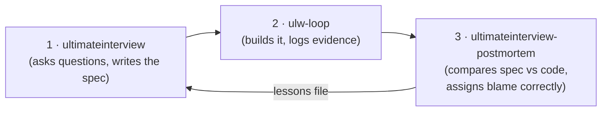

# The Interview Closed Loop — User Guide

How to use `ultimateinterview`, `ulw-loop`, and `ultimateinterview-postmortem` together so that every project you build makes the *next* interview better.

This guide assumes no prior knowledge of any of the three tools. Design background and the review that shaped this setup live in `docs/ultimateinterview-postmortem-closed-loop-handoff.md`; you do not need to read it to use the loop.

## The idea in one minute

When you ask an AI (or a person) to build something from a vague request, three different things can go wrong:

1. **The spec was incomplete** — nobody asked the right question, so the implementer guessed.
2. **The implementation drifted** — the spec was fine, but the code did something else.
3. **Nobody can tell** — there is not enough evidence left behind to know which of the two happened.

Most workflows can't tell these apart after the fact, so nothing improves. This loop is built to tell them apart. It has three stations and two small files that connect them:



The output of station 3 is not a report you read once. It is a **lessons file** that station 1 automatically reads at the start of every future interview — so a class of question that was missed once gets asked earlier next time. That is the "closed" part of the closed loop.

## The pieces, in plain language

| Piece | What it is | Where it lives |
| --- | --- | --- |
| `ultimateinterview` | A Claude Code skill that interviews you about a vague request until it becomes an implementation-ready spec. It hunts for questions you didn't know needed asking. | `.claude/skills/ultimateinterview/` |
| `handoff.md` | The spec the interview produces. Part 1 ("Build Contract") is everything an implementer needs; Part 2 is the audit trail. | `.ultimateinterview/<slug>/handoff.md` |
| `ulw-loop` | A LazyCodex/Codex execution loop that keeps working until completion is *verified*, and — the part this loop cares about — writes an evidence ledger as it goes: which success criterion passed, what failed, what got revised. | `lazycodex/` submodule; state in `.omo/ulw-loop/` |
| `decisions.jsonl` | A tiny log the implementer appends to whenever they make a call the spec didn't force. One JSON line per decision. This is the single most valuable input to the postmortem. | `.ultimateinterview/<slug>/decisions.jsonl` |
| `pack_evidence.py` | The adapter. Gathers the spec, the interview ledger, the ulw-loop evidence, the decision log, and the git diff into ONE file so the postmortem never has to understand anyone else's file formats. **The postmortem runs it for you** — you never invoke it by hand. | `.claude/skills/ultimateinterview-postmortem/scripts/` |
| `ultimateinterview-postmortem` | A Claude Code skill that compares what the spec promised against what the code actually contains, classifies every difference, and writes lessons. | `.claude/skills/ultimateinterview-postmortem/` |
| lessons files | Durable "next time, ask about X earlier" rules. Repo-specific rules go to `docs/ultimateinterview-lessons.md`; general rules go to the global store next to the skill. | see Output section below |

## Step by step

### Step 1 — Interview: turn a vague request into a spec

In Claude Code, describe what you want and invoke the skill (saying "ultimateinterview" or "make a spec" is enough to trigger it):

> "I want a CLI I can run every morning that shows me today's todos. ultimateinterview."

What happens next:

- The skill inspects your repo first and **never asks you things the code can answer**.
- It asks one high-leverage question at a time (multiple-choice where possible), pressure-tests answers that carry risk, and keeps a scored ledger of every open ambiguity.
- **It reads the lessons files during orientation.** If a past postmortem wrote "a time word like *today* in the goal → pin down date-boundary semantics early", and your request contains "morning/today", that question class fires in round one instead of never. This is the loop paying you back.
- It stops when no dangerous ambiguity remains (a scripted, blocker-based check — not a vibe), runs its gates, and writes `handoff.md`.

You get: `.ultimateinterview/<slug>/` containing `handoff.md` (the spec), `ledger.json` (every settled decision with its evidence), and `transcript.md`.

### Step 2 — Build: execute the spec under ulw-loop, and log your decisions

Give the implementer (usually a Codex session with LazyCodex installed) **Part 1 of `handoff.md`** as the task brief and run it under ulw-loop:

```bash
$ulw-loop "Implement the Build Contract in .ultimateinterview/<slug>/handoff.md (Part 1)"
```

ulw-loop turns the work into goals with explicit success criteria and refuses to finish until they are verified with captured evidence. As it runs, it writes its state under `.omo/ulw-loop/`:

- `goals.json` — the goals and their success criteria
- `ledger.jsonl` — an append-only event stream: `evidence_captured`, `criterion_failed`, `criterion_blocked`, `criteria_revised`, ...
- `brief.md` — the brief it was given

> Note: when a Codex session id is set (`OMO_ULW_LOOP_SESSION_ID` or `CODEX_SESSION_ID`), the state lands in a subdirectory, `.omo/ulw-loop/<session-id>/`. You don't need to remember this — the postmortem's evidence packer discovers it automatically.

**When the implementation lands, the implementer STOPS.** The handoff preamble says so explicitly: the postmortem belongs to a fresh context (step 3), never to the head that wrote the code. The first executor run wrote its own `postmortem.md` — a self-audit scoring itself 17/17 fulfilled — which is exactly the circularity the loop exists to break. An implementer self-review is welcome as `postmortem.self.md`; the postmortem skill treats it as evidence and moves anything squatting at `postmortem.md` aside before auditing.

**The one habit that makes the loop work:** whenever the implementer makes a decision the spec did not force — filled a gap, deviated, assumed something — append one line to `.ultimateinterview/<slug>/decisions.jsonl`:

```json
{"decision": "store dates as ISO strings", "reason": "spec names no serialization format", "spec_citation": "REQ-3", "alternatives": ["epoch seconds"], "impact": "store file format", "self_class": "spec_gap"}
```

Only `decision` and `reason` are required. `self_class` is the implementer's own guess at who is to blame (see the classification table below) — the postmortem treats it as evidence, not as a verdict. The handoff's Decision boundaries section carries a standing instruction telling implementers to do this, so an agent reading Part 1 will know.

Why bother? Because six weeks later, "the spec was silent so I picked ISO dates" is exactly the sentence that distinguishes *the interview missed a question* from *the implementer ignored the spec* — and nobody remembers it unless it was written down at the moment it happened.

ulw-loop is the preferred substrate because it leaves this evidence trail for free, but it is **optional**: the loop still works with a plain implementation session, you just lose the criterion-level execution evidence (the bundle will record what's missing rather than pretending).

### Step 3 — Postmortem: assign blame correctly

When the implementation is substantially done, in Claude Code, in the same repo:

> "spec postmortem for todo-cli-app"

**The first thing the skill does is gather the evidence itself.** It runs `pack_evidence.py`, which writes `.ultimateinterview/<slug>/evidence_bundle.json` — one schema-versioned file containing the spec, the interview ledger, the decision log, the ulw-loop events (auto-discovered under `.omo/ulw-loop`, session-id subdirectories included, and already sorted into useful projections), and the implementation diff. You don't run anything and you don't point at any directories. The bundle is size-bounded for its reader: executor state snapshots inside events are digested to stubs (the first real run would otherwise have packed 5 MB), and the raw state stays on disk where the bundle's `sources` section points.

Two packing behaviors worth knowing:

- **It fails loudly on files it owns.** A malformed `decisions.jsonl` line stops everything with the line number — fix it, and the skill reruns the packer.
- **It degrades gracefully on files it doesn't own.** No ulw-loop run? No decision log? Those are recorded in a `missing_evidence` list inside the bundle instead of blocking. The postmortem will then say "this axis of the audit ran blind" rather than silently guessing.

Full schema reference (and the manual `pack_evidence.py` invocation, if you ever want to inspect a bundle yourself): `.claude/skills/ultimateinterview-postmortem/references/evidence-bundle.md`.

With the bundle in hand, the postmortem walks the spec and the diff in both directions — *every spec requirement: where is it implemented? every substantive code behavior: which requirement asked for it?* — and classifies every mismatch:

| You'll see | Plain meaning |
| --- | --- |
| `fulfilled` | Spec asked for it, code does it. The happy row. |
| `escaped-requirement` | Code needed it, spec never mentioned it. **The interview missed a question.** This is the row the whole loop exists to shrink. |
| `scope-drift` | Spec promised it, code silently doesn't do it. |
| `divergent-implementation` | Code does it *differently* than the spec settled. If it reversed a decision you made in the interview, the postmortem flags it to you for an explicit re-decision. |
| `deferred-outcome` | You knowingly postponed it; did the risk materialize? |

The `decisions.jsonl` entries get walked as first-class rows: if the spec really was silent where a decision was forced, that's an escaped requirement *with the gap already documented*; if the spec covered it and the decision contradicts it, that's a divergent implementation. Every escape is then attributed to the interview mechanism that should have caught it (a lens that never triggered, a question that never ranked high enough, an answer that was accepted without pressure...), because the fix differs per mechanism.

You get: `.ultimateinterview/<slug>/postmortem.md` with a divergence table, the attribution per escape, and a **discovery rate** — the measured fraction of requirements the interview actually caught. This number is how you know whether the skill is improving across projects. The report itself is gated by `postmortem_lint.py`: section completeness, one divergence row per requirement (no "REQ-001 through REQ-006" aggregation), and the rates recomputed from the table — so a sloppy report can't quietly corrupt the trend line.

### Step 4 — The loop closes by itself

For each escape, the postmortem writes (or strengthens) a lesson row — a *signal → question-class* routing rule like:

> "file-based store in scope → enumerate write-path durability (crash mid-write)"

Rules must be observable at interview time ("the request mentions export") — never hindsight ("we forgot X"). They land in two stores:

- `docs/ultimateinterview-lessons.md` — rules specific to this repo's domain (committed to git)
- the global lessons store next to the skill — generalized rules that follow you across repos

The next interview reads both during orientation. Each lesson also carries a Fired/Caught counter: a lesson that keeps firing without ever catching anything is automatically retired after 3 dry runs, so the lessons file never becomes a superstition pile.

**You do nothing in this step.** That's the point.

## One rule before editing the skill itself

If a postmortem convinces you to change the interview skill's rules: rerun the previously measured cases first (the sessions with recorded discovery rates) and compare rates before/after. Patch only what measurably improved. This keeps the loop honest — otherwise "improvements" are just vibes with extra steps.

Two of the three checks are scripted; the third is not (it can't be cheaply):

1. **Tooling regression (scripted, one command).** `cd .agents/skills/ultimateinterview && uv run scripts/regression_check.py`. Runs `handoff_coverage`, `verification_lint`, and `postmortem_lint` against a captured fixture set (`scripts/regression_fixtures/`, checked in so it survives a fresh checkout) and asserts no crash + stable host-independent verdicts. Add `--live` to also sweep the gitignored `.ultimateinterview/` sessions when present. Run this before AND after any script edit.
2. **Signal-firing check (scripted, static).** `uv run scripts/signal_firing.py "<request text>" [--touched-code "<terms>"]`. Reports which lenses the CURRENT Orientation triggers + active lessons signals would fire on a request — triggers are parsed from `references/orientation.md` and `lessons.md` at runtime, so a trigger you delete stops firing and the canonical cases in `test_signal_firing.py` fail. This catches a trigger that stopped firing; it does NOT prove the escape gets caught.
3. **Discovery-rate before/after (NOT scripted — full human loop).** A real rate change needs re-interview → new spec → re-implement → re-postmortem for each measured case (option (c) in the follow-ups handoff). Until that is run for a given rule change, keep the change labeled **experimental** in the memory note and do not claim a discovery-rate improvement from it.

## Quick reference

```text
Interview        Claude Code: "ultimateinterview: <your request>"
  → spec         .ultimateinterview/<slug>/handoff.md
Build            Codex: $ulw-loop "Implement Part 1 of <handoff path>"
  → evidence     .omo/ulw-loop/{goals.json, ledger.jsonl}   (maybe under <session-id>/)
  → decisions    append .ultimateinterview/<slug>/decisions.jsonl as you decide
Postmortem       Claude Code: "spec postmortem for <slug>"
  → bundle       .ultimateinterview/<slug>/evidence_bundle.json   (packed automatically)
  → report       .ultimateinterview/<slug>/postmortem.md
  → lessons      docs/ultimateinterview-lessons.md (+ global store)  ← next interview reads these
```

## Gotchas

- **Don't run the postmortem on half-built work.** In-progress items get misclassified as scope drift. Wait until the implementation is substantially done.
- **Don't trust "the loop said it's complete" as quality.** ulw-loop's goal status is a coordination signal the agent itself declares; the criteria evidence and the final quality gate are the real checks, and the postmortem re-checks against the spec anyway.
- **The implementer and the postmortem runner shouldn't share a head.** If the same session both wrote the code and runs the postmortem, the skill delegates the inventory walk to a fresh-context subagent automatically — an implementer auditing its own code for things it forgot is circular. And if the implementer already wrote a `postmortem.md` of its own, the skill moves it to `postmortem.self.md` and audits independently: a self-report is evidence, not an audit.
- **Lessons graduate.** A lesson row that keeps catching gets absorbed into the interview skill's own method (a lens trigger, a checklist gate) and retires with an `absorbed:` reason — the lessons file is a staging area for rules earning their way into the methodology, not a permanent pile.
- **decisions.jsonl is snake_case and strict.** Unknown fields (including camelCase spellings like `specCitation`) are rejected with the line number. Required: `decision`, `reason`. Optional: `spec_citation`, `alternatives`, `impact`, `self_class`, `ts`.
- **`self_class` vocabulary** (the implementer's guess, the postmortem's decision): `spec_gap` (spec didn't constrain me), `implementation_deviation` (I departed from the spec), `evaluation_uncertainty` (can't tell without more evidence), `execution_process_gap` (the record of what happened is missing), `legitimate_spec_evolution` (the user changed the spec mid-flight, on the record).
