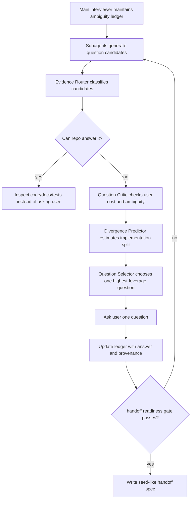
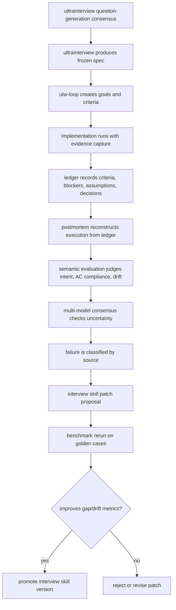

# Ultrainterview Postmortem Closed Loop Handoff

Date: 2026-07-07

이 문서는 지금까지의 토론을 시간 흐름 순으로 정리한 handoff 문서다. 목적은 `ultrainterview`가 만든 스펙, 구현 결과, 실행 ledger, semantic evaluation을 연결해서 인터뷰 스킬을 개선하는 closed loop 설계를 이어받을 수 있게 하는 것이다.

## 1. Ouroboros Evaluate의 역할 확인

처음 확인한 것은 `ouroboros evaluate`가 일반 코드 리뷰와 다르다는 점이다.

`ouroboros evaluate`는 코드 품질 전반을 보는 일반 리뷰라기보다, Seed/spec의 goal, constraints, acceptance criteria에 대해 구현 결과가 맞는지 확인하는 검증 파이프라인이다.

핵심 구조:

- Stage 1: mechanical verification. lint, build, test, static, coverage 등 결정적 검사.
- Stage 2: semantic evaluation. LLM judge가 AC compliance, goal alignment, drift score, uncertainty, reward-hacking risk를 평가.
- Stage 3: optional multi-model consensus. 불확실하거나 요청된 경우 여러 모델로 판정.

중요한 결론:

- `evaluate`는 skill과 MCP tool 양쪽이 있다.
- skill은 사용법/라우팅/runbook이고, 실제 평가는 Ouroboros MCP 내부 Python 코드가 수행한다.
- semantic evaluation은 정적 의미 분석기가 아니라 LLM-as-judge에 구조화된 프롬프트와 JSON schema를 씌운 방식이다.

관련 문서:

- `docs/ouroboros-evaluate-skill-and-mcp.md`
- `/Users/jpark/gitrepos/harnesses/ouroboros/src/ouroboros/evaluation/semantic.py`
- `/Users/jpark/gitrepos/harnesses/ouroboros/src/ouroboros/evaluation/pipeline.py`
- `/Users/jpark/gitrepos/harnesses/ouroboros/src/ouroboros/evaluation/models.py`

## 2. Semantic Evaluation의 한계 정리

semantic evaluation은 기본적으로 LLM에게 original goal, AC, constraints, artifact/source files를 주고 판단하게 한다.

따라서 다음 한계가 있다.

- LLM judge는 확률적이며 완전한 보증 장치가 아니다.
- evidence가 부족하면 judge가 추측할 수 있다.
- 스펙이 애매하면 judge도 애매한 기준으로 판단한다.
- 같은 계열 모델 여러 개를 써도 같은 착각을 공유할 수 있다.

하지만 다음 장치는 신뢰도를 올린다.

- deterministic checks를 먼저 통과시킨다.
- judge 출력은 structured schema로 제한한다.
- judge가 cited evidence와 missing evidence를 반드시 내게 한다.
- disagreement는 실패가 아니라 uncertainty signal로 본다.
- golden set을 만들어 judge prompt/model 조합을 calibration한다.

핵심 결론:

semantic evaluation은 단독 truth source가 아니라, ledger와 deterministic evidence 위에서 의미적 drift를 판정하는 보조 judge여야 한다.

## 3. Spec Gap, Implementation Deviation, Evaluation Uncertainty 분리

토론의 중심 문제는 두 가지 모순이었다.

첫째, 인터뷰가 부실하면 불완전한 스펙이 나오고, 구현자가 빈칸을 임의로 채운다.

둘째, 스펙이 완벽해도 LLM 구현은 확률적이라 구현이 틀릴 수 있고, 평가 역시 LLM judge라 불완전하다.

이를 해결하기 위해 실패 원인을 한 덩어리로 보지 않고 세 축으로 분리하기로 했다.

- `spec_gap`: 스펙이 구현 판단을 제한하지 못해서 구현자가 임의 결정을 해야 했음.
- `implementation_deviation`: 스펙은 충분했지만 구현이 스펙에서 벗어남.
- `evaluation_uncertainty`: 구현/스펙 판정에 필요한 증거가 부족하거나 judge 간 불일치가 있음.

추가로 postmortem에는 다음 분류도 필요하다.

- `execution_process_gap`: ledger/evidence가 부족해서 무엇이 일어났는지 추적 불가.
- `legitimate_spec_evolution`: 사용자 입력이나 새 발견 때문에 스펙 변경이 정당함.

핵심 결론:

postmortem의 목적은 "실패했다"를 말하는 것이 아니라, 실패의 출처를 분리해서 인터뷰 스킬 개선으로 연결하는 것이다.

## 4. oh-my-codex / LazyCodex의 Evidence-Based 실행 구조 조사

oh-my-codex와 LazyCodex는 git submodule로 들어와 있고, 다음 구현체를 조사했다.

- oh-my-codex `executor agent`
- oh-my-codex `ultragoal`
- LazyCodex `ulw-loop`

확인한 점:

- 구현자가 spec gap 때문에 내린 임의 결정을 1급 이벤트로 남기는 완전한 schema는 아직 약하다.
- 다만 steering, criteria revision, evidence capture, blocker, needs-user-decision 같은 간접 신호는 남는다.
- executor prompt에는 assumptions/notes를 남길 수 있는 구조가 있지만, durable decision log schema로 강제되지는 않는다.

제안된 보강 이벤트:

```json
{
  "kind": "implementation_decision",
  "decision": "...",
  "specCitation": "...",
  "reason": "...",
  "alternatives": ["..."],
  "implementationImpact": "...",
  "postmortemClass": "spec_gap | implementation_deviation | evaluation_uncertainty"
}
```

핵심 결론:

postmortem이 인터뷰 스킬을 개선하려면 실행 중 implementation decision과 assumption을 durable ledger로 남겨야 한다.

## 5. Ouroboros Evolve와 Goalpost Moving 문제

Ouroboros는 evolve 과정에서 ontology와 acceptance criteria를 세대별로 바꿀 수 있다. 따라서 겉으로 보면 goalpost moving처럼 보일 수 있다.

정리한 기준:

- Gen N 구현은 Gen N spec으로 평가해야 한다.
- Gen N+1 spec은 새 실험으로 봐야 한다.
- 최신 spec으로 과거 구현을 소급 채점하면 진짜 goalpost moving이다.

Ouroboros 쪽 중요한 개념:

- Seed direction, 즉 goal/constraints/acceptance criteria는 immutable로 다뤄진다.
- effective ontology는 lineage를 통해 evolve할 수 있다.
- 각 generation은 snapshot이어야 한다.

핵심 결론:

spec evolution은 허용할 수 있지만, postmortem에서는 반드시 "어느 spec version으로 어떤 artifact를 평가했는지"를 고정해야 한다.

## 6. ulw-loop와 ultragoal의 Lifecycle 차이

두 시스템은 비슷하지만 철학이 다르다.

### ultragoal

ultragoal은 goal/objective 보호와 final quality gate가 강하다.

장점:

- objective reconciliation이 강하다.
- protected objective/constraint/quality/completion을 약화하는 steering을 막는다.
- 최종 완료 선언을 보수적으로 다룬다.

단점:

- 실패 원인을 criterion 단위로 잘게 나누기 어렵다.
- postmortem 학습 데이터의 해상도가 낮을 수 있다.

관련 코드:

- `/Users/jpark/gitrepos/harnesses/oh-my-codex/src/ultragoal/artifacts.ts`

### ulw-loop

ulw-loop는 goal 안에 success criteria를 두고, criterion별 evidence를 남기는 구조다.

장점:

- criteria별 pass/fail/blocked 상태가 있다.
- `evidence_captured`, `criterion_failed`, `criterion_blocked`, `criteria_revised` 같은 ledger event가 있다.
- postmortem에서 "어떤 criterion이 왜 부실했는가"를 추적하기 좋다.

단점:

- criteria revision이 가능하므로 운영을 잘못하면 조용한 goalpost moving이 될 수 있다.
- ultragoal만큼 objective 보호 규칙이 강하지 않을 수 있다.

관련 코드:

- `/Users/jpark/gitrepos/harnesses/lazycodex/plugins/omo/components/ulw-loop/src/constants.ts`
- `/Users/jpark/gitrepos/harnesses/lazycodex/plugins/omo/components/ulw-loop/src/evidence.ts`
- `/Users/jpark/gitrepos/harnesses/lazycodex/plugins/omo/components/ulw-loop/src/checkpoint.ts`

핵심 결론:

인터뷰 스킬 개선 closed loop에는 `ulw-loop`가 더 적합하다. 다만 최종 승격과 protected objective/quality gate 보호는 `ultragoal` 스타일을 빌려야 한다.

## 7. goal_needs_user_decision의 의미

`goal_needs_user_decision`은 LLM이 임의로 띄우는 이벤트가 아니다.

LazyCodex ulw-loop에서는 checkpoint가 failed/blocked일 때 evidence를 검사하고, 외부 권한/인증/접근 문제로 분류되는 blocker가 같은 signature로 3번 반복되면 `needs_user_decision`으로 circuit break한다.

즉:

- 반복 가능한 내부 실패는 retry 가능.
- 외부 결정 없이는 해결되지 않는 blocker가 반복되면 non-retriable.
- 이때 ledger event가 `goal_needs_user_decision`이 된다.

관련 코드:

- `/Users/jpark/gitrepos/harnesses/lazycodex/plugins/omo/components/ulw-loop/src/checkpoint.ts`
- `/Users/jpark/gitrepos/harnesses/lazycodex/plugins/omo/components/ulw-loop/src/quality-gate-blockers.ts`

핵심 결론:

`goal_needs_user_decision`은 spec gap 일반 신호가 아니라, 반복된 외부 결정/권한 blocker를 멈추는 안전장치다. 다만 postmortem에서는 "인터뷰가 미리 물었어야 했던 외부 결정인가"를 분석하는 재료가 될 수 있다.

## 8. Drift Detection 방식 비교

Ouroboros, ulw-loop, ultragoal은 drift를 다르게 다룬다.

### Ouroboros

Ouroboros evaluate는 semantic evaluator가 `drift_score`를 명시적으로 산출한다.

- LLM judge가 AC, goal, constraints, artifact/source files를 보고 drift를 점수화한다.
- drift가 threshold를 넘으면 seed drift alert trigger가 걸릴 수 있다.

관련 코드:

- `/Users/jpark/gitrepos/harnesses/ouroboros/src/ouroboros/evaluation/semantic.py`
- `/Users/jpark/gitrepos/harnesses/ouroboros/src/ouroboros/evaluation/trigger.py`

### ulw-loop

ulw-loop는 drift를 직접 점수화하지 않는다.

대신 다음 불일치로 간접 감지한다.

- Codex goal objective/status mismatch
- unresolved criteria
- missing or failed evidence
- final quality gate mismatch

Codex goal objective 비교는 LLM도 테스트도 아니다. `get_goal` snapshot에서 objective/status를 뽑고, ulw-loop plan이 기대하는 objective와 whitespace-normalized exact match로 비교한다.

중요한 한계:

`get_goal.status === complete`는 Codex가 자동 검증한 사실이 아니라, 에이전트가 `update_goal({ status: "complete" })`로 기록한 완료 선언이다. 따라서 coordination signal일 뿐 품질 보증은 아니다.

관련 코드:

- `/Users/jpark/gitrepos/harnesses/lazycodex/plugins/omo/components/ulw-loop/src/codex-goal-snapshot.ts`
- `/Users/jpark/gitrepos/harnesses/lazycodex/plugins/omo/components/ulw-loop/src/goal-status.ts`
- `/Users/jpark/gitrepos/harnesses/lazycodex/plugins/omo/components/ulw-loop/src/checkpoint.ts`

### ultragoal

ultragoal도 drift를 직접 점수화하지 않는다. goal/objective reconciliation과 final quality gate로 completion drift를 막는다.

핵심 결론:

- Ouroboros는 semantic drift score를 만든다.
- ulw-loop/ultragoal은 completion consistency를 검증한다.
- postmortem에는 둘 다 필요하다.

## 9. 권장 Closed Loop 디자인

최종적으로 추천한 구조는 다음과 같다.

### 실행은 ulw-loop로 한다

이유:

- criterion 단위 evidence가 남는다.
- 실패 원인을 postmortem에서 잘게 분해할 수 있다.
- 인터뷰 스킬 개선에 필요한 원재료가 많다.

필수 보강:

- implementation decision / assumption event를 ledger에 추가한다.
- criteria revision은 original spec citation, rationale, before/after diff를 강제한다.
- get_goal snapshot은 품질 보증이 아니라 coordination evidence로만 사용한다.

### postmortem은 ledger + semantic evaluation으로 한다

입력:

- original interview spec
- frozen criteria
- `goals.json`
- `ledger.jsonl`
- implementation diff/final artifact
- manual QA evidence
- get_goal snapshot history

분석 순서:

1. ledger를 읽어 실제로 어떤 일이 일어났는지 복원한다.
2. criteria별 evidence 상태를 확인한다.
3. implementation decision/assumption을 spec gap 후보로 추출한다.
4. semantic evaluator로 original intent/AC 대비 drift를 평가한다.
5. multi-model consensus는 불확실성 탐지와 escalation에 사용한다.
6. 실패 원인을 `spec_gap`, `implementation_deviation`, `evaluation_uncertainty`, `execution_process_gap`, `legitimate_spec_evolution`으로 분류한다.
7. 과거 spec을 수정하지 않고, 인터뷰 스킬 patch proposal만 만든다.

### semantic evaluation은 multi-model consensus로 보강한다

추천 구조:

- `Spec Judge`: 스펙이 구현 결정을 충분히 제한했는가.
- `Implementation Judge`: 구현이 스펙/AC를 만족했는가.
- `Evidence Judge`: evidence가 판정을 뒷받침하는가.
- `Drift Judge`: 원래 intent에서 의미적으로 벗어났는가.

모든 judge는 같은 structured schema를 사용한다.

```json
{
  "verdict": "pass | fail | uncertain",
  "class": "spec_gap | implementation_deviation | evaluation_uncertainty | execution_process_gap | legitimate_spec_evolution",
  "confidence": 0.0,
  "citedEvidence": ["..."],
  "missingEvidence": ["..."],
  "recommendedInterviewImprovement": ["..."]
}
```

중요한 운영 원칙:

- consensus는 정답 보증 장치가 아니다.
- disagreement는 uncertainty signal이다.
- 불일치가 크면 다수결로 강행하지 말고 `uncertain`으로 escalate한다.
- golden set으로 judge prompt/model 조합을 calibration해야 한다.

## 10. Ralplan과 Question-Generation Consensus

추가 토론에서 중요한 방향 전환이 있었다.

처음에는 `ultrainterview`가 만든 interview spec을 oh-my-codex의 `ralplan`으로 돌리면 무엇이 확정되는지 검토했다. 결론은 다음과 같다.

`ralplan`이 확정하는 것은 "사용자 의도" 자체가 아니다. `ralplan`은 Planning artifact가 Planner -> Architect -> Critic consensus gate를 통과했는지를 확정한다. 즉 "이 계획은 실행 가능한가", "Architect와 Critic이 승인했는가"는 확인하지만, 스펙의 빈틈을 반드시 사용자에게 되묻는 장치는 아니다.

관련 근거:

- `ralplan`은 `$plan --consensus` alias이며 Planner, Architect, Critic loop를 돈다.
- non-interactive mode에서는 사용자 confirmation 없이 자동으로 Planner -> Architect -> Critic loop를 진행할 수 있다.
- durable gate는 Architect review와 Critic review가 순서대로 approve 되었는지, native subagent evidence가 있는지 확인한다.
- 하지만 "모르는 것을 평균적인 conventional default로 채우지 않았는가"를 완전히 보장하지는 않는다.

관련 코드:

- `/Users/jpark/gitrepos/harnesses/oh-my-codex/plugins/oh-my-codex/skills/ralplan/SKILL.md`
- `/Users/jpark/gitrepos/harnesses/oh-my-codex/src/ralplan/runtime.ts`
- `/Users/jpark/gitrepos/harnesses/oh-my-codex/src/ralplan/consensus-gate.ts`
- `/Users/jpark/gitrepos/harnesses/oh-my-codex/docs/contracts/ralplan-consensus-gate.md`

핵심 판단:

`ralplan after interview`는 유용하지만 늦다. handoff나 plan이 만들어진 뒤에 reviewer가 빈틈을 찾으면 다시 인터뷰로 되돌아가야 한다. 더 좋은 구조는 `ralplan`의 합의 철학을 인터뷰 내부, 특히 question-generation 단계로 앞당기는 것이다.

### 질문 생성 단계에 Subagent 구조 도입

권장 방향은 handoff.md를 만든 뒤 리뷰하는 것이 아니라, 질문 후보를 만드는 순간부터 여러 관점의 subagent를 투입하는 것이다.

목표:

- 사용자에게 묻는 질문 자체를 consensus 대상으로 만든다.
- "다음 질문이 정말 가장 high-leverage인가"를 매 라운드 검증한다.
- repo에서 알 수 있는 code fact를 사용자에게 묻지 않는다.
- human decision gap을 low-risk assumption으로 몰래 바꾸지 않는다.
- 한 번에 하나의 사용자 질문만 묻되, 그 질문은 여러 관점이 경쟁한 결과여야 한다.

권장 subagent role:

- `Domain Agent`: 용어, entity, state, invariant, lifecycle 빈틈을 찾는다.
- `Implementation Agent`: 스펙이 그대로 주어졌을 때 구현자가 갈라질 지점을 찾는다.
- `QA Agent`: acceptance criteria가 observable/testable한지, verification surface가 있는지 본다.
- `Risk Agent`: security, data, rollback, failure mode, irreversible action을 찾는다.
- `Product Agent`: scope, non-goal, user outcome, tradeoff, priority 빈틈을 찾는다.
- `Ontology Critic`: 개념 분류, 용어 충돌, category error를 찾는다.
- `Question Critic`: 후보 질문이 사용자 시간을 낭비하는지, repo inspection으로 해결 가능한지 검토한다.
- `Evidence Router`: 후보를 `code_fact`, `human_decision`, `acceptable_assumption`, `deferred_risk`로 분류한다.
- `Question Selector`: 최종적으로 사용자에게 물을 한 질문을 고른다.

질문 후보 schema:

```json
{
  "question": "...",
  "gapType": "human_decision | code_fact | assumption | deferred_risk",
  "whyItMatters": "...",
  "implementationDivergence": "what two implementers might do differently",
  "expectedAnswerShape": "choice | scalar | policy | example | boundary",
  "impact": 0.0,
  "uncertaintyReduction": 0.0,
  "userCost": 0.0,
  "canInspectInstead": true,
  "evidenceNeeded": ["..."]
}
```

### Proposed Interview Loop



### Aggressive Ultrainterview Rules

추천하는 강화 규칙:

- 질문 후보는 최소 3개 관점에서 생성한다.
- 사용자에게 묻기 전 `canInspectInstead`를 반드시 평가한다.
- 모든 질문 후보는 "안 물으면 두 구현자가 어떻게 다르게 구현할 수 있는가"를 포함해야 한다.
- `human_decision` gap은 자동 assumption으로 변환하지 않는다.
- `code_fact` gap은 사용자에게 묻지 않고 repo/docs/tests/logs에서 확인한다.
- `acceptable_assumption`은 low-risk, reversible, conventional일 때만 허용한다.
- security/data/irreversible/external integration 관련 gap은 ranking에서 boost한다.
- handoff 전 리뷰가 아니라 매 질문 라운드마다 mini fresh-context gate를 수행한다.
- final handoff에는 "질문하지 않고 assumption으로 둔 것"을 별도 섹션으로 강제한다.

질문 선택 scoring 예:

```text
priority = (impact * uncertainty_reduction * divergence_risk * risk_boost) / user_cost
```

단, `human_decision`이면서 implementation-changing이면 score와 무관하게 blocker로 승격한다.

핵심 결론:

`ralplan`은 plan consensus에 강하다. `ultrainterview`에 필요한 것은 plan consensus가 아니라 question consensus다. 즉 승인 기준을 "이 plan을 실행할 수 있는가"가 아니라 "이 질문을 안 물어도 두 명의 유능한 구현자가 materially same thing을 만들 것인가"로 바꿔야 한다.

## 11. 최종 권장 아키텍처

추천 아키텍처는 다음과 같다.



Recommended split:

- `ultrainterview`: question-generation consensus and frozen spec production.
- `ulw-loop`: execution substrate and evidence ledger.
- `ultragoal`: governance ideas for protected objective/quality gate.
- `ouroboros evaluate`: semantic drift and AC compliance judge.
- postmortem skill: attribution engine that turns execution failures into interview-skill improvements.

## 12. Open Design Questions

아직 구현 전에 결정해야 할 질문들:

1. `implementation_decision` event를 ulw-loop ledger에 추가할지, postmortem 전용 artifact로 둘지.
2. criteria revision을 허용할 때 original spec과의 관계를 어떤 schema로 강제할지.
3. semantic evaluator를 Ouroboros MCP 그대로 사용할지, ultrainterview-postmortem 전용 judge prompt를 따로 만들지.
4. multi-model consensus의 promotion threshold를 어떻게 정할지.
5. golden set을 어떤 사례들로 시작할지.
6. `spec_gap`과 `legitimate_spec_evolution`의 경계를 어떻게 human-reviewable하게 만들지.
7. question-generation subagent를 항상 켤지, ambiguity/risk threshold가 높을 때만 켤지.
8. "두 구현자가 materially same thing을 만들 것인가" gate를 어떤 structured rubric으로 구현할지.
9. `human_decision`과 `acceptable_assumption`의 자동 분류 기준을 어떻게 제한할지.

## 13. Working Hypothesis

사용자의 현재 가설:

좋은 인터뷰 스킬이 좋은 스펙을 만들면 implementation drift가 줄어든다.

현재까지의 판단:

이 가설은 방향이 맞다. 다만 drift는 완전히 사라지지 않는다. 좋은 스펙은 `spec_gap`을 줄이고, 구현자의 임의 결정을 줄이고, 평가 가능성을 높인다. 그러나 `implementation_deviation`과 `evaluation_uncertainty`는 별도 축으로 남는다.

따라서 목표는 "완벽한 스펙"이 아니라, 실패했을 때 다음을 분리할 수 있는 스펙이다.

- 스펙이 부족했는가.
- 구현이 벗어났는가.
- 평가 증거가 부족했는가.
- 사용자 결정이 필요했는가.

이 분리가 가능해지면 postmortem이 인터뷰 스킬을 실제로 학습시킬 수 있다.
